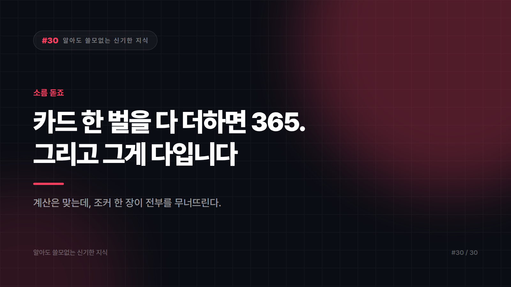

# 카드 한 벌을 다 더하면 365가 됩니다. 소름 돋죠. 그게 다입니다.

*시리즈: 알아도 쓸모없는 신기한 지식 | 30/30*

---

한 번쯤 들어보셨을 겁니다. 트럼프 카드 한 벌에 1년이 통째로 숨어 있다는 이야기요.

계산이 이렇게 갑니다.

- 카드는 **52장** — 1년은 **52주**
- 무늬는 **4가지** — 계절은 **4개**
- 한 무늬당 **13장** — 달의 주기는 1년에 **13번**쯤
- 그림 카드는 **12장** — 1년은 **12달**
- A를 1, K를 13으로 놓고 한 무늬를 다 더하면 91. **91 × 4 = 364.** 여기에 **조커 한 장**을 더하면 **365.**
- 조커 두 장을 다 넣으면 **366**, 윤년입니다.

진짜로 맞습니다. 제가 다시 계산해 봤는데 다 맞아요.

그래서 이게 사실이냐고요?

**아니요.**

## 숫자가 맞는 것과 그래서 만든 것은 다릅니다

문제는 계산이 아닙니다. 계산은 정확합니다. **"그래서 그렇게 설계했다"는 부분에 근거가 없는** 게 문제죠.

숫자를 나중에 가져다 맞추는 건 생각보다 쉽습니다. 52, 4, 13, 12 같은 값은 달력에서도 흔한 숫자라서 어떻게든 걸립니다. 안 맞는 항목은 조용히 빼고 맞는 항목만 나열하면 완성이죠.

이게 소름 돋는 이유는 우연이 신기해서가 아니라, **우리가 애초에 맞는 것만 보게끔 배열된 목록**을 보고 있기 때문입니다.

## 결정적인 구멍: 조커

위 계산에서 365를 완성하는 마지막 한 장, 조커를 보세요.

**조커는 카드가 만들어지고 한참 뒤에 추가된 카드입니다.**

19세기에 미국에서 특정 게임의 최상위 패로 도입된 것으로 알려져 있습니다. 원래 덱에는 없었어요.

그러니까 "1년을 담아 설계한 덱"의 마지막 조각이, 수백 년 뒤에 다른 대륙에서 게임 규칙 때문에 끼워 넣은 카드라는 뜻입니다.

설계도에 없던 부품으로 설계 의도를 증명하는 셈이죠.

## 구멍 두 번째: 카드는 원래 제각각이었습니다

우리가 아는 하트·다이아·클로버·스페이드는 **프랑스식 무늬**입니다. 세계 표준처럼 보이지만 여러 체계 중 하나예요.

- 독일식은 도토리, 잎, 하트, 방울
- 이탈리아·스페인 계열은 컵, 동전, 몽둥이, 검

무늬 개수도, 한 무늬당 장수도, 궁정 카드 구성도 지역마다 달랐습니다. 40장짜리 덱, 48장짜리 덱이 멀쩡히 쓰였고 지금도 쓰입니다.

**52장이 우주의 상수였던 적이 없습니다.**

카드 자체도 유럽 발명이 아닙니다. 동아시아에서 출발해 이슬람 세계를 거쳐 14세기 후반쯤 유럽에 들어온 것으로 봅니다. 유럽에 도착한 뒤에 지역마다 제 입맛대로 갈라진 거죠.

## 그럼 프랑스식은 왜 이겼냐면

이유가 아주 시시합니다.

**인쇄가 싸서요.**

프랑스식 무늬는 단순한 도형에 색이 두 가지뿐입니다. 도토리나 방울, 정교한 컵과 검에 비하면 찍어내기가 압도적으로 쉽고 쌉니다.

카드는 소모품입니다. 싸게 많이 찍을 수 있는 쪽이 시장을 먹습니다. 그렇게 한 지역의 인쇄 편의가 전 세계 표준이 됐습니다.

아름다움도 상징도 아니고 **생산 단가**입니다. 이 시리즈에서 반복해서 나온 그 결말이에요.

참고로 "각 King은 역사 속 실존 인물을 뜻한다"는 이야기도 자주 붙습니다. 옛 프랑스 카드 제작자들이 궁정 카드에 이름을 인쇄하던 관행이 있었던 건 맞지만, 그게 카드 설계의 본질이라거나 지금 덱에 담긴 의미라는 식의 설명은 **한참 부풀려진 것**입니다.

## 마지막으로, 이건 진짜입니다

가짜만 털고 끝내기 아쉬우니 검증되는 것 하나 드리겠습니다.

**주사위의 마주 보는 두 면을 더하면 7입니다.**

1과 6, 2와 5, 3과 4. 표준 주사위라면 예외 없습니다.

지금 주사위 하나 찾아서 확인해 보세요. 이건 전설도 해석도 아니고 그냥 **눈으로 확인되는 규칙**입니다. 굴려서 나온 눈이 3이면, 바닥에 깔린 면은 4입니다.

좋은 TMI와 가짜 TMI의 차이는 이겁니다. **확인할 수 있느냐.** 카드 365는 확인이 안 되고, 주사위 7은 지금 당장 됩니다.

## 그래서 이걸 알면 뭐가 좋냐면

아무 쓸모 없습니다. 서른 편 내내 그랬습니다.

카드 365가 우연이라는 걸 안다고 포커에서 이기지 않고, 주사위 반대면이 7이라는 걸 안다고 원하는 눈이 나오지도 않습니다. 확인해 봤습니다. 안 나옵니다.

오히려 손해를 보실 수도 있습니다. 이제 누가 술자리에서 카드 365 이야기를 신나게 꺼내면, 당신은 그걸 알면서 가만히 있어야 하거든요. 말하면 분위기가 식습니다. 아는 게 짐이 되는 흔치 않은 사례입니다.

---

서른 편 동안 참 별걸 다 봤습니다.

9월이 두 칸 밀려 있고, 로마 숫자에는 0이 없었고, 시간대는 기차가 만들었고, 1kg은 금고 속 금속 덩어리였고, 옛날 책에는 띄어쓰기가 없었습니다.

공통점을 굳이 찾자면 하나 있습니다. **대단한 설계로 보이던 것들 대부분이, 알고 보면 어쩌다 그렇게 된 뒤에 아무도 안 고친 결과**였다는 것.

거창한 교훈으로 마무리하고 싶은 유혹이 있지만 참겠습니다. 그러면 이 시리즈의 제목이 거짓말이 되니까요.

읽는 데 쓰신 시간은 끝내 돌려드리지 못했습니다. 대신 술자리에서 써먹을 수 있는 소재가 몇 개 생겼고, 그중 절반은 "사실 그거 근거 없대요"로 시작하는 재미없는 종류입니다.

여기까지입니다. 정말 아무 쓸모 없었습니다. 감사합니다.

---

