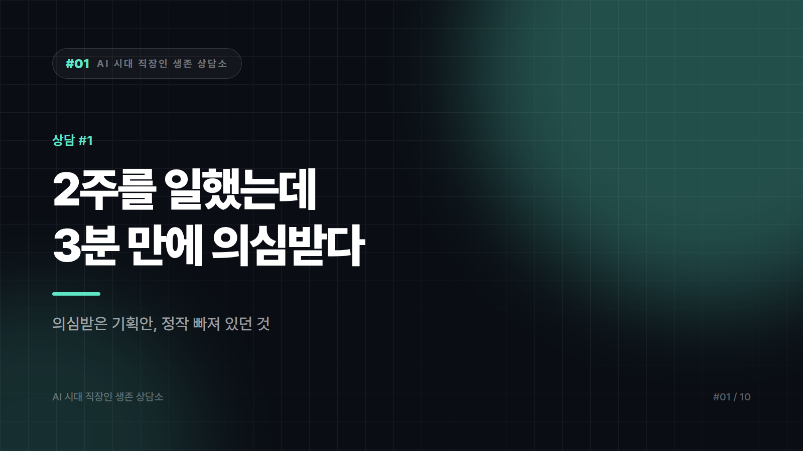

# "이거 AI로 뽑은 거 아니야?" — 의심받은 기획안

*시리즈: AI 시대 직장인 생존 상담소 | 1/10*

> 이 상담소는 여러 사람에게 들은 이야기를 섞고 다듬어 편지 형태로 재구성합니다. 등장하는 사연자는 모두 가상의 인물이며, 특정 개인이나 회사의 실제 사례가 아닙니다. 다만 고민의 모양만큼은 최대한 현실에 가깝게 깎았습니다.

---

> 안녕하세요. 입사 3년 차, 스물아홉 마케터입니다.
>
> 지난주에 신규 캠페인 기획안을 올렸습니다. 시장 조사부터 메시지 초안까지 2주를 꼬박 썼고, 그중 도입부 카피 몇 줄과 경쟁사 정리 표는 AI를 써서 초안을 잡았습니다. 물론 다 고쳤습니다.
>
> 팀장님이 문서를 3분쯤 훑더니 이렇게 말했습니다. "이거 AI로 뽑은 거 아니야? 요즘 애들 문장이 다 비슷해."
>
> 웃으면서 "참고만 했습니다"라고 답했는데, 자리에 돌아와서 손이 떨렸습니다. 억울한 것도 억울한 건데, 더 무서운 건 제가 완전히 결백하지는 않다는 겁니다. 앞으로 AI를 안 쓰면 마감을 못 맞출 것 같고, 쓰면 계속 의심받을 것 같습니다. 어느 쪽이 맞나요?
>
> — 서울, 마케팅팀 3년 차

---

손이 떨렸다는 문장에서 오래 멈췄습니다. 그 떨림은 들킬까 봐 나는 떨림이 아니었을 겁니다. 2주 치 노동이 3분 만에 부정당한 데서 오는 떨림에 가깝습니다. 두 감정은 완전히 다른데, 그 순간의 당사자는 잘 구분하지 못합니다. 그래서 죄책감처럼 느껴집니다.

벌어진 일을 냉정하게 보면 AI를 썼느냐의 문제가 아닙니다. 기획안에 당신이 일한 흔적이 보이지 않았다는 문제입니다. 팀장은 2주를 못 봤습니다. 결과물만 봤고, 결과물은 매끈했고, 매끈한 것에서는 고생의 냄새가 나지 않습니다. AI 문장의 특징이 정확히 그렇습니다. 틀리지도 않고 뾰족하지도 않습니다.

그래서 다음 보고에서는 결과물 말고 과정을 먼저 꺼내놓는 편이 낫습니다. 기획안 앞이나 뒤에 한 페이지를 붙이는 방법이 있습니다. 제목은 "이 안이 나오기까지" 정도. 검토한 경쟁사 몇 곳, 폐기한 방향 두세 개와 그걸 버린 이유, 참고한 내부 데이터의 출처. 다섯 줄이면 됩니다. 여기서 힘을 쓰는 건 살린 안이 아니라 버린 안입니다. AI는 버린 안을 보여주지 못하니까요.

문서보다 입을 먼저 쓰는 것도 방법입니다. 기획안을 열기 전에 90초만 말하는 겁니다. 이번 건에서 제일 고민한 건 A와 B 중 무엇을 버릴까였고, B를 버린 이유는 이거였다고. 이 90초를 들은 상사는 같은 문서를 다르게 읽습니다. 문서가 달라져서가 아니라 그 문서를 만든 사람이 보이기 시작해서입니다.

AI를 썼다는 사실은 먼저 밝히는 쪽이 유리합니다. 숨기면 약점이 되고 먼저 꺼내면 방법론이 됩니다. 경쟁사 표는 초안을 AI로 뽑고 수치는 원문과 대조했다고 말하는 순간, 그 표는 의심의 대상에서 검증된 공정으로 바뀝니다. 단, 대조를 실제로 했을 때만 그렇습니다. 안 하고 말하면 그건 전혀 다른 종류의 사고가 됩니다.

여기까지가 이번 주에 할 수 있는 일이고, 진짜 문제는 팀장의 의심이 아닌 것 같습니다.

당신이 두려워하는 건 AI를 썼다고 혼나는 일이 아니라, AI를 빼면 뭐가 남는지 스스로도 자신이 없다는 쪽에 가까워 보입니다. 편지에 완전히 결백하지는 않다고 쓰신 게 그 증거입니다. 결백은 규정 위반에나 쓰는 단어인데, 회사에 그런 규정이 있는지조차 확실하지 않은 상태에서 스스로를 피고인석에 세우고 계십니다.

질문을 바꿔보면 어떨까 합니다. 쓸까 말까가 아니라, 어디까지 내가 판단했나. 자료를 모으고 표를 정리하고 문장을 다듬는 걸 AI가 하는 건 계산기를 쓰는 일과 크게 다르지 않습니다. 무엇을 버릴지, 어떤 고객에게 걸지, 실패하면 누가 책임질지는 계산기가 정해주지 않습니다. 연차가 쌓일수록 회사가 돈을 내는 지점은 점점 뒤쪽으로 옮겨 갑니다.

덧붙이면, 한국 기업 전반의 AI 사용 지침은 아직 정리 중인 곳이 많습니다. 지금 회사에 문서화된 기준이 없다면 그 공백은 언젠가 누군가에게 불리하게 해석됩니다. 대외 문서는 사실관계 재확인 필수, 고객 정보 입력 금지. 이 정도의 팀 원칙을 당신이 먼저 제안해두면 다음에 같은 질문을 받을 때 기댈 데가 생깁니다.

당신은 2주를 일했습니다. 그 2주가 보이지 않았을 뿐입니다. 다음 보고 때는 버린 것들을 먼저 보여주시면 좋겠습니다. 고생한 티를 내라는 게 아니라 판단한 티를 내라는 뜻입니다. 그 둘의 차이를 아는 3년 차는 생각보다 드뭅니다.

---

*다음 편: [#2] "AI가 다 짜주는데 제 실력은 언제 늘죠?" — 입사 6개월 차 개발자의 편지*

---

본문에 그림이 들어가면 좋을 자리는 아래와 같다. 실제 이미지는 아직 넣지 않았다.

〔이미지 자리 — 본문에서 1번째 논점을 설명하는 대목〕

〔이미지 자리 — 본문에서 2번째 논점을 설명하는 대목〕

〔이미지 자리 — 본문에서 3번째 논점을 설명하는 대목〕

〔이미지 자리 — 마지막 문단 바로 위〕
