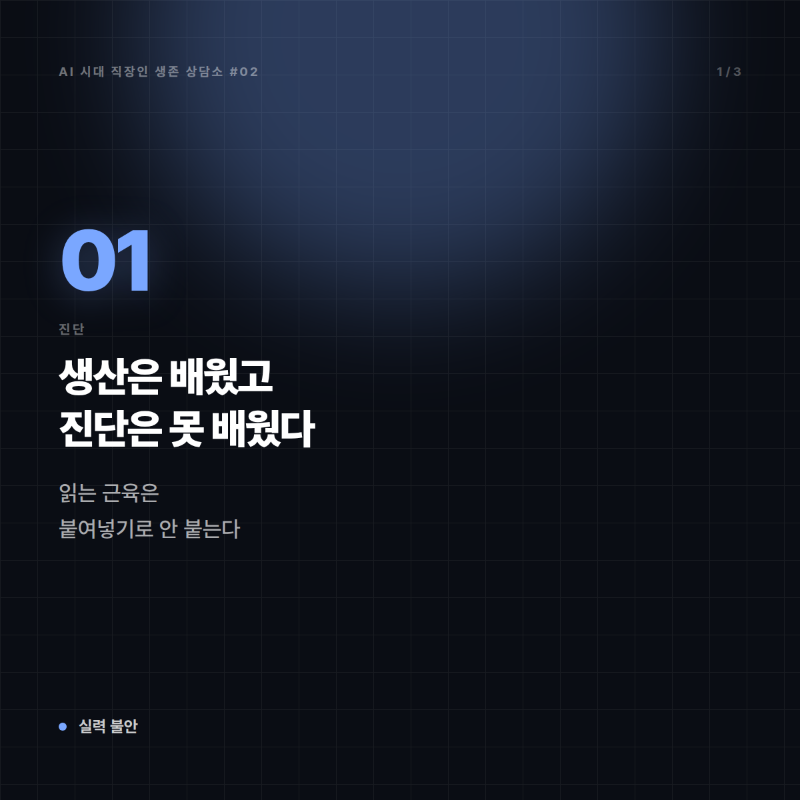
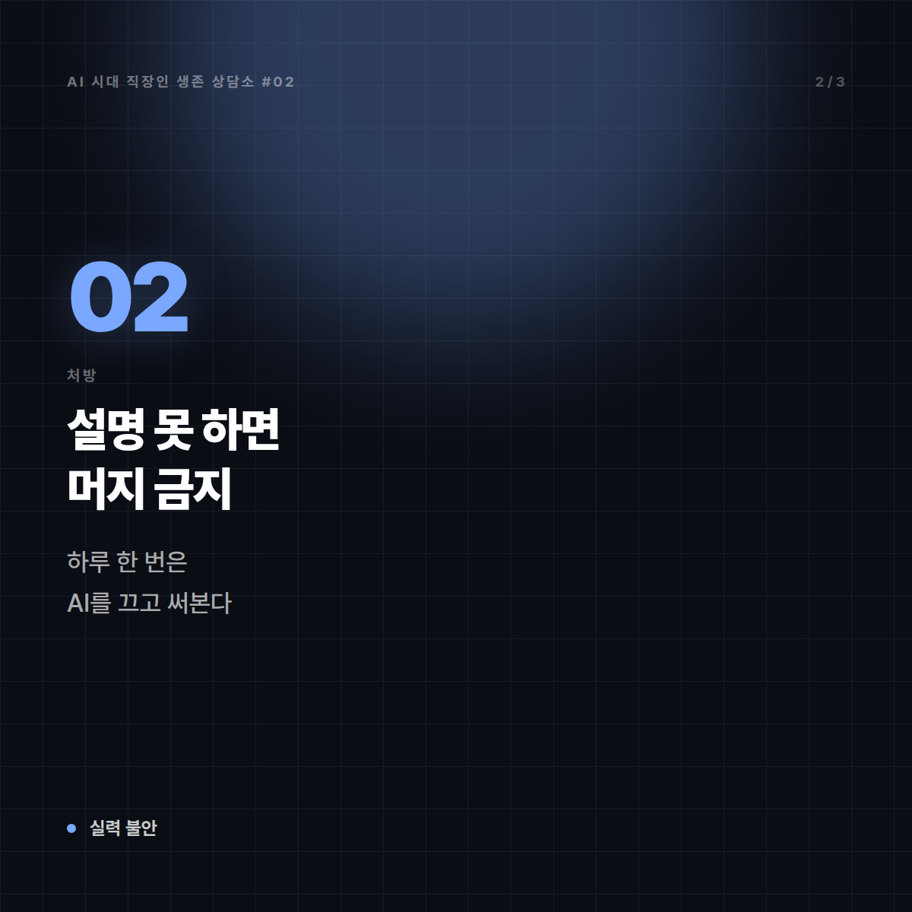
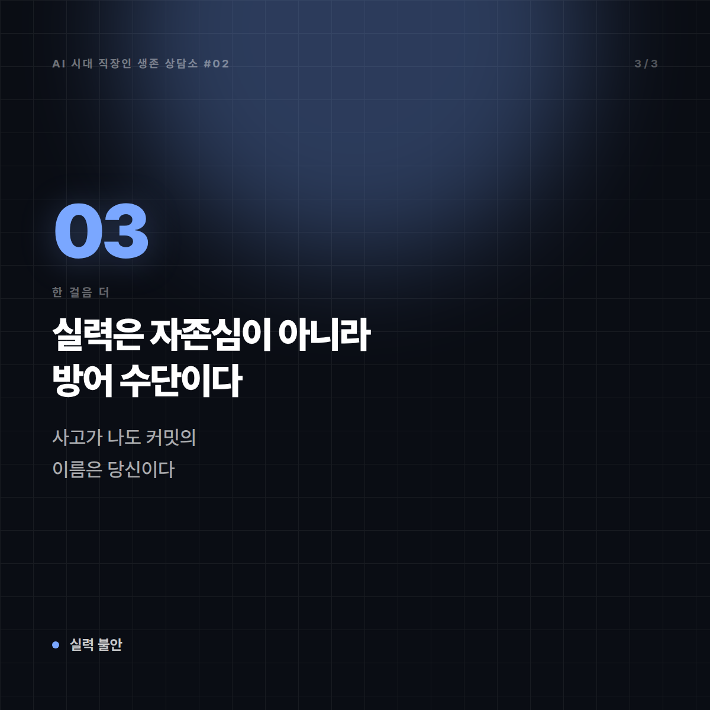
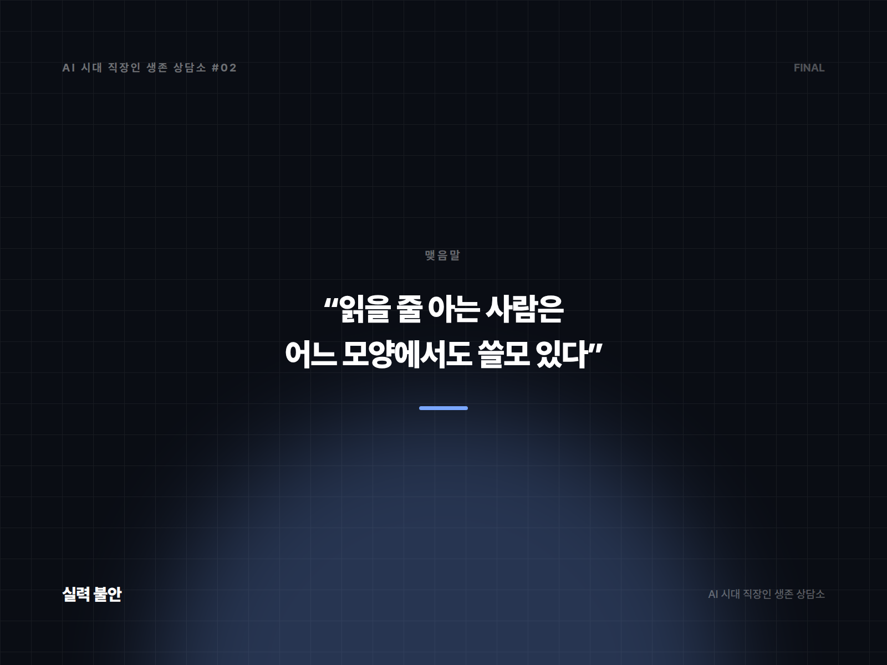

# [AI 시대 직장인 생존 상담소 #2] "AI가 다 짜주는데, 제 실력은 언제 늘죠?"

*시리즈: AI 시대 직장인 생존 상담소 | 2/10*

---

## 📮 사연

> 입사 6개월 된 스물여섯 백엔드 개발자입니다.
>
> 부끄러운 이야기인데, 제가 지난 6개월간 짠 코드 중에 처음부터 끝까지 제 머리에서 나온 건 거의 없습니다. 기능 하나 맡으면 AI에게 설명하고, 나온 코드를 붙이고, 에러가 나면 에러를 다시 붙여넣습니다. 돌아갑니다. 리뷰도 통과합니다. 사수는 "빠르다"고 칭찬합니다.
>
> 그런데 지난달 장애가 났을 때, 제가 짠 모듈인데도 어디서 터졌는지 못 찾았습니다. 결국 사수가 20분 만에 잡았습니다. 그날 이후로 무섭습니다. 저는 개발자가 되고 있는 게 맞나요? 아니면 AI 출력물 붙여넣는 사람이 되고 있나요?
>
> — 판교, 백엔드 6개월 차

---

## ☕ 답변

"돌아갑니다. 리뷰도 통과합니다." 이 두 문장 다음에 곧바로 "무섭습니다"가 오는 편지는, 이미 문제를 절반쯤 푼 편지입니다. 대부분은 칭찬받는 동안 무서워하지 않습니다. 그 감각을 잃지 마세요. 그게 지금 당신이 가진 가장 비싼 자산입니다.

진단은 이렇습니다. 당신은 **생산은 배웠고 진단은 못 배웠습니다.** 코드를 만드는 일은 AI가 대신해도 티가 안 나지만, 장애는 만드는 일이 아니라 **읽는 일**입니다. 읽는 근육은 붙여넣기로는 절대 안 붙습니다. 6개월간 출력은 늘고 입력은 안 는 상태였던 겁니다.

이번 주부터 할 수 있는 것들입니다.

**1. "설명 못 하면 머지 금지" 규칙을 스스로에게 겁니다.**
PR 올리기 전에 혼잣말로 3분 설명해 보세요. 이 함수가 왜 여기 있고, 이 조건문이 빠지면 무슨 일이 나는지. 막히는 줄이 있으면 그 줄이 당신의 구멍입니다. 3분이면 됩니다. 하루 10분도 안 걸립니다.

**2. 하루에 한 번은 AI를 끄고 씁니다.**
전부 끄라는 게 아닙니다. **가장 작은 작업 하나만** 맨손으로 하세요. 유틸 함수 하나, 테스트 케이스 하나. 시간은 세 배 걸리고 결과물은 더 못생겼을 겁니다. 그게 정상입니다. 근육통 없는 운동이 없습니다.

**3. 장애 복기를 자기 것으로 만드세요.**
지난달 그 장애, 사수가 20분 만에 잡았죠. 가서 물어보세요. "어디부터 보셨어요? 로그 어느 줄에서 감 잡으셨어요?" 정답이 아니라 **탐색 순서**를 물어야 합니다. 그리고 그 순서를 메모에 남기세요. 3개월이면 당신만의 디버깅 체크리스트가 생깁니다. 이건 AI에게 물어도 잘 안 나옵니다. 이 시스템의 로그는 이 회사에만 있으니까요.

**4. 코드를 받을 때 질문을 하나 더 던지세요.**
"이 코드 왜 이렇게 짰어?"와 "이 방식의 단점은?"을 AI에게 되묻는 습관. 답을 그대로 믿으라는 게 아니라, **의심하는 각도를 배우기 위해서**입니다.

---

## 🔍 한 걸음 더

여기서 판을 한 번 뒤집겠습니다. 사실 당신이 정말 걱정해야 할 건 "실력이 안 느는 것"이 아닙니다.

**책임이 어디 있는지**입니다.

장애가 났을 때 회사가 부르는 사람은 코드를 만든 존재가 아니라 **이름이 적힌 사람**입니다. 커밋에는 당신 이름이 박힙니다. 사고가 나면 AI는 소환되지 않습니다. 그러니까 지금 구조는 이렇습니다 — 생산의 즐거움은 도구가 가져가고, 책임은 온전히 당신에게 남습니다. 이 비대칭을 견디는 유일한 방법이 "읽을 줄 아는 것"입니다. 실력은 자존심 문제가 아니라 **방어 수단**입니다.

또 하나. 6개월 차가 AI를 쓰는 게 잘못이라는 말은 하지 않겠습니다. 안 쓰고 버티는 게 미덕인 시절은 지났고, 앞으로 신입에게 요구되는 속도는 당신이 지금 내는 속도가 기준이 될 가능성이 큽니다. 다만 **속도가 기본값이 되면 변별력은 다른 데서 생깁니다.** 5년 뒤 당신 또래가 다 빠를 때, 남는 차이는 "이 시스템을 이해하는가"입니다. 지금 사수가 20분 만에 원인을 찾은 그 능력 말입니다.

몇 년 뒤 개발자 직무가 어떤 모양일지는 저도 단언하지 못합니다. 그건 아무도 확실히 모릅니다. 확실한 건 하나입니다. **읽을 줄 아는 사람은 어느 모양에서도 쓸모가 있습니다.**

---

## ✉️ 맺음말

칭찬받는 중에 무서워할 줄 아는 6개월 차는 흔치 않습니다.

빠른 건 이미 하셨으니, 이제 느린 걸 하나만 끼워 넣으세요. 하루 한 개, 맨손으로. 6개월 뒤에 다시 장애가 나면, 그때는 당신이 20분 만에 찾을 겁니다.

---

*본 사연은 여러 사례를 조합해 각색한 가상의 편지입니다.*
*다음 편: [#3] "팀원 결과물을 제가 검수할 수가 없습니다" — 마흔한 살 팀장의 편지*

---

## 🖼 이미지 (5장)

이 포스팅 전용으로 제작한 이미지입니다. 원본은 `images/02_실력이안늘어요/` 폴더에 있습니다.

**대표 썸네일 (1600×900)**

**본문 카드 1 (1200×1200)**

**본문 카드 2 (1200×1200)**

**본문 카드 3 (1200×1200)**

**마무리 카드 (1600×1200)**

