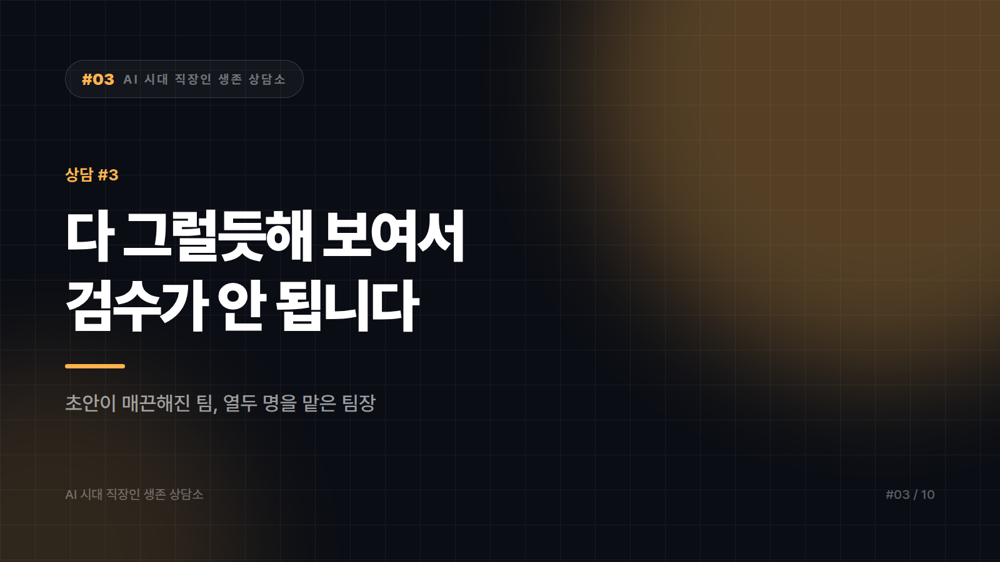

# "팀원이 AI로 만든 걸, 제가 검수할 수가 없습니다"

*시리즈: AI 시대 직장인 생존 상담소 | 3/10*

---

> 마흔한 살, 열두 명짜리 기획팀을 맡고 있는 팀장입니다.
>
> 요즘 팀원들이 올리는 문서가 훌륭합니다. 분량도 많고 표도 예쁘고 문장도 매끄럽습니다. 문제는 제가 그걸 검증할 시간이 없다는 겁니다. 예전엔 초안이 거칠어서 어디가 약한지 금방 보였는데, 지금은 전부 다 그럴듯해 보입니다.
>
> 지난주에 그대로 올린 보고서에서 임원이 숫자 하나를 짚었습니다. 출처를 물었는데 아무도 몰랐습니다. 작성자도 "AI가 정리해준 거라…"고 했습니다. 제 얼굴이 화끈거렸습니다.
>
> 팀원들에게 AI 쓰지 말라고 할 수는 없습니다. 저도 씁니다. 그런데 이대로 가면 언젠가 크게 한 번 터질 것 같습니다. 관리자는 이 상황을 어떻게 다뤄야 합니까?
>
> — 수도권, 기획팀장 (팀원 12명)

---

전부 다 그럴듯해 보인다. 이 문장이 편지의 핵심입니다.

관리자의 검수는 원래 편차를 찾는 일이었습니다. 못 쓴 부분이 눈에 띄니까 거기를 파면 됐습니다. 그런데 도구가 바닥을 올려버리면 편차가 사라지고, 눈으로 하는 검수는 그 순간 무력해집니다. 당신의 검수 능력이 떨어진 게 아니라 검수 방식이 수명을 다한 겁니다.

그래서 감을 절차로 바꾸는 수밖에 없습니다. 팀 회의 15분이면 대부분 세팅됩니다.

첫째는 숫자에 주인을 붙이는 일입니다. 보고서에 들어가는 모든 수치 옆에 출처를 괄호로 답니다. 상반기 내부 정산, 재무팀 제공 같은 식으로요. 출처를 못 다는 숫자는 문서에서 뺍니다. 논쟁할 일이 아닙니다. 뺄 수 있는 숫자였다면 애초에 근거가 없던 겁니다.

문서 맨 뒤에 확인 로그 세 줄을 붙이는 것도 효과가 큽니다. 누가 무엇을 어떻게 확인했는지. 경쟁사 가격은 공식 홈페이지에서 직접 확인, 고객 인터뷰 인용은 녹취 원문 대조. 이 세 줄이 당신의 방패이자 팀원의 훈련 도구가 됩니다. 쓰다 보면 본인이 뭘 안 봤는지 스스로 알게 되거든요.

검수의 대상도 결과물에서 근거로 옮기는 편이 낫습니다. 문서를 처음부터 끝까지 읽는 건 시간도 없고 효과도 없습니다. 대신 가장 위험한 주장 세 개를 골라 그것만 뿌리까지 팝니다. 보고서가 무너지는 자리는 언제나 문장이 아니라 전제입니다.

대외 문서와 내부 문서를 갈라두는 것도 필요합니다. 외부로 나가는 문서, 고객 데이터가 들어간 문서, 계약과 법무 관련 문서는 기준을 따로 둡니다. 내부 브레인스토밍에 AI를 쓰는 일과 고객사 제안서에 검증 안 된 수치를 넣는 일은 위험의 크기가 아예 다릅니다.

## 검수보다 먼저 사라진 것

사실 더 큰 문제는 검수가 아닙니다. 팀원이 어디까지 아는지 알아볼 통로가 없어진 쪽입니다.

예전엔 거친 초안이 곧 진단서였습니다. 문장이 엉키면 생각이 엉킨 것이었고, 그걸 보고 누구를 어떻게 키울지 정할 수 있었습니다. 지금은 모든 초안이 깨끗하게 도착하니 사람이 보이지 않습니다. 한두 해 지나면 누가 잘하는지 모르겠다는 상태가 오고, 그때는 평가도 육성도 배치도 같이 흔들립니다.

그래서 관리자가 새로 만들어야 하는 건 검수 절차가 아니라 말로 확인하는 자리입니다. 문서 제출과 별개로 10분짜리 구두 브리핑을 루틴에 넣고, 이번 건에서 제일 애매했던 부분이 뭐였냐고 묻습니다. 답하는 모습을 보면 그 사람이 문서의 어디까지를 자기 것으로 소화했는지 3분이면 드러납니다. 문서는 매끈해져도 애매한 지점을 짚어내는 능력은 아직 대체되지 않았습니다.

하나 더 솔직하게 말씀드리면, 사고가 났을 때 조직이 묻는 대상은 대개 작성자가 아니라 결재선입니다. 이건 AI 시대의 특징이 아니라 원래 그랬습니다. 다만 그럴듯한 오류가 예전보다 훨씬 쉽게 통과하니 결재자의 노출 위험만 올라간 것입니다. 위의 규칙들은 팀원 관리용이기 이전에 당신을 위한 장치입니다.

얼굴이 화끈거렸다는 건 그 자리를 진지하게 맡고 있다는 뜻입니다. 완벽한 검수는 앞으로도 불가능하겠지만, 어디서 뚫렸는지 알 수 있는 팀은 만들 수 있습니다. 이번 주 회의 15분, 규칙 세 줄이면 시작은 됩니다.

---

*본 사연은 여러 사례를 조합해 각색한 가상의 편지입니다.*
*다음 편: [#4] "제 업무가 자동화 대상이 됐습니다" — 경리 15년 차의 편지*

---

본문에 그림이 들어가면 좋을 자리는 아래와 같다. 실제 이미지는 아직 넣지 않았다.

〔이미지 자리 — 본문에서 1번째 논점을 설명하는 대목〕

〔이미지 자리 — 본문에서 2번째 논점을 설명하는 대목〕

〔이미지 자리 — 본문에서 3번째 논점을 설명하는 대목〕

〔이미지 자리 — 마지막 문단 바로 위〕
