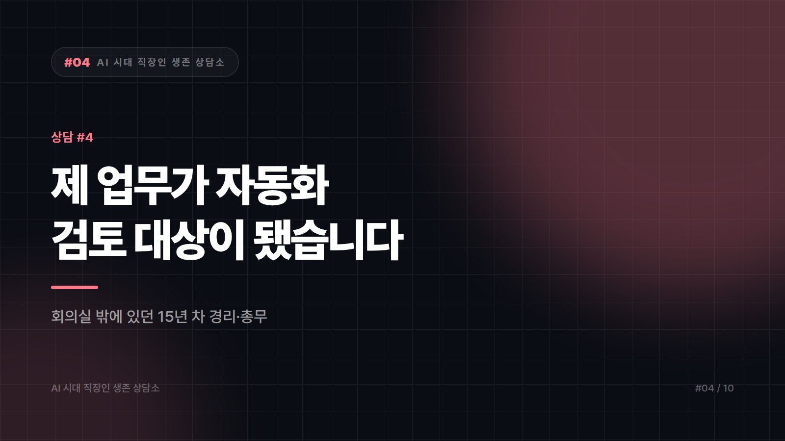

# [AI 시대 직장인 생존 상담소 #4] "제 업무가 자동화 검토 대상이 됐습니다"

*시리즈: AI 시대 직장인 생존 상담소 | 4/10*

---

> 마흔일곱 살, 중소 제조업체에서 경리·총무를 15년 했습니다.
>
> 지난달 대표님이 외부 업체를 불러 "전표 처리랑 정산 자동화" 컨설팅을 받았습니다. 회의실에서 제 업무 흐름도가 화면에 떠 있는 걸 봤습니다. 저는 그 회의에 안 들어갔습니다. 아무도 부르지 않았습니다.
>
> 제가 하는 일이 반복적인 건 압니다. 매입 전표 입력하고, 세금계산서 맞춰보고, 급여 자료 정리하고. 15년 하다 보니 눈 감고도 합니다. 그런데 그게 곧 "기계로 되는 일"이라는 뜻인 것 같아서, 요즘 출근길이 무겁습니다.
>
> 이 나이에 다른 걸 배우라는 말은 저도 많이 들었습니다. 뭘 배우라는 건지는 아무도 말 안 해줍니다.
>
> — 경기 남부, 경리·총무 15년 차

---

## 아무도 부르지 않았다는 것

가장 아픈 대목은 자동화가 아니라 이 문장이라고 생각합니다. 15년 치 업무 흐름도가 화면에 떠 있는데, 그 흐름을 제일 잘 아는 사람이 회의실 밖에 있었습니다. 그건 능력 평가가 아니라 정보에서 배제된 사건이고, 실제로 위험한 쪽도 그쪽입니다.

상황은 냉정하게 보겠습니다. 전표 입력, 계산서 대사, 정산 같은 정형 반복 업무가 소프트웨어로 넘어가는 흐름은 오래전부터 진행돼 왔습니다. AI 때문에 시작된 게 아니라 속도가 붙었습니다. 우리 회사는 안 될 거라고 버티는 건 도움이 되지 않습니다. 그렇다고 그러니 곧 잘린다는 말도 사실은 아닙니다. 도입 후에 실제로 벌어지는 일은 대개 인력 삭감보다 업무 재배치 쪽이고, 그 재배치에서 좋은 자리를 잡는 사람은 시스템을 아는 사람입니다. 지금 필요한 건 이직 준비보다 그 회의실에 들어가는 일입니다.

들어가는 방법은 의외로 단순합니다. 흐름도를 당신 손으로 다시 그려서 내는 겁니다. 컨설팅 업체가 그린 그림에는 반드시 빠진 게 있습니다. 예외 처리입니다. 거래처가 계산서를 늦게 끊을 때, 금액이 안 맞을 때, 대표님이 현금으로 결제했을 때 어떻게 처리하는지. A4 한 장에 정상 흐름과 예외 흐름을 나눠 적고 제목을 "자동화 검토 시 확인 필요 사항"쯤으로 붙여 대표님께 드리면 됩니다. 이 종이 한 장이면 회의 참석자 명단이 바뀝니다.

예외 목록은 15년 치로 뽑아두시면 좋겠습니다. 자동화 프로젝트가 넘어지는 자리는 예외입니다. 당신 머릿속에만 있는 그 목록이 이 회사에서 가장 희소한 자산인데, 문서로 만들면 사라지는 게 아니라 당신이 그 문서의 저자가 됩니다.

도구도 하나쯤은 익혀두는 게 유리합니다. 다만 코딩을 배우라는 조언은 이 상황에서 별 도움이 안 됩니다. 지금 쓰는 회계 프로그램과 엑셀에서 시작하면 됩니다. 반복되는 대사 작업 하나를 골라 함수나 자동화 기능으로 줄여보고 그 결과를 보고하는 겁니다. 두 시간 걸리던 게 20분이 됐다는 보고를 한 번이라도 올린 사람은 자동화의 대상이 아니라 담당자로 분류됩니다. 이 차이가 생각보다 결정적입니다.

## 당신이 가진 무기

나이도 연차도 아닙니다. 책임을 질 수 있다는 점입니다.

경리 업무의 본질은 입력이 아니라 맞다고 말하는 것입니다. 세무서에서 소명 요구가 오면 시스템이 대답하지 않습니다. 사람이 대답합니다. 결산을 승인하고, 자료가 맞다고 서명하고, 틀렸을 때 어디를 봐야 하는지 아는 사람. 자동화가 늘수록 검증하고 책임지는 자리의 값은 오히려 올라갑니다. 15년간 쌓은 게 입력 속도라고 생각하셨다면 그건 과소평가입니다. 쌓으신 건 이 회사의 돈이 어떻게 흐르는가에 대한 지도입니다.

솔직하게 말씀드릴 부분도 있습니다. 회사가 인력 조정을 염두에 두고 있다면 그건 개인의 노력으로 다 막을 수 있는 영역이 아닙니다. 그래서 두 가지를 같이 해두시는 편이 안전합니다. 하나는 업무 기록과 성과를 개인 이력으로 정리해두는 것입니다. 무슨 시스템을 다뤘고 몇 건을 처리했고 어떤 개선을 했는지. 다른 하나는, 권고사직이나 계약 변경 이야기가 실제로 나오면 그 자리에서 서명하지 않고 노무사나 고용노동부 상담을 먼저 받는 것입니다. 절차와 요건에 따라 결과가 크게 달라지는 영역이라, 이 글이 법률 조언을 대신할 수는 없습니다.

출근길이 무겁다는 건 회피하지 않고 있다는 뜻입니다. 이번 주에 A4 한 장, 예외 목록부터 써보시면 어떨까요. 그 종이가 화면에 떠 있던 흐름도의 주인이 누구인지 다시 정할 겁니다.

---

*본 사연은 여러 사례를 조합해 각색한 가상의 편지입니다. 법률·노무 사안은 반드시 전문가 상담을 거치시기 바랍니다.*
*다음 편: [#5] "외주가 반으로 줄었습니다" — 서른셋 디자이너의 편지*

---

본문에 그림이 들어가면 좋을 자리는 아래와 같다. 실제 이미지는 아직 넣지 않았다.

〔이미지 자리 — 본문에서 1번째 논점을 설명하는 대목〕

〔이미지 자리 — 본문에서 2번째 논점을 설명하는 대목〕

〔이미지 자리 — 본문에서 3번째 논점을 설명하는 대목〕

〔이미지 자리 — 마지막 문단 바로 위〕
