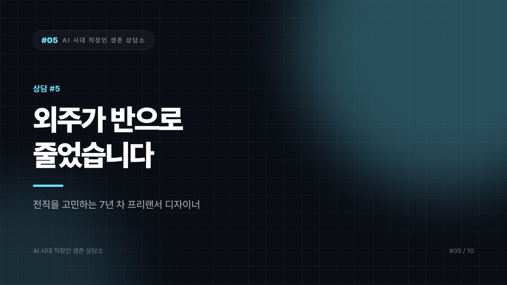

# "외주가 반으로 줄었습니다" — 전직을 고민하는 디자이너

*시리즈: AI 시대 직장인 생존 상담소 | 5/10*

---

> 서른셋, 프리랜서 그래픽 디자이너 7년 차입니다. 주로 상세페이지와 SNS 콘텐츠, 가끔 브랜딩을 했습니다.
>
> 작년 하반기부터 일이 줄었습니다. 거래처 두 곳이 "내부에서 직접 해보기로 했다"며 끊었고, 한 곳은 단가를 30% 깎자고 했습니다. 실제로 그 회사 인스타를 보니 예전에 제가 하던 톤과 비슷한 이미지가 계속 올라옵니다. 잘 만든 건 아닙니다. 그런데 그 정도면 됐다고 생각하는 것 같습니다.
>
> 요즘 UX나 기획 쪽으로 전직을 알아보고 있습니다. 그런데 거기도 이미 사람이 넘칩니다. 7년을 쌓은 걸 버리고 옮기는 게 맞는 건지, 아니면 버티는 게 맞는 건지 모르겠습니다.
>
> — 부산, 프리랜서 디자이너 7년 차

---

"잘 만든 건 아닙니다. 그런데 그 정도면 됐다고 생각하는 것 같습니다." 이번 상담에서 가장 정확한 진단은 이 두 문장입니다. 답의 절반을 이미 써서 보내셨습니다.

시장에서 벌어진 일은 품질 경쟁이 아니라 기준선의 이동입니다. 예전에는 60점을 만들려면 사람을 써야 했고 그래서 60점짜리 일감이 존재했습니다. 지금은 60점이 사내에서 나옵니다. 사라진 건 디자이너가 아니라 60점 시장입니다. 90점 시장은 남아 있습니다. 다만 예전보다 좁고, 들어가는 문이 다릅니다.

그래서 지금 정해야 할 것도 전직이냐 버티기냐가 아닌 것 같습니다. 내 포트폴리오가 60점 시장용인지 90점 시장용인지 쪽입니다. 7년 치 작업물을 펼쳐놓고 두 무더기로 나눠보면 금방 보입니다. 요청받은 걸 예쁘게 구현한 것, 그리고 문제를 정의하고 방향을 바꾼 것. 후자가 세 건 이상이면 옮길 필요가 없습니다. 포장만 바꾸면 됩니다. 한 건도 없다면 실력 문제라기보다 그동안 그런 일을 맡을 자리에 서본 적이 없다는 뜻이고, 그건 전직이 아니라 거래 방식을 바꿔서 풀리는 문제입니다.

포트폴리오는 결과물 나열에서 사례 서술로 바꾸는 게 좋겠습니다. 이미지만 걸지 말고 각 건에 네 줄을 답니다. 클라이언트의 문제, 내가 제안한 방향, 반대하거나 수정한 지점, 그리고 결과 수치. 전환율이든 문의 수든 판매 변화든 아는 범위에서만 쓰고, 모르면 비워두는 편이 낫습니다. AI로는 이 네 줄이 나오지 않습니다.

단가를 30% 깎자는 요청에는 범위로 답하는 방법이 있습니다. 같은 일을 30% 싸게 하면 다음 협상의 출발선이 거기서 시작됩니다. 대신 그 예산이면 시안 수와 수정 횟수를 이렇게 조정하겠다고 제안하면, 가격이 아니라 구조를 협상하는 사람이라는 인상이 남습니다. 그 인상은 다음 건에서 값을 합니다.

만들어주는 일 옆에 봐주는 일을 붙여두는 것도 방법입니다. 직접 만들기 시작한 그 거래처들은 곧 벽에 부딪힙니다. 톤이 안 맞고, 브랜드가 흔들리고, 어느 게 나은지 판단을 못 합니다. 그때 필요한 건 제작이 아니라 감수와 가이드입니다. 지금 연락해서 직접 하시는 것들 월 1회 점검해드리는 건 어떠냐고 물어보는 정도면 충분합니다. 제작 단가보다 낮게 시작하더라도 이건 잘 끊기지 않는 자리입니다.

전직 이야기로 돌아가 보겠습니다. UX나 기획이 탈출구처럼 보이지만 냉정하게 보면 그쪽도 안전지대는 아닙니다. 산출물이 화면이든 문서든, 요청받은 걸 구현하는 위치에 있으면 같은 압력이 옵니다. 직군을 바꿔서 피해지는 게 아니라 판단하는 자리로 옮겨야 피해집니다. 전직이 틀렸다는 말이 아니라, 결정하기 전에 옮긴 곳에서 나는 판단하는 쪽인지를 먼저 확인해보시라는 뜻입니다.

한 가지 덜 이야기되는 것도 말씀드리고 싶습니다. 7년 차 프리랜서의 진짜 자산은 감각보다 관계 쪽입니다. 지금 잃은 건 거래처 두 곳이고, 그건 실력이 아니라 채널이 줄어든 겁니다. 채널 복구는 새 포트폴리오 사이트보다 끊긴 곳에 연락하는 쪽이 빠릅니다. 자존심이 걸리는 일이라는 걸 압니다. 그래도 이건 구걸이 아니라 영업입니다. 요즘 직접 하신다고 들었는데 잘 되고 계시냐고 묻는 안부 연락 다섯 통이 이번 달에 할 수 있는 가장 수익률 높은 작업일 겁니다.

앞으로 디자인 시장이 어떤 모양이 될지 확언할 수 있는 사람은 없습니다. 확실한 건 60점을 파는 자리가 계속 좁아진다는 것 하나입니다.

7년을 버린다는 표현만은 쓰지 않으셨으면 합니다. 7년간 쌓은 건 툴 숙련도가 아니라 클라이언트의 애매한 말을 화면으로 번역하는 능력이고, 그건 어디로 옮겨도 따라옵니다. 이번 주에는 이력서 말고 연락 다섯 통부터입니다.

---

*본 사연은 여러 사례를 조합해 각색한 가상의 편지입니다.*
*다음 편: [#6] "AI 쓰면 싸게 되잖아요" — 단가 후려치기에 시달리는 프리랜서 작가*

---

본문에 그림이 들어가면 좋을 자리는 아래와 같다. 실제 이미지는 아직 넣지 않았다.

〔이미지 자리 — 본문에서 1번째 논점을 설명하는 대목〕

〔이미지 자리 — 본문에서 2번째 논점을 설명하는 대목〕

〔이미지 자리 — 본문에서 3번째 논점을 설명하는 대목〕

〔이미지 자리 — 마지막 문단 바로 위〕
