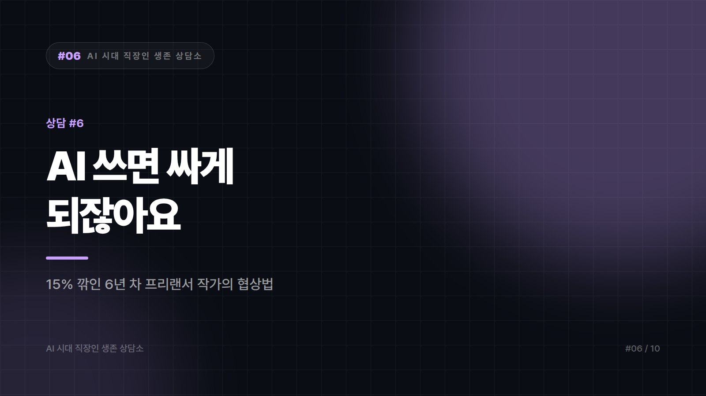

# "AI 쓰면 싸게 되잖아요" — 단가를 깎이는 프리랜서

*시리즈: AI 시대 직장인 생존 상담소 | 6/10*

---

> 서른여섯, 프리랜서 카피라이터 겸 콘텐츠 작가입니다. 6년 됐습니다.
>
> 지난달 오래 거래한 에이전시 담당자가 이렇게 말했습니다. "요즘 AI 쓰시잖아요. 그럼 시간 얼마 안 걸리시는 거 아니에요? 건당 단가를 좀 조정했으면 하는데요."
>
> 사실 씁니다. 자료 조사와 구성 초안은 AI로 잡고, 문장은 제가 다시 씁니다. 덕분에 예전보다 빨라진 건 맞습니다. 그래서 말문이 막혔습니다. 아니라고 하면 거짓말이고, 맞다고 하면 단가가 깎입니다.
>
> 결국 15% 깎인 금액으로 계약했습니다. 그 뒤로 다른 거래처들도 비슷한 말을 꺼낼까 봐 겁이 납니다. 뭐라고 답했어야 했나요?
>
> — 대구, 프리랜서 작가 6년 차

---

말문이 막힌 건 정직해서입니다. 다만 그 정직함이 잘못된 질문 앞에서 발휘됐습니다.

AI 쓰면 시간 얼마 안 걸리죠, 라는 질문에는 가격의 근거가 시간이라는 전제가 깔려 있습니다. 이 전제에 한 번 동의하면 그다음은 전부 방어전이 됩니다. 빨라질수록 더 깎이니까요. 논리를 끝까지 밀면 0원에서 만납니다. 그러니 필요했던 답은 얼마 안 걸린다도, 많이 걸린다도 아니라 전제를 옮기는 문장이었습니다.

> "네, 초안은 빨라졌습니다. 그래서 요즘은 같은 예산이면 시안을 두 개 드리거나, 발행 후 성과 보고 한 번을 더 넣습니다. 단가를 낮추는 대신 받으시는 걸 늘리는 쪽이 어떨까요?"

가격 협상을 범위 협상으로 옮기는 것. 이게 이 상황의 기술 전부입니다. 상대가 원하는 건 대개 싸게가 아니라 예산 대비 더입니다. 둘은 다릅니다. 앞쪽에 응하면 다음 계약의 출발선이 영구히 내려가고, 뒤쪽에 응하면 단가는 지켜집니다.

견적서 양식부터 바꿔두면 이 대화가 훨씬 쉬워집니다. 지금은 아마 원고 1건에 얼마로 돼 있을 텐데, 항목을 쪼개는 겁니다. 리서치, 구성안, 원고, 수정 2회, 발행 후 점검. 항목이 보이면 깎는 대화가 무엇을 뺄까로 바뀝니다. 통짜 금액은 통짜로 깎이고, 쪼갠 금액은 쪼개서 협상됩니다.

이미 서명한 건은 되돌리기 어렵습니다. 대신 다음 건에서 수정 횟수나 납기를 조정하면서 지난번 단가 기준이라 이 범위로 잡았다고 말하는 방법이 있습니다. 가격과 범위가 연동된다는 걸 한 번 겪게 하는 쪽이 열 마디 설득보다 빠릅니다. 계약서에 확정된 방향이 변경될 경우 추가 건으로 산정한다는 한 줄을 넣어두는 것도 값이 쌉니다. 실제로 청구하지 않더라도 무한 수정 요청은 눈에 띄게 줄어듭니다.

그리고 이번 달에 신규 문의처 세 곳. 단가 협상력의 팔 할은 말솜씨가 아니라 대안의 존재에서 나옵니다. 거래처가 두 곳이면 어떤 화법도 먹히지 않습니다.

## 그 담당자도 깎으라는 말을 들었을 겁니다

판을 한 번 뒤집어 보면, 그는 당신을 후려치려던 게 아닐 가능성이 큽니다. 위에서 예산 삭감 압박을 받고 있었고 마침 AI라는 명분이 생긴 것에 가깝습니다. 콘텐츠 예산이 조여지는 흐름은 여러 업계에서 관찰되고 있고, AI는 그 결정을 정당화하기 좋은 단어입니다.

이 구도를 이해하면 대응이 달라집니다. 이겨야 할 상대가 아니라 윗선에 들고 갈 명분을 만들어줘야 할 파트너로 보이니까요. 단가는 유지하되 성과 보고를 붙여드릴 테니 그걸로 예산을 방어하시라는 제안이 잘 먹히는 이유가 여기 있습니다.

조금 더 근본적인 얘기도 해야겠습니다. 파는 게 원고인 한 단가 압박은 계속됩니다. 원고는 이제 흔합니다. 흔하지 않은 건 이 문장이 왜 이 고객에게 먹히는지 설명할 수 있는 사람입니다. 6년 치 작업 중 성과가 좋았던 걸 몇 개 골라 왜 먹혔는지 한 문단씩 정리해두면, 다음 미팅에서 그 얘기를 꺼내는 순간 호칭이 바뀝니다. 외주 작가에서 콘텐츠 판단자로. 그 호칭은 시간당 단가로 계산되지 않습니다.

15%는 되돌리기 어렵습니다. 대신 다음 협상의 문장은 지금 준비해둘 수 있습니다. 네, 빨라졌습니다. 그래서 더 드릴 수 있습니다. 이 두 문장을 소리 내어 몇 번 읽어두면, 다음에 같은 질문이 왔을 때는 말문이 막히지 않을 겁니다.

---

*본 사연은 여러 사례를 조합해 각색한 가상의 편지입니다.*
*다음 편: [#7] "포트폴리오가 다 비슷해 보인대요" — 스물여섯 비전공 취준생의 편지*

---

본문에 그림이 들어가면 좋을 자리는 아래와 같다. 실제 이미지는 아직 넣지 않았다.

〔이미지 자리 — 본문에서 1번째 논점을 설명하는 대목〕

〔이미지 자리 — 본문에서 2번째 논점을 설명하는 대목〕

〔이미지 자리 — 본문에서 3번째 논점을 설명하는 대목〕

〔이미지 자리 — 마지막 문단 바로 위〕
