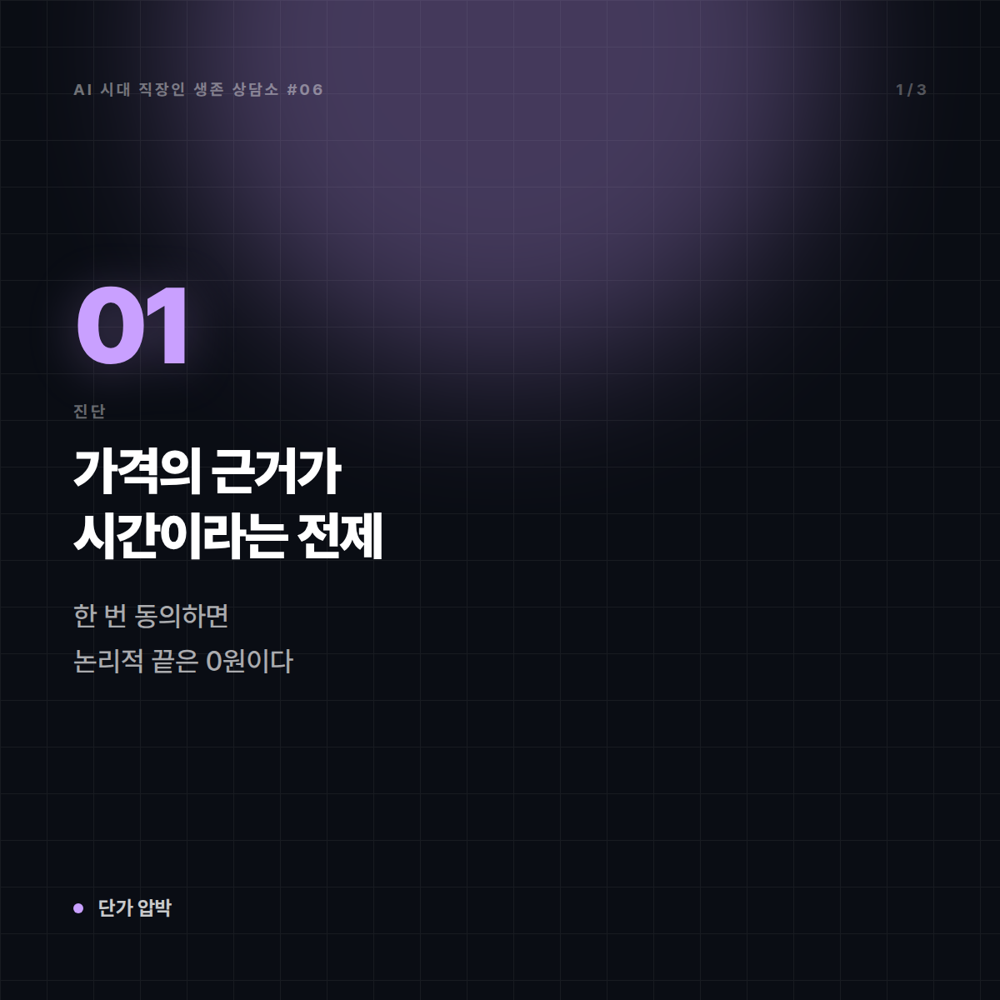
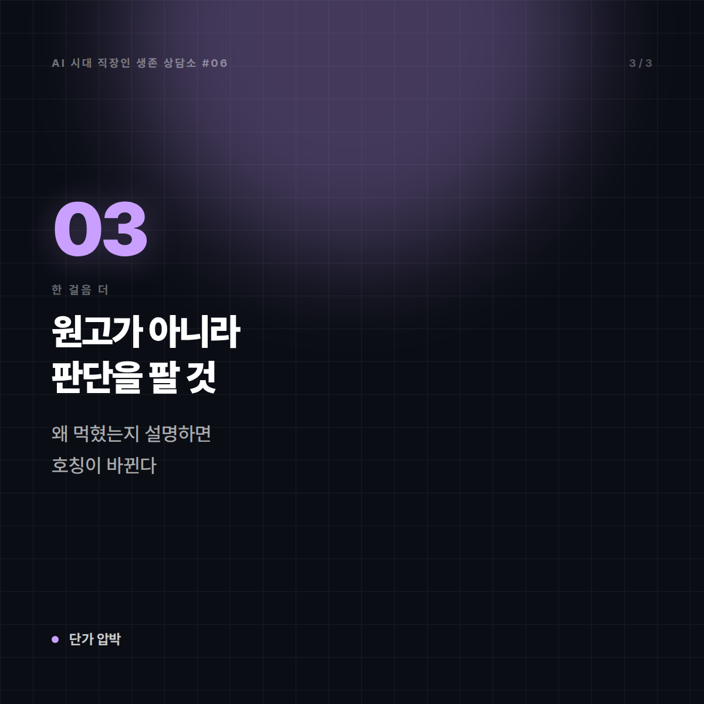
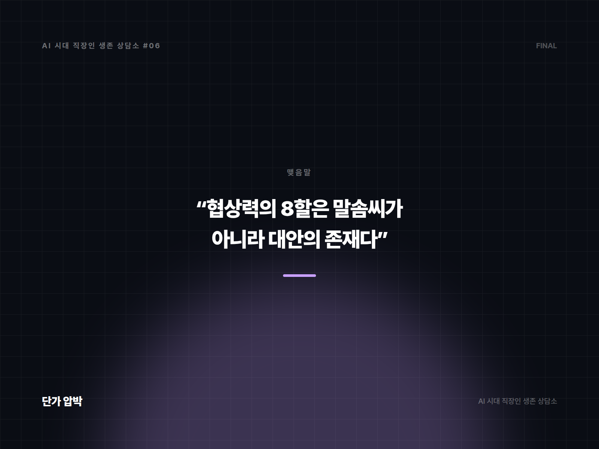

# [AI 시대 직장인 생존 상담소 #6] "AI 쓰면 싸게 되잖아요" — 단가를 깎이는 프리랜서

*시리즈: AI 시대 직장인 생존 상담소 | 6/10*

---

## 📮 사연

> 서른여섯, 프리랜서 카피라이터 겸 콘텐츠 작가입니다. 6년 됐습니다.
>
> 지난달 오래 거래한 에이전시 담당자가 이렇게 말했습니다. "요즘 AI 쓰시잖아요. 그럼 시간 얼마 안 걸리시는 거 아니에요? 건당 단가를 좀 조정했으면 하는데요."
>
> 사실 씁니다. 자료 조사와 구성 초안은 AI로 잡고, 문장은 제가 다시 씁니다. 덕분에 예전보다 빨라진 건 맞습니다. 그래서 말문이 막혔습니다. 아니라고 하면 거짓말이고, 맞다고 하면 단가가 깎입니다.
>
> 결국 15% 깎인 금액으로 계약했습니다. 그 뒤로 다른 거래처들도 비슷한 말을 꺼낼까 봐 겁이 납니다. 뭐라고 답했어야 했나요?
>
> — 대구, 프리랜서 작가 6년 차

---

## ☕ 답변

말문이 막힌 건 당신이 정직해서입니다. 문제는 그 정직함이 **잘못된 질문 앞에서** 발휘됐다는 겁니다.

"AI 쓰면 시간 얼마 안 걸리죠?"라는 질문은 **가격의 근거가 시간이라는 전제**를 깔고 있습니다. 이 전제에 한 번 동의하면 그다음은 전부 방어전입니다. 더 빨라질수록 더 깎이니까요. 논리적으로 끝은 0원입니다. 그러니 답해야 했던 건 "얼마 안 걸립니다"도 "많이 걸립니다"도 아니고, **전제를 바꾸는 문장**이었습니다.

이렇게 말하면 됩니다.

> "네, 초안은 빨라졌습니다. 그래서 요즘은 같은 예산이면 시안을 두 개 드리거나, 발행 후 성과 보고 한 번을 더 넣습니다. 단가를 낮추는 대신 받으시는 걸 늘리는 쪽이 어떨까요?"

이게 핵심 기술입니다. **가격 협상을 범위 협상으로 옮기는 것.** 상대는 "싸게"를 원하는 게 아니라 "예산 대비 더"를 원합니다. 두 개는 다릅니다. 전자에 응하면 다음 계약의 출발선이 영구히 내려가지만, 후자에 응하면 단가는 지켜집니다.

이번 주에 할 일.

**1. 견적서 양식을 바꾸세요.** 지금 아마 "원고 1건 = OO원"으로 돼 있을 겁니다. 항목을 쪼개세요. 리서치 / 구성안 / 원고 / 수정 2회 / 발행 후 점검. 항목이 보이면 **깎는 대화가 "무엇을 뺄까"로 바뀝니다.** 통짜 금액은 통짜로 깎이고, 쪼갠 금액은 쪼개서 협상됩니다.

**2. 이번에 깎인 그 거래처는 다음 계약에서 범위를 줄이세요.** 이미 서명한 건 되돌리기 어렵습니다. 대신 다음 건에서 수정 횟수나 납기를 조정하며 "지난번 단가 기준이라 이 범위로 잡았습니다"라고 말하세요. 가격과 범위가 연동된다는 걸 한 번 경험시키는 게 설득보다 효과적입니다.

**3. 재작업 조항을 넣으세요.** "확정된 방향이 변경될 경우 추가 건으로 산정"이라는 한 줄. 실제로 청구하지 않더라도, 무한 수정 요청을 멈추는 효과가 있습니다.

**4. 이번 달에 신규 문의처 세 곳을 만드세요.** 단가 협상력의 8할은 말솜씨가 아니라 **대안의 존재**에서 나옵니다. 거래처가 두 곳이면 어떤 화법도 안 먹힙니다.

---

## 🔍 한 걸음 더

여기서 판을 뒤집어 보겠습니다. 사실 그 담당자는 당신을 후려치려던 게 아닐 가능성이 큽니다.

그는 **위에서 예산 삭감 압박을 받고 있고**, 마침 "AI"라는 명분이 생긴 겁니다. 실제로 최근 몇 년간 콘텐츠 예산이 조여지는 흐름은 여러 업계에서 관찰되고 있고, AI는 그 결정을 정당화하기 좋은 단어입니다. 이 구도를 이해하면 대응이 달라집니다. 그를 이겨야 할 상대가 아니라, **그가 윗선에 들고 갈 명분을 만들어 줘야 할 파트너**로 보게 되니까요. "단가는 유지하되 성과 보고를 붙여드릴 테니, 그걸로 예산 방어하시라"는 제안이 그래서 잘 먹힙니다.

그리고 더 근본적인 이야기. 당신이 파는 게 원고라면 단가 압박은 계속됩니다. 원고는 이제 흔합니다. 흔하지 않은 건 **"이 문장이 왜 이 고객에게 먹히는지 설명할 수 있는 사람"**입니다. 6년 치 작업 중 성과가 좋았던 건 몇 개를 골라, 왜 먹혔는지 한 문단씩 정리해 두세요. 다음 미팅에서 그 얘기를 꺼내는 순간 당신의 호칭은 외주 작가에서 **콘텐츠 판단자**로 바뀝니다. 그 호칭은 시간당 단가로 계산되지 않습니다.

---

## ✉️ 맺음말

15% 깎인 건 되돌리기 어렵습니다. 대신 **다음 협상의 문장**은 지금 준비할 수 있습니다.

"네, 빨라졌습니다. 그래서 더 드릴 수 있습니다." 이 한 문장을 소리 내어 세 번 연습하세요. 다음에 같은 질문이 오면, 이번엔 말문이 막히지 않을 겁니다.

---

*본 사연은 여러 사례를 조합해 각색한 가상의 편지입니다.*
*다음 편: [#7] "포트폴리오가 다 비슷해 보인대요" — 스물여섯 비전공 취준생의 편지*

---

## 🖼 이미지 (5장)

이 포스팅 전용으로 제작한 이미지입니다. 원본은 `images/06_AI쓰면싸게되잖아요/` 폴더에 있습니다.

**대표 썸네일 (1600×900)**

**본문 카드 1 (1200×1200)**

**본문 카드 2 (1200×1200)**

**본문 카드 3 (1200×1200)**

**마무리 카드 (1600×1200)**

