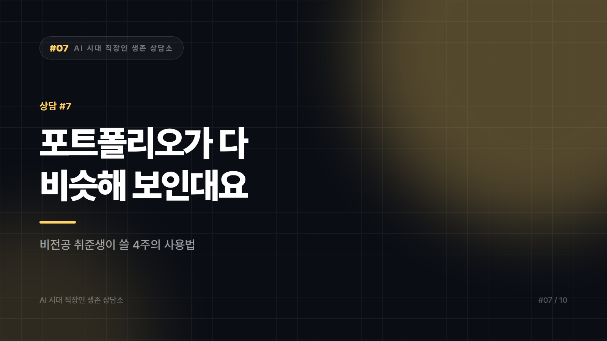
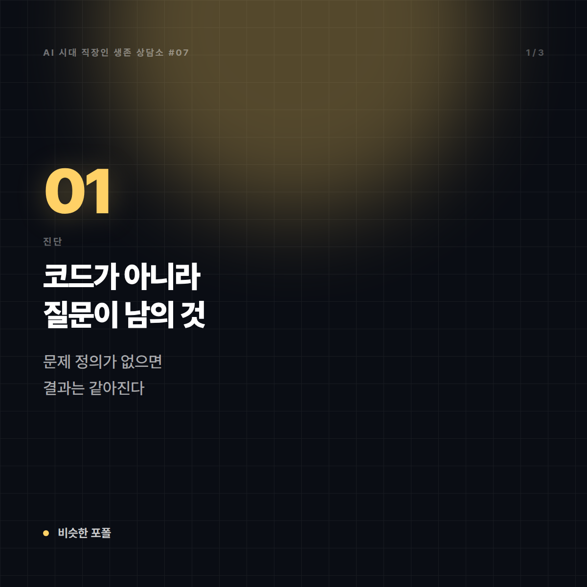
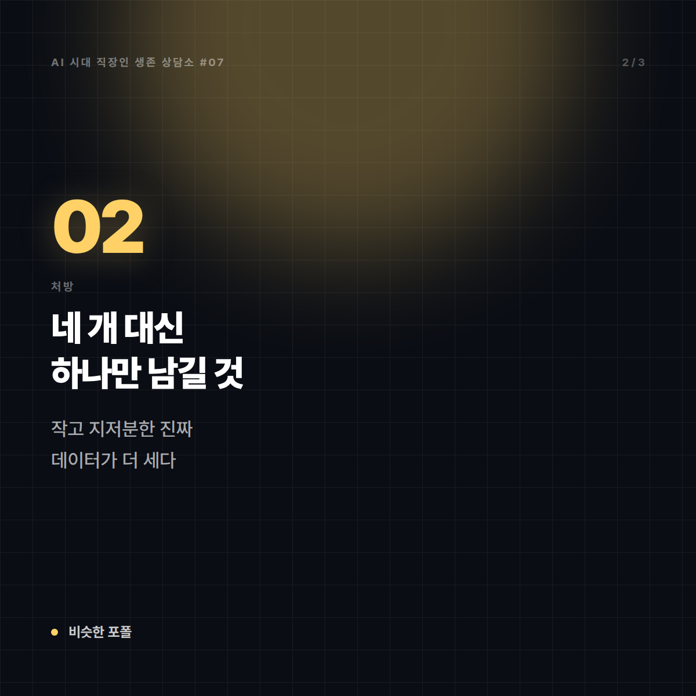
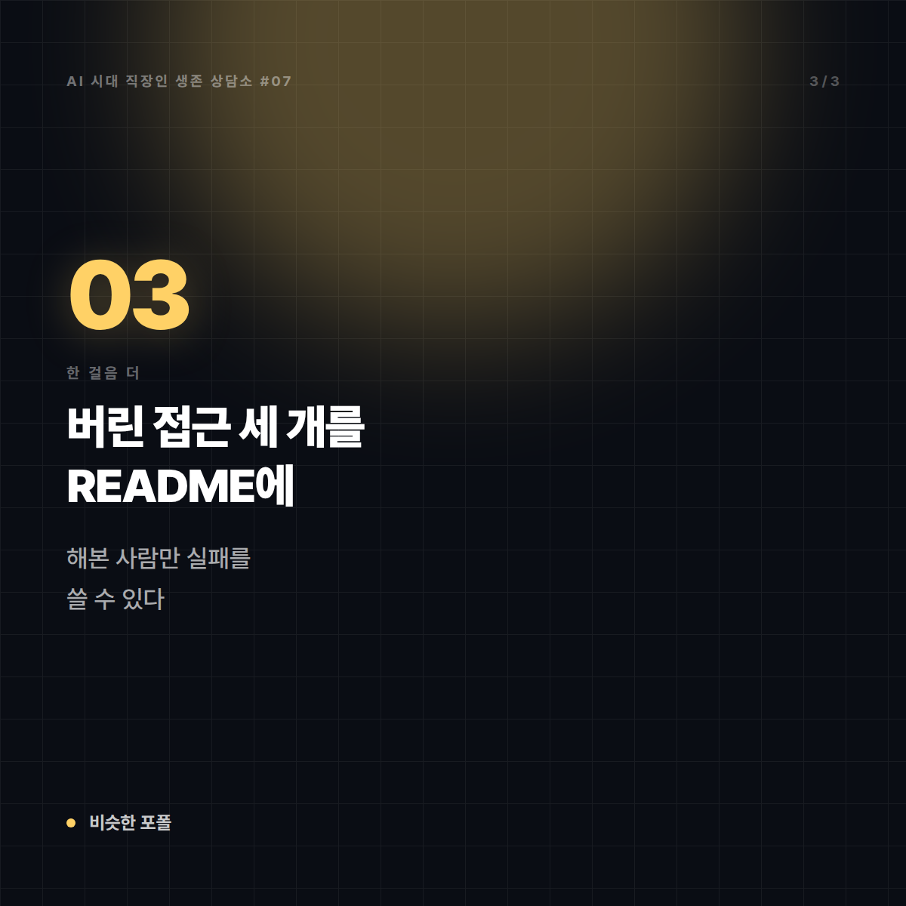
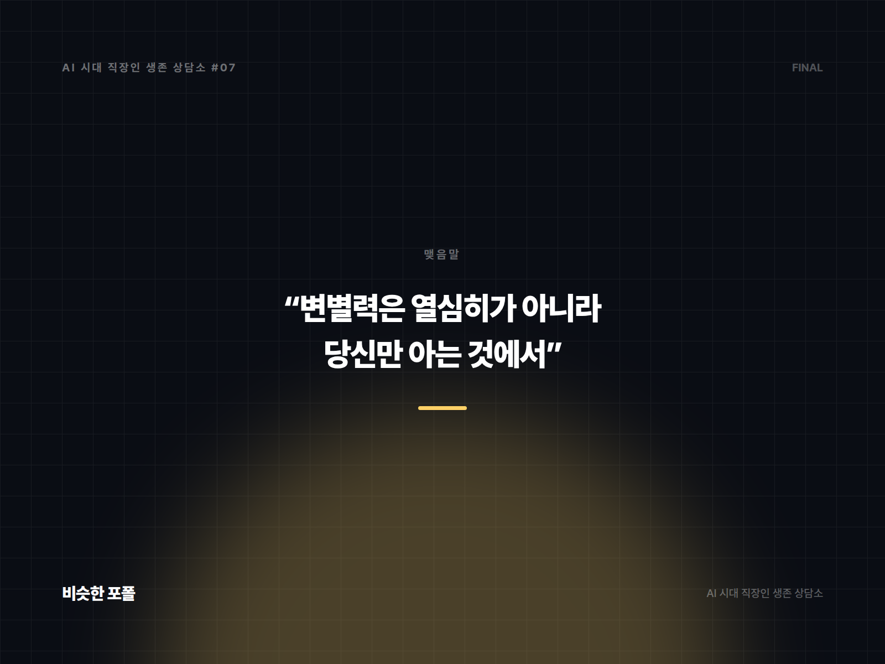

# [AI 시대 직장인 생존 상담소 #7] "포트폴리오가 다 비슷해 보인대요"

*시리즈: AI 시대 직장인 생존 상담소 | 7/10*

---

## 📮 사연

> 스물여섯, 비전공 취준생입니다. 문과 졸업 후 데이터 분석 쪽을 준비한 지 1년 됐습니다.
>
> 부트캠프를 수료했고, 포트폴리오 프로젝트를 네 개 만들었습니다. 서류는 계속 떨어집니다. 한 곳에서 면접을 봤는데 면접관이 이렇게 말했습니다. "요즘 지원자 포트폴리오가 다 비슷해요. 주제도 비슷하고, 코드도 비슷하고, 결론도 비슷하고."
>
> 억울했습니다. 저는 정말 열심히 했거든요. 그런데 집에 와서 제 깃허브와 같이 수료한 동기들 깃허브를 나란히 열어보니, 솔직히 저도 구분이 안 갔습니다.
>
> AI로 코드를 짠 게 문제였을까요? 다들 그렇게 하는데요.
>
> — 서울, 비전공 취준생 1년 차

---

## ☕ 답변

집에 와서 동기들 깃허브를 나란히 열어본 사람은, 이미 대부분의 지원자보다 앞서 있습니다. 억울한 채로 멈추지 않고 확인하러 갔으니까요. 다만 그 확인의 결과는 아프죠. "저도 구분이 안 갔습니다"라는 문장에 답이 다 들어 있습니다.

먼저 오해 하나를 풀겠습니다. **AI로 코드를 짠 게 문제가 아닙니다.** 실무에서도 씁니다. 문제는 프로젝트의 **질문이 남의 것**이라는 점입니다. 부트캠프에서 주제를 받고, 공개 데이터셋을 받고, 전형적인 분석 절차를 따라가면, 아무리 열심히 해도 결과물은 같은 모양으로 나옵니다. 코드가 비슷한 게 아니라 **문제 정의가 없었던 것**입니다. 면접관이 본 건 그거고, 요즘 그 차이는 예전보다 훨씬 빨리 드러납니다. 다들 매끈하게 만들어 오니까요.

앞으로 4주를 이렇게 쓰시길 권합니다.

**1주차 — 프로젝트를 늘리지 말고 하나를 고르세요.**
네 개 중에 제일 애착이 가는 하나만 남깁니다. 나머지는 지웁니다. 네 개의 평범한 프로젝트보다 한 개의 설명 가능한 프로젝트가 낫습니다.

**2주차 — 질문을 당신 것으로 바꾸세요.**
공개 데이터셋으로 "타이타닉 생존 예측"을 한 사람은 수천 명입니다. 대신 **당신만 접근할 수 있는 데이터**를 찾으세요. 아르바이트했던 가게의 매출 장부(허락받고, 개인정보는 지우고), 당신이 활동한 동아리의 3년 치 기록, 직접 수집한 데이터. 규모는 작아도 됩니다. **작고 지저분한 진짜 데이터가 크고 깨끗한 공개 데이터를 이깁니다.** 실무 데이터가 원래 지저분하거든요.

**3주차 — 실패를 기록하세요.**
README에 "시도했다가 버린 접근 3가지와 이유"를 쓰세요. 이게 결정적입니다. 매끈한 성공 서사는 누구나 만들지만, **왜 이 방법을 버렸는지는 직접 해본 사람만 씁니다.** 면접관이 파고들 수 있는 유일한 구멍이자, 당신이 유일하게 유리해지는 지점입니다.

**4주차 — 5분 설명본을 만드세요.**
화면 없이 말로만 5분. 데이터를 어떻게 구했고, 어디서 막혔고, 무엇을 포기했고, 결과를 실제로 누가 쓸 수 있는지. 녹음해서 들어보세요. 막히는 부분이 곧 면접에서 무너질 부분입니다.

---

## 🔍 한 걸음 더

그런데 사실 문제는 포트폴리오가 아닐 수 있습니다.

면접까지 간 게 1년에 한 번이라면, 지금 막히는 구간은 **서류**입니다. 포트폴리오를 다섯 번째로 만드는 것보다 **지원 경로를 바꾸는 것**이 훨씬 빠르게 결과를 바꿉니다. 비전공자에게 공채형 서류 경쟁은 가장 불리한 링입니다. 반대로 유리한 링은 세 가지입니다. 작은 회사의 상시 채용, 계약직·인턴을 통한 진입, 그리고 사람을 통한 추천. 부트캠프 동기들은 경쟁자가 아니라 **6개월 뒤 각 회사에 흩어져 있을 정보원**입니다. 지금 관계를 끊지 마세요.

한 가지 더 냉정하게 말씀드립니다. AI 때문에 주니어 데이터 직군의 문이 어떻게 변할지는 저도 단언하지 못합니다. 그건 아직 진행 중인 이야기이고, 확실하게 말하는 사람이 있다면 그 사람이 과장하는 겁니다. 다만 분명한 경향은 있습니다. **"시키면 돌리는 사람"의 자리는 줄고, "무엇을 돌릴지 정하는 사람"의 자리는 남습니다.** 그래서 지금 1년 차 준비생이 붙잡아야 할 건 도구 목록이 아니라 **질문을 만드는 훈련**입니다. 앞의 4주는 그 훈련이기도 합니다.

---

## ✉️ 맺음말

열심히 한 건 사실입니다. 다만 열심히는 변별력이 아닙니다. 변별력은 **당신만 아는 것**에서 나옵니다.

프로젝트 다섯 번째를 시작하지 마세요. 대신 이미 있는 하나에, 당신이 버린 것들을 적어 넣으세요. 그게 남들 깃허브에 없는 유일한 페이지입니다.

---

*본 사연은 여러 사례를 조합해 각색한 가상의 편지입니다.*
*다음 편: [#8] "AI 얘기만 나오면 저만 빠집니다" — 열두 해 영업직의 편지*

---

## 🖼 이미지 (5장)

이 포스팅 전용으로 제작한 이미지입니다. 원본은 `images/07_포트폴리오가다비슷해요/` 폴더에 있습니다.

**대표 썸네일 (1600×900)**

**본문 카드 1 (1200×1200)**

**본문 카드 2 (1200×1200)**

**본문 카드 3 (1200×1200)**

**마무리 카드 (1600×1200)**

