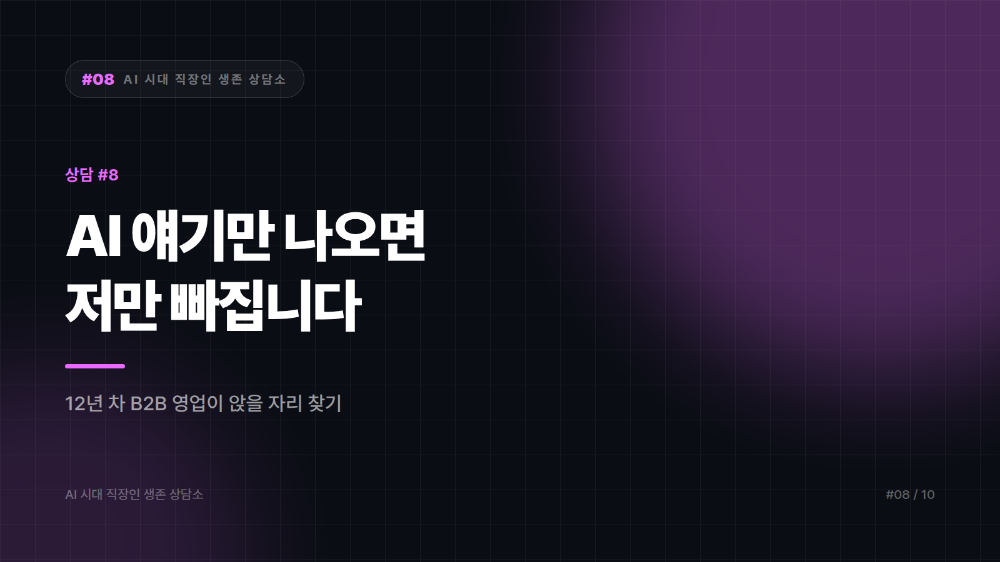
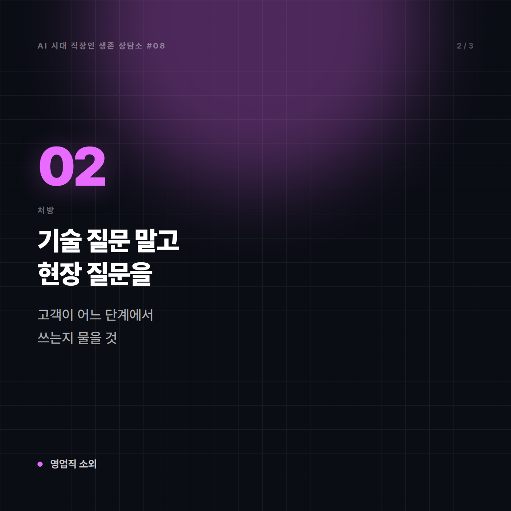
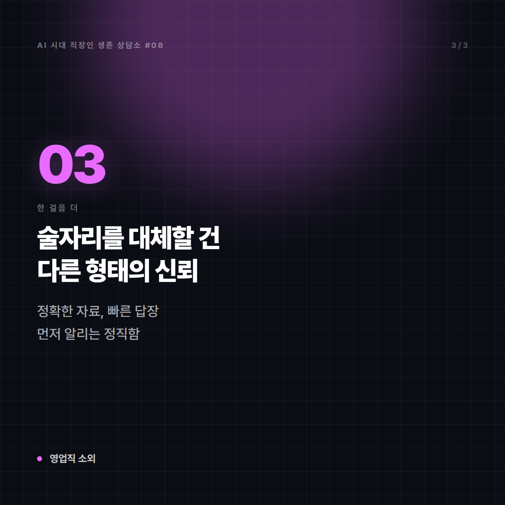
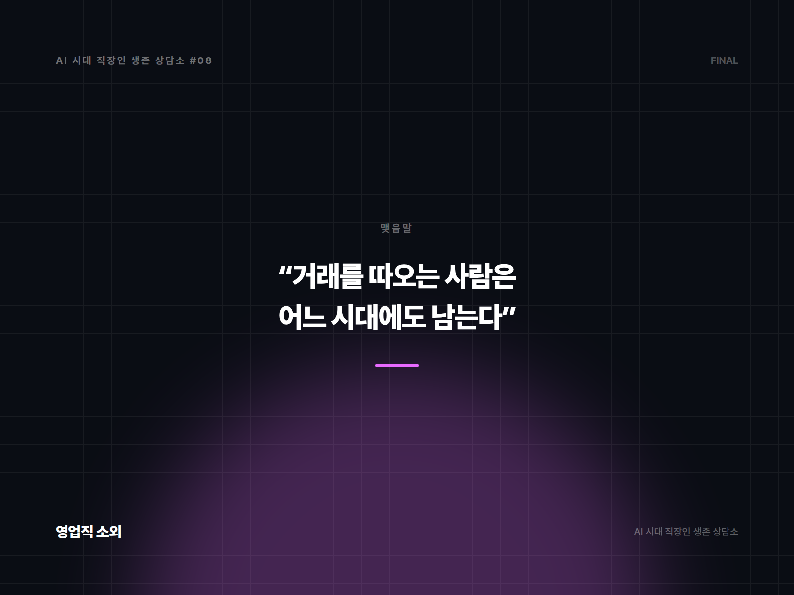

# [AI 시대 직장인 생존 상담소 #8] "AI 얘기만 나오면 저만 빠집니다"

*시리즈: AI 시대 직장인 생존 상담소 | 8/10*

---

## 📮 사연

> 서른여덟, 산업재 B2B 영업 12년 차입니다.
>
> 올해 회사가 "AI 전환"을 내걸었습니다. 전사 교육이 돌고, 사내 공모전이 열리고, 개발팀과 기획팀은 신났습니다. 저는 그 자리에 앉아 있으면 공기가 다릅니다. 용어를 못 알아듣고, 질문하면 분위기가 처집니다.
>
> 제 일은 여전히 전화하고, 찾아가고, 술 한잔하고, 견적 맞추는 일입니다. 이게 구식이라는 걸 압니다. 그런데 저희 거래처 구매 담당자들도 다 저 같은 사람들이라서, 아직은 이 방식이 먹힙니다.
>
> 언젠가 안 먹히는 날이 올 텐데, 그때 저는 아무것도 준비된 게 없을 것 같습니다. 영업직은 뭘 해야 합니까?
>
> — 충청권, B2B 영업 12년 차

---

## ☕ 답변

"그 자리에 앉아 있으면 공기가 다르다." 이 감각은 실제 능력 격차보다 훨씬 빨리 옵니다. 그리고 대개 과장돼 있습니다. 회의실에서 신난 사람들 중 상당수도 실은 용어만 익힌 상태입니다. 다만 그들이 편해 보이는 건 **그 언어가 자기 직군의 모국어**이기 때문입니다. 당신이 견적 조건과 납기 협상을 편하게 말하는 것처럼요.

진단은 이렇습니다. 당신에게 부족한 건 기술 지식이 아니라 **그 판에 들고 갈 재료**입니다. 지금 회의실에서 당신은 손님입니다. 손님은 원래 불편합니다. 주인이 되려면 남들이 못 가진 걸 들고 들어가야 하는데, 다행히 영업은 회사 전체에서 **가장 좋은 재료를 깔고 앉아 있는 직군**입니다. 고객이 실제로 뭘 불평하는지, 왜 계약이 깨졌는지, 어떤 조건에서 결재가 났는지. 그 데이터는 개발팀에 없습니다. 당신 머리와 수첩에 있습니다.

이번 달에 할 일.

**1. 당신 업무 중 "기억에 의존하는 것"을 목록으로 만드세요.**
어떤 담당자가 어떤 성향이고, 어느 회사가 언제 예산을 짜고, 지난 실주(失注)의 이유가 뭐였는지. 이걸 문서로 빼는 순간 두 가지가 생깁니다. 하나, 자동화·분석의 재료. 둘, **당신이 그 재료의 소유자라는 사실**이 조직에 드러납니다.

**2. 회의에서 기술 질문 말고 현장 질문을 하세요.**
"그 모델이 어떻게 작동하나요?"는 당신이 불리한 질문입니다. 대신 이렇게 물으세요. "그 기능이 나오면 고객사 구매 담당자가 어느 단계에서 쓰게 되나요?" 이 질문에 개발팀이 막히는 순간, **공기의 주인이 바뀝니다.** 현장을 아는 사람만 할 수 있는 질문이 가장 강합니다.

**3. 도구는 딱 두 개만, 당신 일에 씁니다.**
① 미팅 후 통화·방문 내용을 정리해 요약과 다음 액션을 뽑는 것. ② 제안서 초안과 경쟁 비교표 잡기. 이 둘만 해도 주당 몇 시간이 나옵니다. 그 시간을 다시 고객을 만나는 데 쓰면, 당신의 강점이 약해지는 게 아니라 **더 자주 발휘됩니다.** 단, 고객사 정보나 계약 조건을 외부 서비스에 그대로 넣는 건 계약 위반이 될 수 있으니 회사 지침을 먼저 확인하십시오. 이건 진짜 사고가 나는 지점입니다.

**4. 실주 분석 한 장을 자발적으로 올리세요.**
올해 놓친 계약 다섯 건의 공통 원인. 영업이 이걸 먼저 문서로 올리면, 다음 AI 프로젝트 회의에 당신이 초대됩니다. 초대받는 게 목표입니다.

---

## 🔍 한 걸음 더

여기서 한 번 뒤집겠습니다. "언젠가 이 방식이 안 먹히는 날"에 대한 걱정 말입니다.

B2B 영업에서 술자리가 사라지는 건 AI 때문이 아니라 세대 교체 때문입니다. 이미 진행 중이고, 앞으로도 그렇게 갈 겁니다. 다만 그 자리를 대체하는 건 소프트웨어가 아니라 **다른 형태의 신뢰**입니다. 자료를 정확하게 주는 것, 불리한 정보도 먼저 말하는 것, 사고가 났을 때 도망가지 않는 것. 구매 담당자가 세대가 바뀌어도 이 세 가지를 보는 건 안 변합니다. 오히려 정보가 흔해질수록 **"이 사람 말은 믿을 수 있다"의 가격이 올라갑니다.**

그러니 준비해야 할 건 기술 공부가 아니라 **영업 방식의 이전**입니다. 당신이 12년간 술자리에서 쌓은 신뢰를, 술자리 없이 쌓는 법으로 옮기는 것. 제안서의 정확도, 답장의 속도, 리스크를 먼저 알리는 정직함. 이게 진짜 대비책입니다.

마지막으로 솔직히 말씀드리면, 영업직 전체가 언제 어떻게 변할지는 저도 모릅니다. 확실한 건 이것입니다. **거래를 따오는 사람은 어느 시대에도 마지막까지 남습니다.** 다만 따오는 방법의 유통기한은 짧아졌습니다.

---

## ✉️ 맺음말

회의실에서 못 알아듣는 건 창피한 일이 아닙니다. 못 알아듣는 채로 아무것도 안 들고 들어가는 게 문제입니다.

다음 회의에는 실주 분석 한 장을 들고 가세요. 그 종이가 있으면, 공기가 달라도 앉아 있을 자리가 생깁니다.

---

*본 사연은 여러 사례를 조합해 각색한 가상의 편지입니다.*
*다음 편: [#9] "회사가 AI를 쓰라는데 규정이 없습니다" — 서른한 살 HR 담당자의 편지*

---

## 🖼 이미지 (5장)

이 포스팅 전용으로 제작한 이미지입니다. 원본은 `images/08_저만빠집니다/` 폴더에 있습니다.

**대표 썸네일 (1600×900)**

**본문 카드 1 (1200×1200)**

**본문 카드 2 (1200×1200)**

**본문 카드 3 (1200×1200)**

**마무리 카드 (1600×1200)**

