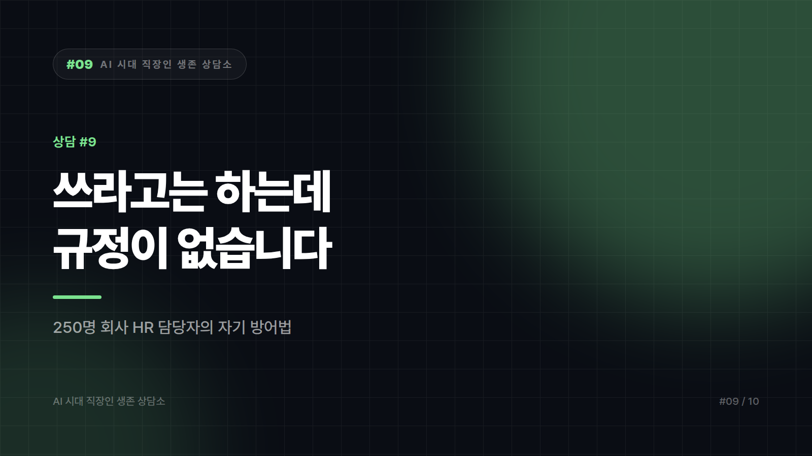

# "쓰라고는 하는데, 규정이 없습니다"

*시리즈: AI 시대 직장인 생존 상담소 | 9/10*

---

> 서른한 살, 250명 규모 회사의 HR 담당자입니다. 채용과 인사 운영을 맡고 있습니다.
>
> 대표님이 "다들 AI 좀 적극적으로 쓰라"고 하셨습니다. 그런데 사내에 관련 규정은 한 줄도 없습니다. 정보보안 담당자에게 물으니 "아직 검토 중"이라고 합니다.
>
> 저는 지금 채용 서류 요약에 AI를 쓸까 고민 중입니다. 지원자가 200명이 넘어서 도저히 시간이 안 납니다. 그런데 이력서에는 이름, 생년월일, 연락처, 학력이 다 들어 있습니다. 이걸 외부 서비스에 넣어도 되는지 모르겠습니다.
>
> 물어볼 데가 없습니다. 아무도 안 된다고 말하지 않지만, 아무도 된다고도 안 합니다. 이런 상태에서 사고가 나면 누가 책임집니까?
>
> — 서울, HR 3년 차

---

아무도 안 된다고 말하지 않지만 아무도 된다고도 안 한다. 이건 조직에서 책임이 실무자에게 넘어가는 순간을 정확히 옮긴 문장입니다. 불안이 과한 게 아니라 구조를 제대로 읽고 계십니다.

가장 급한 것부터 말씀드리면, 지원자 이력서를 회사 승인 없이 외부 AI 서비스에 넣는 일은 지금은 하지 않는 쪽이 안전합니다. 이력서는 이름과 생년월일과 연락처와 학력이 묶인 전형적인 개인정보이고, 국내 개인정보보호법 체계에서 개인정보의 제3자 제공이나 처리 위탁은 목적과 절차를 따져야 하는 영역입니다. 세부 적용은 서비스 형태와 계약과 데이터 처리 방식에 따라 달라지므로 이 글이 유권해석을 대신할 수는 없습니다. 다만 판단이 서지 않을 때 개인정보를 먼저 넣어보는 건 확실히 나쁜 선택입니다. 문제가 생기면 회사도 노출되지만, 최초 입력자로 기록에 남는 건 당신입니다.

그러면 200명 서류는 어떻게 하느냐. 데이터를 갈라서 쓰는 방법이 있습니다. 이력서 원본을 통째로 넣을 이유가 없습니다. 평가에 필요한 건 이름과 생년월일이 아니라 경력 내용입니다. 이름, 연락처, 생년월일, 학교명 같은 식별정보를 걷어낸 경력 기술 부분만 떼어 지원자 번호를 붙이고 그 텍스트로 요약과 분류를 돌리면 됩니다. 이것만으로 위험은 크게 줄고 업무 효율은 거의 그대로입니다.

회사가 이미 계약한 도구가 있는지도 확인해볼 만합니다. 기업용 계약을 갖고 있으면서 실무자에게 알리지 않는 경우가 꽤 흔합니다. 정보보안 담당자에게 검토 중이냐고 묻는 대신 현재 사용 가능한 도구 목록을 달라고 하면 답이 나올 때가 있습니다. 질문을 바꾸면 답도 바뀝니다.

그리고 이게 제일 중요한데, 서면으로 물어두시면 좋겠습니다. 구두 말고 메일로요. 세 줄이면 됩니다.

> "채용 서류 검토에 OO 도구 사용을 검토 중입니다. 식별정보를 제거한 경력 텍스트만 입력할 계획입니다. 가능 여부와 조건을 회신 부탁드립니다."

답이 안 와도 괜찮습니다. 물어본 기록이 남는 것 자체가 방어가 됩니다. 지금 처한 위험의 본질은 기술이 아니라 기록의 부재 쪽이니까요.

채용이라는 영역 자체가 특히 조심스럽다는 점도 덧붙이고 싶습니다. AI가 지원자를 걸러내는 방식은 차별 문제와 바로 이어집니다. 요약과 정리는 보조로 쓰더라도 탈락 결정 자체를 자동화하는 건 다른 이야기입니다. 왜 떨어뜨렸는지 사람이 설명하지 못하는 채용은 나중에 가장 크게 터집니다.

## 사실 당신이 맡아야 할 일은 따로 있습니다

내가 써도 되나가 아니라, HR 담당자인 당신이 이 회사의 AI 사용 규정 초안을 쓰는 일입니다.

대표는 쓰라고 했고, 보안팀은 검토 중이고, 현업은 이미 각자 알아서 쓰고 있습니다. 이 상태가 반년만 더 가면 어딘가에서 사고가 납니다. 그리고 그때 조직이 찾는 건 규정을 만들지 않은 사람이 아니라 사고를 낸 사람입니다. 규정은 통제 장치이기 이전에 직원 보호 장치이고, 그러면 그건 인사 담당자의 일이 맞습니다.

초안이 거창할 필요는 없습니다. A4 한 장, 네 줄이면 시작됩니다.

- 넣어도 되는 것과 절대 안 되는 것 (개인정보, 고객 데이터, 미공개 재무·계약 정보)
- 회사가 승인한 도구 목록
- 대외 문서는 사실관계 재확인 후 발행
- 인사 평가나 채용 탈락처럼 사람에 관한 최종 결정은 사람이 한다

이걸 들고 대표님께 가면 됩니다. 쓰라고 하셨으니 안전하게 쓸 기준을 만들어봤다고. 250명 회사에서 이 문서를 처음 쓴 사람은 그 뒤로 오랫동안 그 영역의 담당자가 됩니다. 지금 느끼는 불안은 뒤집어 보면 아직 주인이 없는 업무 영역이라는 신호이기도 합니다.

물어볼 데가 없다는 건 당신이 물어볼 사람이 되어야 하는 자리에 왔다는 뜻일 수 있습니다. 이번 주에 메일 한 통과 A4 한 장. 그 두 개면 허락 없이 쓴 사람이 아니라 기준을 만든 사람으로 기록됩니다. 같은 일을 하고도 남는 모양이 전혀 다릅니다.

---

*본 사연은 여러 사례를 조합해 각색한 가상의 편지입니다. 개인정보·노무 관련 사안은 사내 법무 또는 외부 전문가의 검토를 받으시기 바랍니다.*
*다음 편(마지막): [#10] "은퇴까지 8년, 지금 배우는 게 의미가 있을까요" — 쉰두 살의 편지*

---

본문에 그림이 들어가면 좋을 자리는 아래와 같다. 실제 이미지는 아직 넣지 않았다.

〔이미지 자리 — 본문에서 1번째 논점을 설명하는 대목〕

〔이미지 자리 — 본문에서 2번째 논점을 설명하는 대목〕

〔이미지 자리 — 본문에서 3번째 논점을 설명하는 대목〕

〔이미지 자리 — 마지막 문단 바로 위〕
