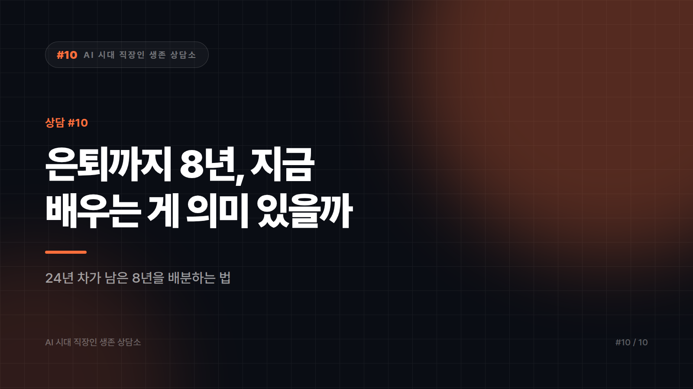

# [AI 시대 직장인 생존 상담소 #10] "은퇴까지 8년, 지금 배우는 게 의미가 있을까요"

*시리즈: AI 시대 직장인 생존 상담소 | 10/10*

---

## 📮 사연

> 쉰둘입니다. 한 회사에서 24년 일했고, 지금은 생산관리 부문을 맡고 있습니다.
>
> 얼마 전 후배가 "부장님도 AI 좀 써보세요" 하길래 웃어넘겼습니다. 집에 와서 혼자 한참 앉아 있었습니다.
>
> 솔직히 말하면 배우기 싫은 게 아니라 **계산이 안 섭니다.** 정년까지 8년 남았습니다. 지금 새로 뭘 배워서 익숙해질 즈음이면 예순입니다. 그 사이 회사가 저를 어떻게 볼지도 모르겠고요.
>
> 자식은 대학생이고 대출도 남았습니다. 지금 제가 해야 할 게 공부인지, 아니면 은퇴 후 준비인지, 그것도 아니면 그냥 조용히 자리를 지키는 건지 판단이 안 섭니다.
>
> — 영남권, 제조업 생산관리 24년 차

---

## ☕ 답변

"배우기 싫은 게 아니라 계산이 안 선다." 이 문장이 정확합니다. 50대에게 학습은 호기심의 문제가 아니라 **자원 배분의 문제**이고, 남은 8년을 어디에 쓸지 정하는 건 냉정한 판단이 맞습니다. 그러니 "늦지 않았어요" 같은 말은 하지 않겠습니다. 대신 계산을 같이 해보겠습니다.

먼저 오해를 하나 걷어냅시다. 지금 필요한 건 **새 직업을 배우는 게 아닙니다.** 개발을 배우거나 데이터 분석가가 되는 건 8년 안에 회수가 어렵습니다. 그건 합리적인 판단입니다. 대신 회수가 확실한 건 **지금 하고 있는 일의 속도를 바꾸는 것**입니다.

이번 달에 이렇게 시작하세요. 세 가지면 충분합니다.

**1. 문서 업무 하나만 골라 도구를 붙이세요.**
생산관리라면 주간 실적 보고, 불량 원인 정리, 협력사 회신 같은 게 있을 겁니다. 그중 가장 지겨운 것 하나. 하루 30분씩 2주면 감이 옵니다. **범위를 넓히지 마세요.** 50대의 학습이 실패하는 이유는 머리가 아니라 범위입니다.

**2. 배운 걸 반드시 남에게 보여주세요.**
혼자 쓰고 끝내면 아무 일도 안 일어납니다. 팀 회의에서 "이거 이렇게 줄였다"고 5분만 공유하세요. 24년 차가 새 도구를 써보고 결과를 공유하는 장면은, 그 자체로 조직에서 매우 희소합니다. **후배가 하면 당연한 일이 당신이 하면 사건이 됩니다.** 이건 능력의 문제가 아니라 위치의 문제입니다.

**3. 24년 치를 문서로 빼세요.**
이게 셋 중 가장 값나가는 일입니다. 어떤 설비가 어떤 조건에서 말썽인지, 어느 협력사가 어떤 상황에서 납기를 놓치는지, 지난 대형 사고 때 무엇이 원인이었는지. 이건 어느 시스템에도 안 들어 있습니다. 당신 머리에만 있습니다. 이걸 정리해 내는 순간 당신은 **자동화의 대상이 아니라 자동화의 설계 자료 제공자**가 됩니다. 이 둘의 대우는 전혀 다릅니다.

---

## 🔍 한 걸음 더

이제 판을 뒤집겠습니다. 사실 질문이 잘못 설정돼 있습니다.

"공부냐, 은퇴 준비냐, 자리 지키기냐" — 이건 셋 중 하나를 고르는 문제가 아닙니다. **세 개가 같은 행동으로 겹치는 지점이 있습니다.** 바로 위의 3번, 경험을 문서로 빼는 일입니다.

그 문서는 회사에서는 당신의 대체 불가능성을 증명하고, 은퇴 후에는 당신의 상품이 됩니다. 제조 현장의 생산관리 경험을 글로 설명할 수 있는 사람은 밖에서 자문, 강의, 중소기업 컨설팅, 협력사 품질 지도 같은 형태로 계속 필요해집니다. 그 시장의 크기를 제가 숫자로 말씀드릴 수는 없습니다. 다만 분명한 건, **그 자리에 필요한 건 최신 도구 숙련도가 아니라 현장을 설명할 줄 아는 능력**이라는 점입니다. 그리고 그 설명 능력은 문서로 써보지 않으면 늘지 않습니다.

여기에 도구가 붙으면 속도가 붙습니다. 24년 치를 혼자 정리하려면 엄두가 안 나지만, 말로 풀어놓고 구조를 잡는 일에는 지금 도구들이 꽤 쓸 만합니다. 그러니까 당신에게 AI는 **새로 배울 과목이 아니라, 당신 경험을 밖으로 꺼내는 받아쓰기 도구**입니다. 이 각도로 접근하면 계산이 섭니다.

마지막으로 솔직한 이야기 둘. 첫째, 앞으로 8년간 제조업 관리직의 역할이 어떻게 변할지 확언할 수 있는 사람은 없습니다. 지금 확실하게 예언하는 사람은 팔 게 있는 사람입니다. 둘째, 그럼에도 방향은 읽을 수 있습니다. 반복 정리 업무는 계속 줄고, **판단하고 책임지는 자리는 남습니다.** 24년 차가 서 있는 곳은 원래 후자입니다. 자리를 옮길 필요가 없고, 그 자리에서 일하는 방식만 바꾸면 됩니다.

---

## ✉️ 맺음말

집에 와서 한참 앉아 계셨다고 하셨죠. 그 시간은 낭비가 아니었습니다. 대부분은 웃어넘기고 그냥 잠듭니다.

8년은 짧지 않습니다. 다만 24년을 정리하기에는 빠듯합니다. 그러니 공부부터 하지 마시고, **기록부터 시작하세요.** 그게 회사에서도, 회사 밖에서도 쓰이는 유일한 자산입니다.

---

## 열 통의 편지를 마치며

이 상담소에 도착한 열 통의 편지는 모두 각색된 가상의 사연이었지만, 고민의 모양은 전부 현실에서 가져왔습니다. 스물여섯부터 쉰둘까지, 직군도 연차도 달랐는데 답변은 이상하게 한 지점으로 모였습니다.

**"내가 무엇을 판단했는지 남겨라."**

버린 기획안, 디버깅의 순서, 예외 처리 목록, 실주의 이유, 규정 초안, 24년 치 현장 지식. 전부 같은 이야기였습니다. 도구는 만드는 일을 빠르게 해주지만, **무엇을 만들지 정하고 그 결과에 이름을 걸었던 기록**은 아직 사람만 남길 수 있습니다.

앞으로 몇 년간 무슨 일이 벌어질지 저는 모릅니다. 다 대체된다는 말도, 아무것도 안 변한다는 말도 믿지 않습니다. 확실한 건 하나입니다. 판단한 흔적을 남겨온 사람은 어느 쪽으로 흘러가든 설명할 게 있습니다. 그거면 대개 충분했습니다.

읽어주셔서 고맙습니다.

---

*본 시리즈의 모든 사연은 여러 사례를 조합해 각색한 가상의 편지이며, 특정 개인이나 기업의 실제 사례가 아닙니다. 법률·노무·개인정보 관련 사안은 반드시 전문가 상담을 거치시기 바랍니다.*

---

본문에 그림이 들어가면 좋을 자리는 아래와 같다. 실제 이미지는 아직 넣지 않았다.

〔이미지 자리 — 본문에서 1번째 논점을 설명하는 대목〕

〔이미지 자리 — 본문에서 2번째 논점을 설명하는 대목〕

〔이미지 자리 — 본문에서 3번째 논점을 설명하는 대목〕

〔이미지 자리 — 마지막 문단 바로 위〕
