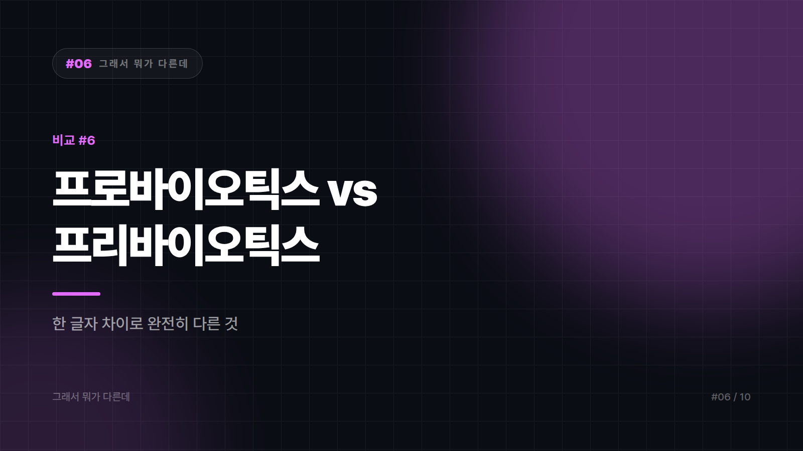

# 프로바이오틱스 vs 프리바이오틱스 — 한 글자 차이로 완전히 다른 걸 사고 있다

*시리즈: 그래서 뭐가 다른데 | 6/10*

---

약국이나 온라인 쇼핑몰에서 이 두 단어를 나란히 본 사람은 대부분 비슷한 거겠지 하고 아무거나 집는다. 그런데 이건 소고기와 소 사료를 헷갈리는 수준의 차이다. 하나는 살아있는 미생물이고, 하나는 그 미생물이 먹는 밥이다.

프로와 프리라는 접두사 한 글자가 그 차이를 다 담고 있는데, 한국어 표기로는 너무 비슷해서 눈에 안 들어온다.

프로바이오틱스는 적절한 양을 섭취했을 때 건강에 도움을 줄 수 있는 살아있는 균 그 자체다. 락토바실러스, 비피도박테리움 계열이 대표적이다. 프리바이오틱스는 우리 몸에서는 소화되지 않고 대장까지 내려가 장내 유익균의 먹이가 되는 성분이다. 식이섬유 계열의 프락토올리고당, 이눌린 같은 것들이 여기 속한다. 프로바이오틱스는 입주민, 프리바이오틱스는 그 집에 넣어주는 식량이라고 생각하면 된다. 입주민만 잔뜩 들여놓고 냉장고를 텅텅 비워두면, 며칠 못 가 다들 짐 싸서 나가는 것과 같다.

## 살아있는 것과 살아있지 않은 것

살아있느냐 아니냐가 나머지 성질을 거의 다 결정한다. 프로바이오틱스는 위산과 담즙을 통과해 살아서 도달해야 의미가 있고, 그래서 온도와 습도에 민감한 제품이 많다. 유통기한도 일반 식품처럼 맛이 변하는 시점이 아니라 보장 균수가 유지되는 기한이라는 의미가 크다. 프리바이오틱스는 살아있는 게 아니니 이런 걱정이 없고 상대적으로 안정적이다.

먹을거리에서도 갈린다. 요구르트와 김치, 된장 같은 발효식품이 앞쪽이고, 양파와 마늘, 바나나, 우엉, 통곡물이 뒤쪽이다.

둘을 함께 담은 제품은 신바이오틱스라고 부른다. 균과 먹이를 같이 넣어 정착을 돕자는 발상이다. 최근에는 균이 만들어낸 대사산물이나 사균체를 가리키는 포스트바이오틱스라는 용어도 제품 표기에 등장하는데, 이러다간 다음 제품엔 트랜스바이오틱스라는 이름이 붙어도 이상하지 않을 지경이다. 용어 정의와 근거 수준은 분야에 따라 아직 논의가 진행 중이다.

## 구분이 흐려지는 자리

마케팅이 두 단어를 뒤섞는 게 첫 번째 이유다. 같은 진열대에 놓이고 포장 디자인도 비슷하고 광고 문구도 장 건강으로 동일하다. 소비자가 구분할 단서는 성분표뿐인데 그걸 읽는 사람은 많지 않다.

균 수가 많을수록 좋다는 단순화도 흔하다. 제품에 적힌 보장 균수는 중요한 정보지만 숫자 하나만으로 우열이 정해지지는 않는다. 어떤 균주인지, 그 균주에 대해 어떤 연구가 있는지, 섭취 시점까지 살아서 도달하는지가 함께 걸린다. 유산균이라는 말도 프로바이오틱스와 완전한 동의어는 아니다. 유산을 만드는 균이라는 분류상의 이름이고, 프로바이오틱스로 쓰이는 균 중에는 유산균이 아닌 것도 있다.

경계가 정말로 흐릿한 지점도 있다. 김치나 된장 같은 전통 발효식품은 살아있는 균과 식이섬유를 동시에 갖고 있다. 자연식품에서는 이 구분이 원래 그렇게 칼같지 않다. 구분이 선명해지는 건 그걸 캡슐에 나눠 담아 팔기 시작하면서부터다.

## 무엇부터 채울 것인가

평소 채소와 통곡물, 콩류를 거의 안 먹는다면 식이섬유 쪽이 먼저다. 균을 아무리 넣어도 먹일 게 없으면 자리를 잡기 어렵다. 그리고 이건 보충제보다 식단에서 채우는 게 순서에 맞다. 반대로 발효식품을 거의 안 먹는 식생활이라면 프로바이오틱스 제품을 검토할 만하다. 이때는 균 수뿐 아니라 균주 정보와 보관 조건을 함께 보는 게 좋다.

둘 다 챙기고 싶다면 신바이오틱스형 제품도 있고, 그냥 발효식품에 채소를 곁들이는 방법도 있다. 후자가 대체로 더 싸고 덜 복잡하다. 처음 먹고 배에 가스가 차거나 불편하면 양을 줄이고 천천히 늘려본다. 특히 프리바이오틱스는 양을 급히 늘리면 불편감이 생길 수 있다.

분명히 해둘 것이 있다. 이 글은 식품 성분에 대한 개념 정리이지 특정 증상의 진단이나 치료를 위한 권고가 아니다. 장 관련 증상이 지속되거나 면역 관련 질환이나 중증 기저질환이 있거나 복용 중인 약이 있다면 보충제를 시작하기 전에 의사나 약사와 상의하는 게 맞다. 건강기능식품의 기능성 표시 기준과 인정 범위도 시점에 따라 달라질 수 있으니 구매 시점의 표시사항을 직접 확인하는 편이 좋다.

프로바이오틱스는 균을 넣는 것이고 프리바이오틱스는 균을 먹이는 것이다. 넣기만 하고 안 먹이면 오래 못 간다.

*다음 편: 단리 vs 복리 — 이자에 이자가 붙는다를 다들 아는데, 왜 계산은 틀릴까*

---

본문에 그림이 들어가면 좋을 자리는 아래와 같다. 실제 이미지는 아직 넣지 않았다.

〔이미지 자리 — 본문에서 1번째 논점을 설명하는 대목〕

〔이미지 자리 — 본문에서 2번째 논점을 설명하는 대목〕

〔이미지 자리 — 본문에서 3번째 논점을 설명하는 대목〕

〔이미지 자리 — 마지막 문단 바로 위〕
