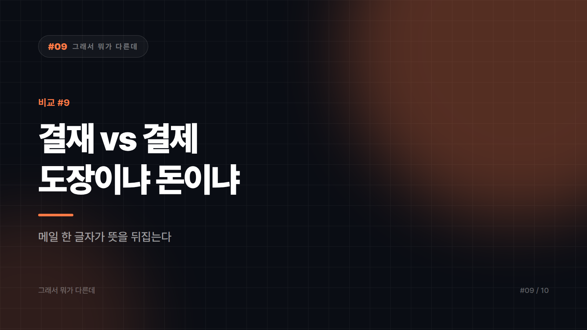

# 결재 vs 결제 — 팀장님께 '결제' 올렸다가 민망해지기 전에

*시리즈: 그래서 뭐가 다른데 | 9/10*

---

업무 메일에서 가장 자주 목격되는 오타 중 하나다. 부장님 결제 부탁드립니다라고 보내면, 문장 그대로 읽었을 때 부장님께 돈을 내달라는 요청이 된다. 물론 다들 알아서 알아듣는다. 실제로 부장님이 오해해서 지갑을 여신다면 그건 그것대로 훈훈한 사고다. 대외 문서나 공문에서 나가면 이야기가 달라질 뿐이다.

한글로 한 글자 차이고 소리도 거의 같다. 그런데 한자로 보면 겹치는 구석이 하나도 없다.

결재는 決裁다. 결정할 결에 재가할 재. 권한을 가진 사람이 안건을 검토하고 승인하는 일이다. 결제는 決濟다. 결정할 결에 건널 제. 대금을 주고받아 거래 관계를 끝내는 일이다. 공통 글자는 決 하나뿐이고 뒷글자가 뜻을 완전히 갈라놓는다. 裁는 재판과 재량의 그 재로 판단하고 자른다는 의미고, 濟는 경제와 구제의 그 제로 마무리한다는 의미다.

## 1초 만에 가르는 법

가장 빠른 판별법은 영어로 바꿔보는 것이다. 그 자리에 approval을 넣어 말이 되면 결재, payment를 넣어 말이 되면 결제다. 팀장님 approval 부탁드립니다는 자연스럽고 카드 approval은 이상하다. 이 테스트 하나면 대개 끝난다.

두 번째 방법은 돈이 실제로 움직이는지 보는 것이다. 움직이면 결제, 안 움직이면 결재다. 예산 지출 품의서를 올리는 행위는 아직 돈이 안 나갔으니 결재고, 승인 후 실제로 대금을 보내는 단계가 결제다. 같은 건에서 두 단어가 순서대로 나오는 셈이다. 붙어 다니는 말들을 외워두는 것도 도움이 된다. 결재판과 결재라인과 전자결재는 앞쪽이고, 결제대금과 카드결제와 결제일은 뒤쪽이다.

## 왜 유독 이 쌍이 안 잡히나

우선 소리가 거의 구분되지 않는다. 한국어에서 ㅐ와 ㅔ의 구분은 현실 발음에서 상당히 약해졌다. 귀로는 안 갈리고 눈으로만 갈리는 쌍이니 말할 때는 아무 문제가 없다가 쓸 때만 사고가 난다. 되와 돼, 뵈요와 봬요가 틀리는 것과 같은 계열이다.

기계도 도와주지 않는다. 둘 다 실재하는 단어라 맞춤법 검사기가 빨간 줄을 안 그어준다. 문맥을 봐야만 잡히는 오류라서 자동 검수의 그물을 그냥 통과한다.

한 문장 안에 둘이 같이 나오는 상황도 있다. 법인카드 결제 건에 대한 결재를 요청드립니다. 이 문장은 둘 다 맞게 쓴 것이다. 지출은 결제고 승인은 결재다. 사람들이 가장 많이 흔들리는 지점이 여기다.

오래된 사내 양식이나 계약서 서식에 대금 결재 같은 표기가 굳어 있는 경우도 있다. 신입이 그 양식을 그대로 물려받으면서 오류가 대물림된다. 관행이라고 해서 맞는 표기가 되지는 않으니 그건 고쳐도 되는 오류다.

## 덤으로 챙기는 단골 쌍

지양과 지향은 소리는 비슷한데 방향이 정반대다. 지양은 하지 않는 쪽이고 지향은 목표로 삼는 쪽이라, 폭력적 표현은 지양합니다가 맞다. 지향이라고 쓰면 뜻이 뒤집힌다. 결단과 결정은 무게가 다르다. 결단은 망설임을 끊는 쪽, 결정은 선택을 정하는 쪽이다. 재고는 표기까지 같아서 문맥으로만 갈린다. 다시 생각한다는 재고와 남은 물건이라는 재고가 한 글자도 다르지 않으니, 재고해 주십시오라는 문장을 창고 담당자가 받으면 잠깐 헷갈릴 수 있다. 진짜로 창고 재고를 다시 센다면 보고서는 하루 늦어지고, 다들 왜 이러냐며 원인을 찾다가 결국 이 문장으로 되돌아온다.

결재는 도장이 움직이고 결제는 돈이 움직인다.

*다음 편: 세균 vs 바이러스 — 항생제 주세요가 통하지 않는 이유*

---

본문에 그림이 들어가면 좋을 자리는 아래와 같다. 실제 이미지는 아직 넣지 않았다.

〔이미지 자리 — 본문에서 1번째 논점을 설명하는 대목〕

〔이미지 자리 — 본문에서 2번째 논점을 설명하는 대목〕

〔이미지 자리 — 본문에서 3번째 논점을 설명하는 대목〕

〔이미지 자리 — 마지막 문단 바로 위〕
