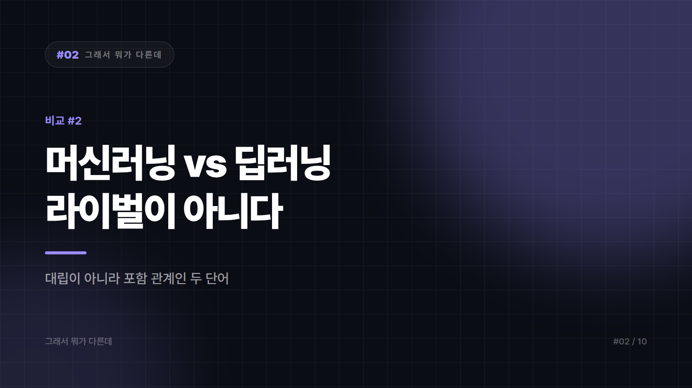
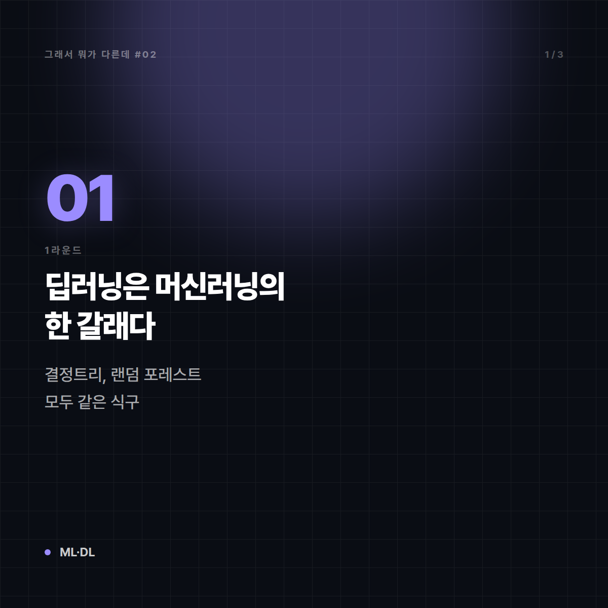
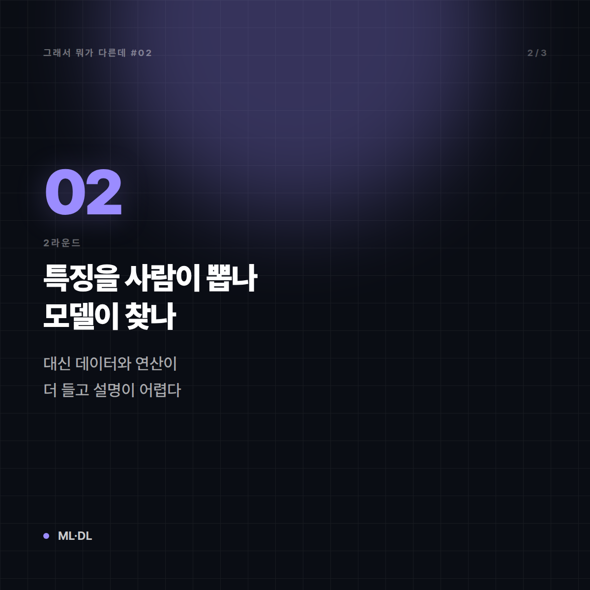
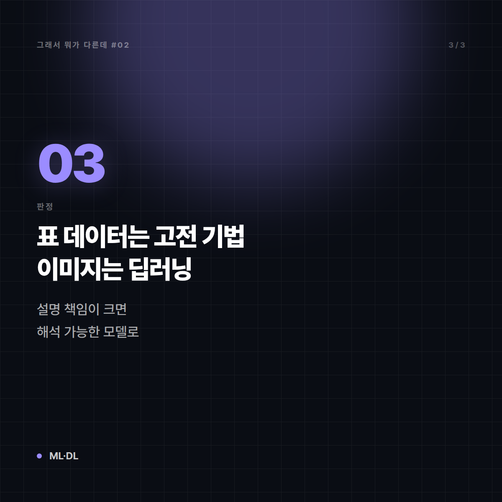
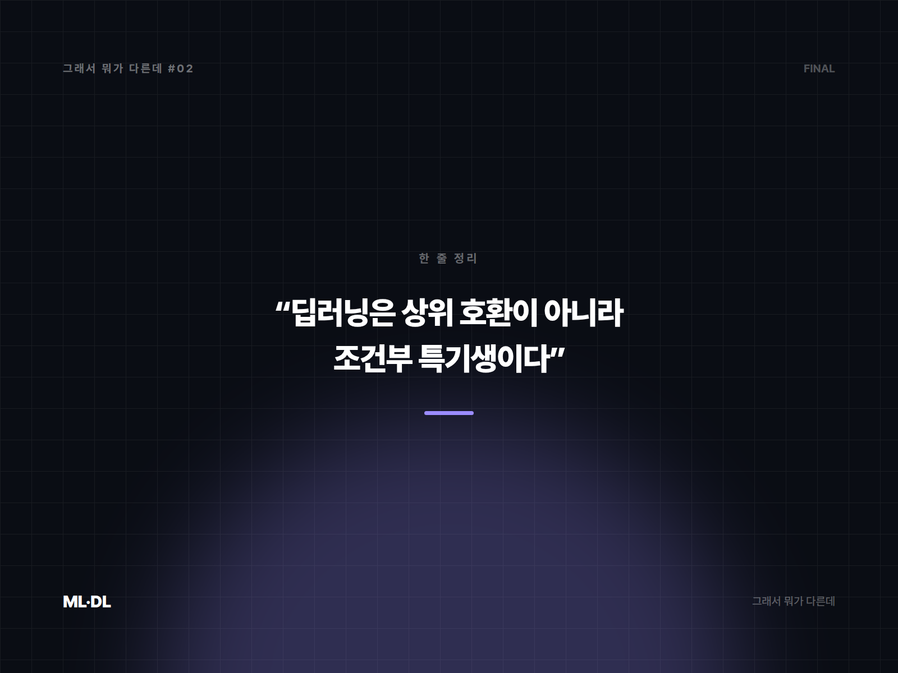

# 머신러닝 vs 딥러닝 — 둘은 라이벌이 아니라 큰집과 작은집이다

*시리즈: 그래서 뭐가 다른데 | 2/10*

---

"우리는 머신러닝이 아니라 딥러닝을 씁니다." 어느 발표 자료에서 이 문장을 본 적이 있다면, 발표자가 실수한 것이다. 딥러닝을 쓰면 머신러닝을 쓰고 있는 것이다. 개를 키우면서 "저는 개가 아니라 포메라니안을 키웁니다"라고 말하는 것과 같은 구조의 문장이기 때문이다.

이 둘은 **대립 관계가 아니라 포함 관계**다. 여기서부터 어긋나면 뒤에 나오는 설명이 전부 어긋난다.

## 1라운드 — 한 줄로 못 박기

**머신러닝**: 사람이 규칙을 일일이 코딩하는 대신, **데이터에서 규칙을 스스로 찾아내게 하는 방법 전체**를 부르는 큰 이름.

**딥러닝**: 그 방법들 중 하나로, **여러 층으로 깊게 쌓은 인공신경망**을 써서 규칙을 찾는 방식.

즉 딥러닝 ⊂ 머신러닝이다. 머신러닝에는 딥러닝 말고도 결정트리, 랜덤 포레스트, 서포트 벡터 머신, 선형회귀, k-최근접 이웃 같은 식구가 잔뜩 있다.

## 2라운드 — 결정적 차이

층을 깊게 쌓았다는 건 단순한 구조 차이가 아니다. 일하는 방식 자체가 갈린다.

| | 전통적 머신러닝 | 딥러닝 |
|---|---|---|
| 특징(feature) 설계 | **사람이 직접 뽑아준다.** "집값엔 평수·역세권·층수가 중요하다" | **모델이 스스로 찾아낸다.** 픽셀만 던져줘도 알아서 윤곽·질감을 잡는다 |
| 필요 데이터량 | 수백~수천 건으로도 쓸 만한 결과 | 대체로 훨씬 많이 필요 |
| 연산 자원 | 노트북 CPU로도 충분한 경우 많음 | GPU 등 가속기 의존도가 높음 |
| 잘 맞는 데이터 | 표(정형 데이터) | 이미지·음성·텍스트(비정형 데이터) |
| 해석 가능성 | 상대적으로 설명하기 쉬움 | 왜 그렇게 판단했는지 설명하기 어려움 |

여기서 가장 중요한 한 줄은 **특징 설계**다. 전통 머신러닝의 성능은 "어떤 변수를 넣어줬는가"에 크게 좌우돼서, 실무자 시간의 상당 부분이 그 작업에 들어갔다. 딥러닝은 그 단계를 모델 안으로 흡수했다. 대신 그 대가로 데이터와 연산을 더 요구하고, 판단 근거가 불투명해졌다.

## 3라운드 — 왜 헷갈리게 됐나

이유는 꽤 명확하다. **2010년대 이후 화제가 된 성과가 거의 다 딥러닝 쪽에서 나왔기 때문이다.** 이미지 인식, 음성 인식, 번역, 그리고 지금의 대형 언어 모델까지. 뉴스에 "AI"로 소개되는 것들이 대부분 딥러닝이다 보니, 머신러닝이라는 상위 개념이 통째로 딥러닝으로 덮여버렸다.

여기에 "AI ⊃ 머신러닝 ⊃ 딥러닝"이라는 3단 구조도 한몫한다. AI는 이 셋 중 가장 넓은 말이라, 규칙 기반 전문가 시스템처럼 학습을 전혀 하지 않는 것도 AI로 분류된다. 그런데 일상에서는 세 단어가 그냥 번갈아 쓰인다.

경계가 흐릿한 지점도 있다. 신경망 층을 2~3개만 쌓으면 그건 딥러닝인가? "깊다"의 기준에 합의된 숫자는 없다. 여러 층을 쌓아 표현을 단계적으로 학습하면 딥러닝으로 부르는 게 관행이지, 층수 몇 개부터라는 법조문이 있는 건 아니다.

## 그래서 언제 뭘

- **엑셀로 정리되는 표 형태 데이터, 행 수가 수천~수만 → 전통적 머신러닝부터.** 정형 데이터에서는 부스팅 계열 같은 고전 기법이 딥러닝보다 잘 나오는 경우가 흔하다. 학습도 빠르고 설명도 된다.
- **이미지·음성·자연어처럼 사람이 특징을 정의하기 어려운 데이터 → 딥러닝.** 이 영역은 사실상 대안이 없다.
- **왜 그런 판단을 했는지 설명해야 하는 업무(심사·승인·규제 대응) → 해석 가능한 모델 쪽에 무게를.** 성능 몇 퍼센트보다 설명 책임이 더 비쌀 때가 있다.
- **데이터가 적다면 → 딥러닝 욕심을 먼저 접어라.** 층을 깊게 쌓는 것보다 데이터를 더 모으는 게 빠른 길인 경우가 많다.

한 줄로: **딥러닝은 머신러닝의 한 갈래이고, 만능 상위 호환이 아니라 "특정 조건에서 압도적인 특기생"이다.**

---

## 🖼 이미지 (5장)

이 포스팅 전용으로 제작한 이미지입니다. 원본은 `images/02_머신러닝_vs_딥러닝/` 폴더에 있습니다.

**대표 썸네일 (1600×900)**

**본문 카드 1 (1200×1200)**

**본문 카드 2 (1200×1200)**

**본문 카드 3 (1200×1200)**

**마무리 카드 (1600×1200)**

