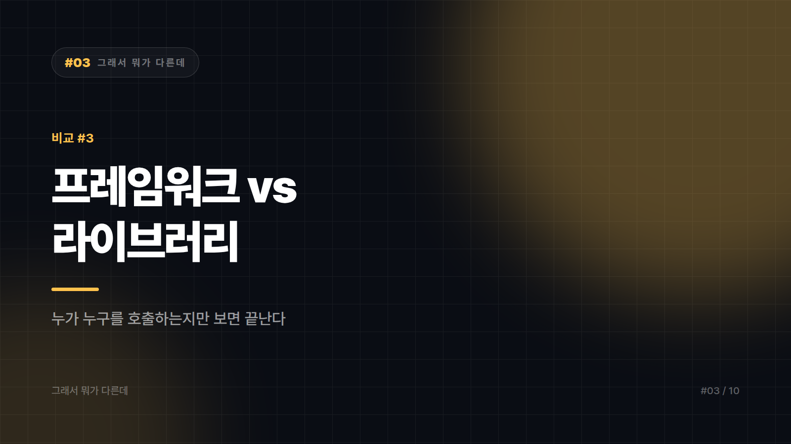

# 프레임워크 vs 라이브러리 — 누가 누구를 부르는지만 보면 끝난다

*시리즈: 그래서 뭐가 다른데 | 3/10*

---

"React는 라이브러리인가 프레임워크인가"로 인터넷에서 싸움이 난 걸 본 적 있을 것이다. 웃긴 건 양쪽 다 나름의 근거가 있다는 점이다. 그래서 이 편의 목표는 정답 판정이 아니다. 무엇을 기준으로 갈라야 하는지를 잡아두면 어떤 도구를 만나도 스스로 판단할 수 있다.

기준은 딱 하나다. 누가 누구를 호출하는가.

라이브러리는 내가 필요할 때 내가 불러다 쓰는 기능 모음이다. 주도권이 내 코드에 있다. 프레임워크는 큰 틀과 흐름이 이미 짜여 있고 내 코드가 그 안의 빈칸을 채우는 구조다. 주도권이 프레임워크에 있다. 업계에서는 이걸 제어의 역전이라 부르고, 별명으로는 할리우드 원칙이라고 한다. 우리에게 연락하지 마세요, 우리가 연락드리겠습니다. 오디션 보고 나온 배우에게 하는 그 말이 프레임워크가 내 코드에게 하는 말이다.

## 호출 방향이 바꿔놓는 것들

호출 방향이 갈리면 나머지가 줄줄이 갈린다. 라이브러리는 구조를 거의 강제하지 않지만 프레임워크는 폴더 구조와 파일명과 규약을 요구한다. 라이브러리는 프로젝트 중간에 끼워 넣을 수 있지만 프레임워크는 보통 시작할 때 결정된다. 자유도가 높으면 손이 많이 가고, 손이 덜 가면 자유도가 낮아진다. 이 맞바꿈은 피할 수 없다.

실무에서 가장 값비싼 항목은 교체 난이도다. 날짜 포맷 라이브러리를 바꾸는 건 오후 한나절이면 되지만, 프레임워크를 바꾸는 건 대개 다시 만든다와 같은 말이다. 앱 전체가 그 위에 얹혀 있기 때문이다. 그래서 라이브러리는 가볍게 골라도 되고, 프레임워크는 오래 고민해서 골라야 한다.

## 싸움이 끝나지 않는 이유

요즘 도구들은 스스로를 뭐라고 부를지 마케팅으로 정한다. 프레임워크라는 말은 무겁고 학습 곡선이 가파르다는 인상을 주기 때문에 일부러 가벼운 라이브러리를 자처하는 경우가 있고, 반대로 생태계가 크다는 걸 강조하려고 프레임워크를 자칭하기도 한다. 이름이 기술적 분류가 아니라 포지셔닝인 경우가 많다.

경계에 걸친 물건이 실제로 많기도 하다. 앞서 말한 React가 대표 사례다. 자체 주장은 UI 라이브러리이고, 렌더링 외에 라우팅이나 상태관리, 데이터 패칭을 강제하지 않는다는 점에서 라이브러리답다. 그런데 컴포넌트 함수를 개발자가 직접 호출하지 않고 React가 필요할 때 불러서 실행한다는 점, 훅 사용에 규칙을 강제한다는 점은 프레임워크의 성질이다. 한 물건 안에 두 성질이 섞여 있으니 싸움이 끝나지 않는다.

규모가 커지면 성질 자체가 변하기도 한다. 라이브러리를 여러 개 조합하고 그 위에 팀 내부 규약을 얹으면 결국 사내 프레임워크가 된다. 많은 팀이 우리는 프레임워크를 안 쓴다고 말하면서 실제로는 아무도 문서화하지 않은 프레임워크를 쓰고 있다.

## 고를 때의 감각

요구사항이 흔하고 빨리 만들어야 한다면 프레임워크가 낫다. 인증과 라우팅과 DB 연결을 매번 새로 설계하는 건 시간 낭비고, 정해진 대로 하기의 가치가 크다. 반대로 제품의 핵심 로직이 남들과 다르고 프레임워크의 가정과 계속 싸울 것 같다면 라이브러리를 조합하는 쪽이 낫다. 틀과 싸우기 시작하면 그때부터 생산성이 마이너스가 된다.

기존 코드에 기능 하나만 추가하는 일이라면 고민할 것도 없이 라이브러리다. 프레임워크는 중간에 얹는 물건이 아니다. 팀이 크거나 인원 교체가 잦다면 다시 프레임워크 쪽으로 기운다. 구조를 강제한다는 단점이 사람이 바뀌는 조직에서는 그대로 장점이 되기 때문이다.

헷갈리는 도구를 만나면 이렇게 물어보면 된다. 내 코드의 시작점은 어디 있지. 시작점을 내가 쥐고 있으면 라이브러리, 남의 손에 있으면 프레임워크다.

---

본문에 그림이 들어가면 좋을 자리는 아래와 같다. 실제 이미지는 아직 넣지 않았다.

〔이미지 자리 — 본문에서 1번째 논점을 설명하는 대목〕

〔이미지 자리 — 본문에서 2번째 논점을 설명하는 대목〕

〔이미지 자리 — 본문에서 3번째 논점을 설명하는 대목〕

〔이미지 자리 — 마지막 문단 바로 위〕
