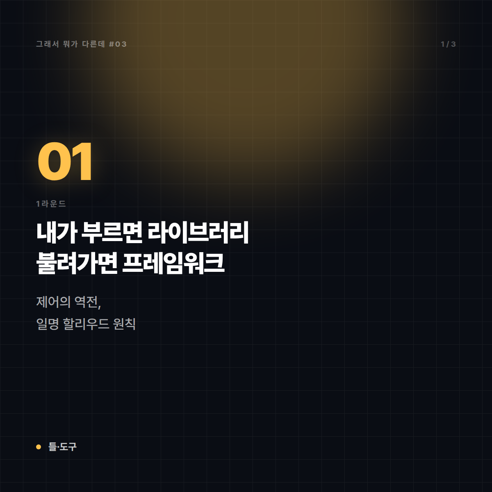
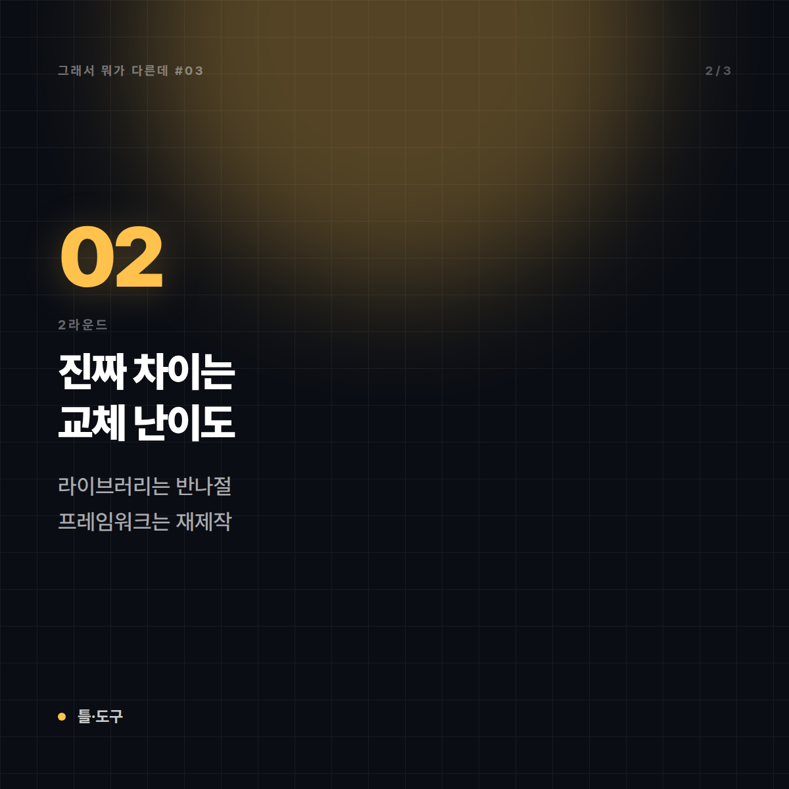
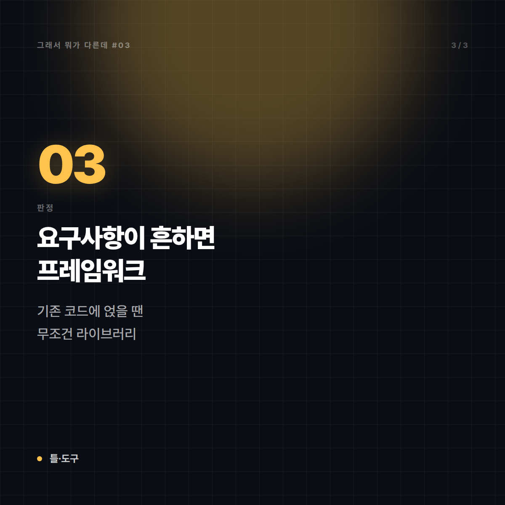
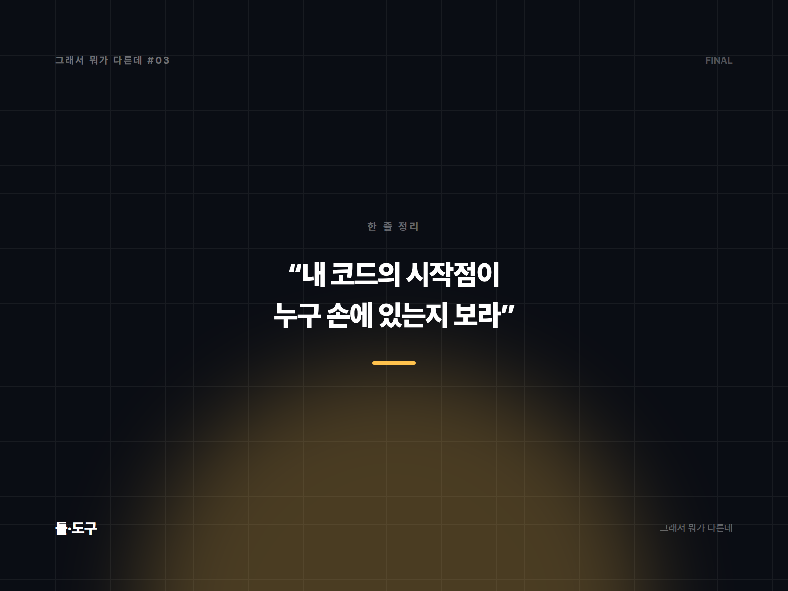

# 프레임워크 vs 라이브러리 — 누가 누구를 부르는지만 보면 끝난다

*시리즈: 그래서 뭐가 다른데 | 3/10*

---

"React는 라이브러리인가 프레임워크인가"로 인터넷에서 싸움이 난 걸 본 적 있을 것이다. 웃긴 건, 양쪽 다 나름의 근거가 있다는 점이다. 그래서 이 편의 목표는 "정답 판정"이 아니다. **무엇을 기준으로 갈라야 하는지**를 잡아두면, 어떤 도구를 만나도 스스로 판단할 수 있다.

기준은 딱 하나다. **누가 누구를 호출하는가.**

## 1라운드 — 한 줄로 못 박기

**라이브러리**: 내가 필요할 때 **내가 불러다 쓰는** 기능 모음. 주도권은 내 코드에 있다.

**프레임워크**: 큰 틀과 흐름이 이미 짜여 있고, **내 코드가 그 안의 빈칸을 채우는** 구조. 주도권은 프레임워크에 있다.

이걸 업계에서는 **제어의 역전(Inversion of Control)**, 별명으로는 **"할리우드 원칙"**이라고 부른다. "우리에게 연락하지 마세요, 우리가 연락드리겠습니다." 오디션 보고 나온 배우에게 하는 그 말이 프레임워크가 내 코드에게 하는 말이다.

## 2라운드 — 결정적 차이

| | 라이브러리 | 프레임워크 |
|---|---|---|
| 호출 방향 | 내 코드 → 도구 | 도구 → 내 코드 |
| 흐름 제어권 | 나 | 프레임워크 |
| 구조 강제 | 거의 없음 | 폴더 구조·파일명·규약을 요구 |
| 교체 난이도 | 비교적 쉬움 (그 부분만 들어냄) | 어려움 (앱 전체가 그 위에 얹혀 있음) |
| 도입 시점 | 중간에 끼워 넣기 가능 | 보통 프로젝트 시작 시 결정 |
| 자유도 vs 속도 | 자유도가 높고 손이 많이 감 | 손이 덜 가고 자유도가 낮음 |

실무에서 가장 값비싼 줄은 **교체 난이도**다. 날짜 포맷 라이브러리를 바꾸는 건 오후 한나절이면 되지만, 프레임워크를 바꾸는 건 대개 "다시 만든다"와 같은 말이다. 그래서 라이브러리는 가볍게 골라도 되고, 프레임워크는 오래 고민해서 골라야 한다.

## 3라운드 — 왜 헷갈리게 됐나

**첫째, 요즘 도구들이 스스로를 뭐라고 부를지 마케팅으로 정한다.** "프레임워크"는 무겁고 학습 곡선이 가파르다는 인상을 주기 때문에, 일부러 "가벼운 라이브러리"를 자처하는 경우가 있다. 반대로 생태계가 크다는 걸 강조하려고 프레임워크를 자칭하기도 한다. **이름은 기술적 분류가 아니라 포지셔닝인 경우가 많다.**

**둘째, 경계에 걸친 물건이 실제로 많다.** 앞서 말한 React가 대표 사례다. 자체 주장은 "UI 라이브러리"고, 실제로 렌더링 외의 라우팅·상태관리·데이터 패칭을 강제하지 않는다는 점에서 라이브러리답다. 그런데 컴포넌트 함수를 개발자가 직접 호출하지 않고 React가 필요할 때 불러서 실행한다는 점, 그리고 훅 사용에 규칙을 강제한다는 점은 프레임워크의 성질이다. **한 물건 안에 두 성질이 섞여 있으니 싸움이 끝나지 않는다.**

**셋째, 규모가 커지면 성질이 변한다.** 라이브러리를 여러 개 조합하고 그 위에 팀 내부 규약을 얹으면, 결국 사내 프레임워크가 된다. 많은 팀이 "우리는 프레임워크를 안 쓴다"고 말하면서 실제로는 아무도 문서화하지 않은 프레임워크를 쓰고 있다.

## 그래서 언제 뭘

- **요구사항이 흔하고 빨리 만들어야 한다면 → 프레임워크.** 인증, 라우팅, DB 연결 같은 걸 매번 새로 설계하는 건 시간 낭비다. "정해진 대로 하기"의 가치가 크다.
- **제품의 핵심 로직이 남들과 다르고, 프레임워크의 가정과 계속 싸울 것 같다면 → 라이브러리 조합.** 틀과 싸우기 시작하면 그때부터 생산성이 마이너스가 된다.
- **기존 코드에 기능 하나만 추가하려면 → 무조건 라이브러리.** 프레임워크는 중간에 얹는 물건이 아니다.
- **팀이 크거나 인원 교체가 잦다면 → 프레임워크 쪽.** 구조를 강제한다는 단점이, 사람이 바뀌는 조직에서는 그대로 장점이 된다.

마지막으로 판별법 하나. 헷갈리는 도구를 만나면 물어보면 된다. **"내 코드의 main 함수는 어디 있지?"** 내가 시작점을 쥐고 있으면 라이브러리, 시작점이 남의 손에 있으면 프레임워크다.

---

## 🖼 이미지 (5장)

이 포스팅 전용으로 제작한 이미지입니다. 원본은 `images/03_프레임워크_vs_라이브러리/` 폴더에 있습니다.

**대표 썸네일 (1600×900)**

**본문 카드 1 (1200×1200)**

**본문 카드 2 (1200×1200)**

**본문 카드 3 (1200×1200)**

**마무리 카드 (1600×1200)**

