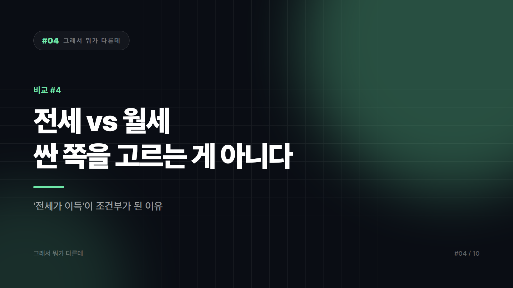
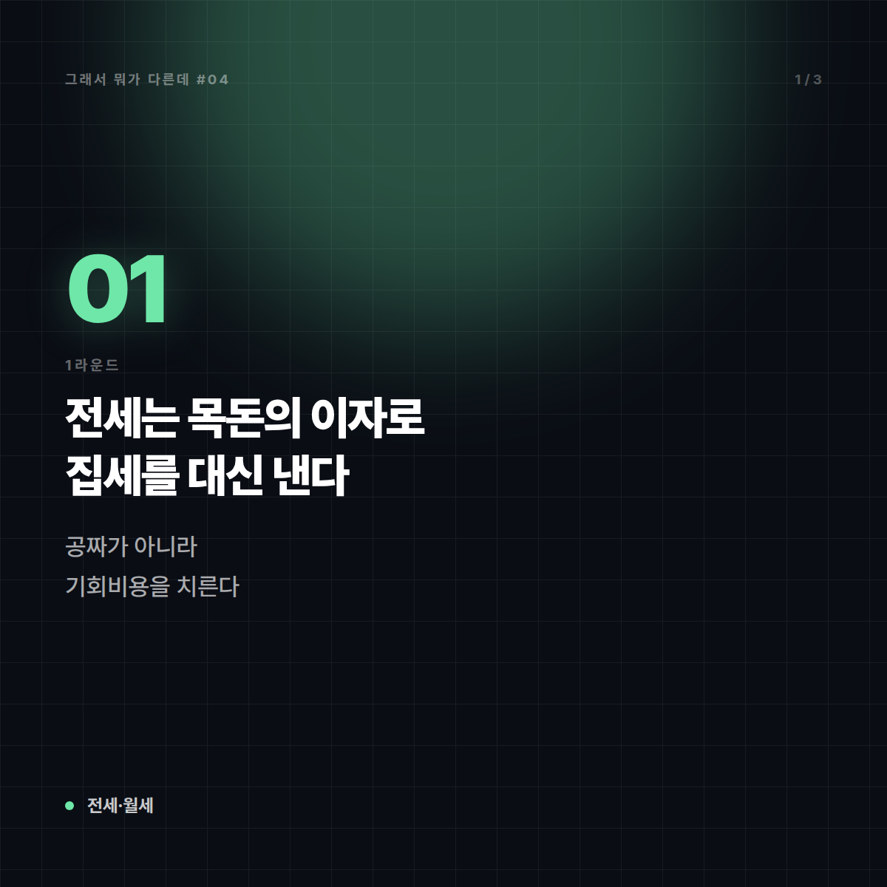
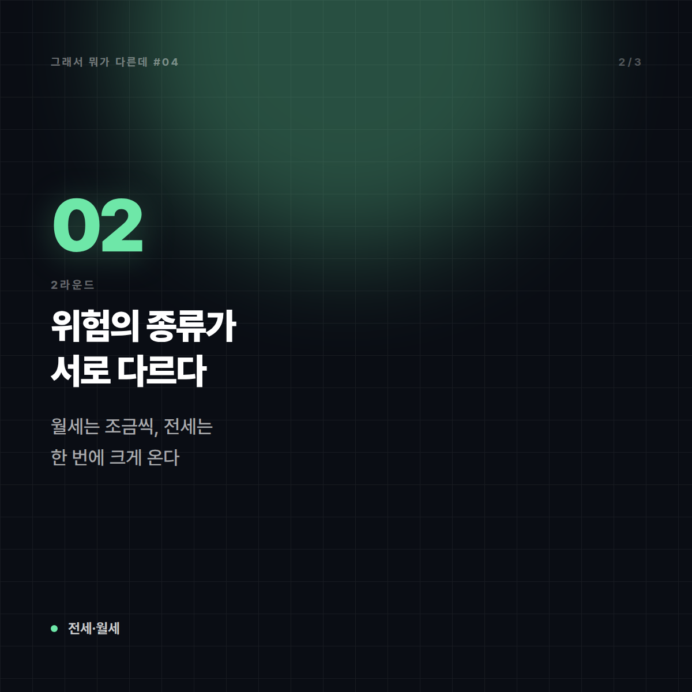
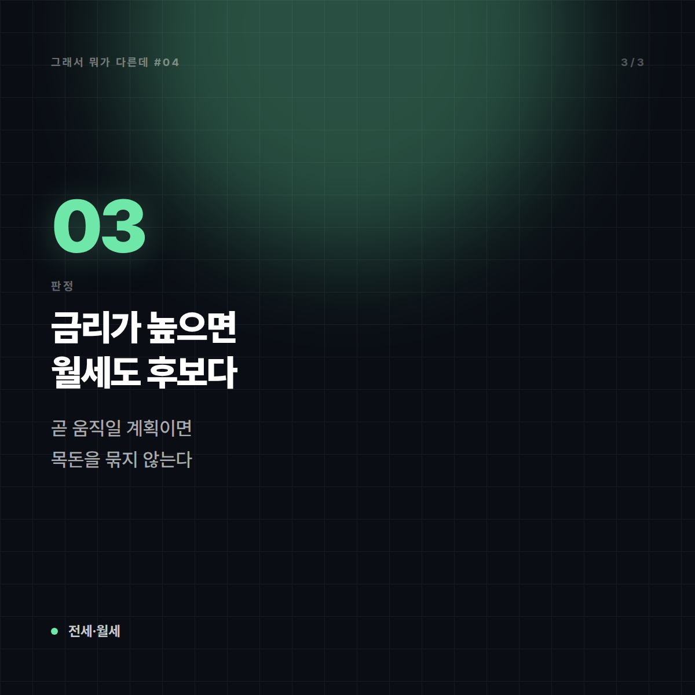

# 전세 vs 월세 — "전세가 이득"이라는 말이 언제부터 조건부가 됐나

*시리즈: 그래서 뭐가 다른데 | 4/10*

---

부모 세대에게 물어보면 답이 한 줄로 끝난다. "무조건 전세지, 월세는 돈 버리는 거야." 그 말이 통했던 시기가 분명히 있었다. 문제는 그 문장이 **이자율이 낮고 집값이 우상향한다는 두 가지 전제 위에서만** 성립했다는 것이다. 전제가 흔들리면 결론도 흔들린다.

전세와 월세는 "싼 거 vs 비싼 거"가 아니다. **성격이 다른 두 개의 계약**이고, 무엇보다 **짊어지는 위험의 종류가 다르다.**

## 1라운드 — 한 줄로 못 박기

**전세**: 목돈(보증금)을 집주인에게 맡기고 사는 대신 매달 임대료를 거의 내지 않는 계약. 계약이 끝나면 맡긴 돈을 돌려받는다.

**월세**: 상대적으로 적은 보증금을 걸고, 사용료를 매달 현금으로 지불하는 계약.

한 문장으로 줄이면 이렇다. **전세는 내 목돈의 "이자"로 집세를 대신 내는 구조**다. 공짜로 사는 게 아니라, 그 돈을 다른 데 굴렸다면 벌었을 수익을 포기하는 것이다. 경제학에서 말하는 기회비용이 집세의 실체다.

## 2라운드 — 결정적 차이

| | 전세 | 월세 |
|---|---|---|
| 초기 자금 | 크다 | 작다 |
| 매달 현금 유출 | 거의 없음(관리비 등 제외) | 매달 발생 |
| 실질 비용 | 보증금의 기회비용 + 대출 이자 | 월세 + 보증금 기회비용 |
| 가장 큰 위험 | **보증금을 못 돌려받을 위험** | 매달 현금이 나가 자산 축적이 느림 |
| 금리가 오르면 | 전세대출 이자 부담 급증 → 불리 | 상대적으로 유리해짐 |
| 이사 유연성 | 낮음(목돈이 묶임) | 높음 |

표에서 가장 굵게 읽어야 할 줄은 **"가장 큰 위험"** 행이다. 월세의 손실은 매달 조금씩, 예측 가능한 크기로 발생한다. 전세의 손실은 평소엔 0이다가, 터지면 **내 전 재산 규모로** 한 번에 온다. 성격이 완전히 다른 위험을 "얼마 나가냐"라는 하나의 잣대로 비교하니 판단이 어긋난다.

## 3라운드 — 실제로 헷갈리는 지점

**"월세는 사라지는 돈, 전세는 돌아오는 돈"이라는 프레임.** 절반만 맞다. 전세 보증금은 돌아오지만, 그 돈이 묶여 있던 기간의 수익은 돌아오지 않는다. 전세대출을 받았다면 이자는 월세와 똑같이 사라지는 돈이다. 전세대출 이자가 같은 집 월세와 비슷하다면, 두 선택의 현금 흐름 차이는 생각보다 크지 않다.

**반전세(보증부 월세)라는 회색지대.** 보증금을 어느 정도 걸고 월세도 내는 형태가 이미 흔하다. 전세와 월세는 양자택일이 아니라 **하나의 축 위에 놓인 스펙트럼**이고, 반전세는 그 중간 어디쯤이다. 집주인과 세입자가 각자의 사정으로 그 지점을 조정하는 것뿐이다.

**"전세가가 싸니 안전하다"는 착각.** 오히려 반대인 경우가 있다. 전세보증금이 매매가에 가까울수록, 집값이 조금만 떨어져도 보증금을 온전히 돌려받기 어려워진다. 계약 전에 등기부등본으로 선순위 권리관계를 확인하고, 보증금 반환을 보장하는 공적 보증 상품 가입 가능 여부를 따져보는 게 실질적인 안전장치다. **다만 보증 가입 요건과 한도, 대출·세제 관련 기준은 정책에 따라 바뀌므로, 계약 시점의 최신 기준을 반드시 직접 확인해야 한다.** 이 글은 구조 설명이지 개별 계약에 대한 법률·금융 자문이 아니다.

## 그래서 언제 뭘

- **목돈이 있고, 시장 금리보다 전세로 아끼는 주거비가 크며, 권리관계가 깨끗한 매물 → 전세.** 단, 보증금 보호 장치를 먼저 확인하고 나서.
- **금리가 높거나, 전세대출 이자가 월세와 비슷한 수준 → 월세를 진지하게 검토.** "전세가 무조건 이득"이라는 말이 깨지는 구간이 바로 여기다.
- **1~2년 안에 이직·유학·결혼 등으로 움직일 가능성이 있다면 → 월세.** 목돈이 묶이면 기회가 와도 못 움직인다.
- **목돈이 전 재산이고 그걸 잃으면 재기가 어렵다면 → 보증금 규모를 낮추는 쪽.** 기대수익보다 최악의 시나리오를 먼저 계산하는 게 맞다.

정리. **전세는 목돈을 위험에 넣고 월 현금흐름을 사는 계약, 월세는 월 현금을 내고 목돈의 안전과 기동성을 사는 계약이다.** 어느 쪽이 이득이냐는 질문에는 답이 없고, "지금 내 금리와 내 인생 계획에서 어느 쪽이냐"에만 답이 있다.

---

## 🖼 이미지 (5장)

이 포스팅 전용으로 제작한 이미지입니다. 원본은 `images/04_전세_vs_월세/` 폴더에 있습니다.

**대표 썸네일 (1600×900)**

**본문 카드 1 (1200×1200)**

**본문 카드 2 (1200×1200)**

**본문 카드 3 (1200×1200)**

**마무리 카드 (1600×1200)**

