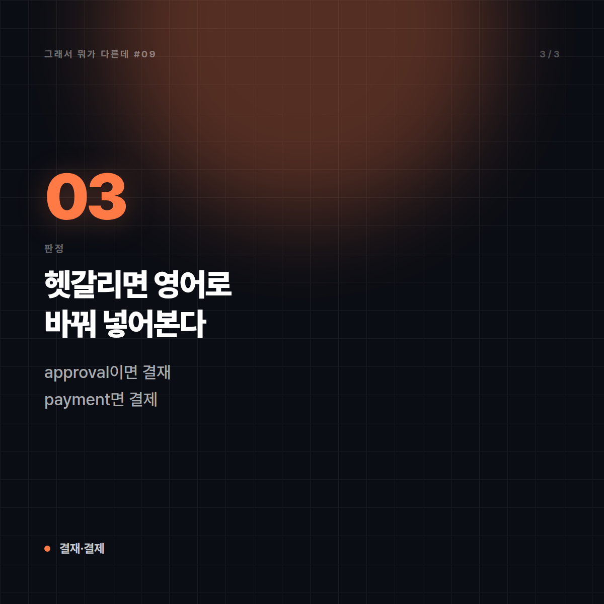

# 결재 vs 결제 — 팀장님께 '결제' 올렸다가 민망해지기 전에

*시리즈: 그래서 뭐가 다른데 | 9/10*

---

업무 메일에서 가장 자주 목격되는 오타 중 하나다. "부장님 결제 부탁드립니다"라고 보내면, 문장 그대로 읽었을 때 **부장님께 돈을 내달라는 요청**이 된다. 물론 다들 알아서 알아듣지만, 대외 문서나 공문에서 이게 나가면 이야기가 달라진다.

한글로 한 글자, 소리도 거의 같다. 그런데 한자로 보면 겹치는 구석이 하나도 없다.

## 1라운드 — 한 줄로 못 박기

**결재(決裁)**: 결정할 결(決) + 재가할 재(裁). **권한을 가진 윗사람이 안건을 검토하고 승인하는 것.**

**결제(決濟)**: 결정할 결(決) + 건널·마칠 제(濟). **대금을 주고받아 거래 관계를 끝내는 것.**

공통 글자는 '決' 하나뿐이고, 뒷글자가 뜻을 완전히 갈라놓는다. **'재(裁)'는 재판·재량의 그 재**로 판단하고 자른다는 의미고, **'제(濟)'는 경제·구제의 그 제**로 마무리한다는 의미다.

## 2라운드 — 결정적 차이

| | 결재 | 결제 |
|---|---|---|
| 한자 | 決裁 | 決濟 |
| 주체 | 승인 권한이 있는 상급자 | 돈을 지불하는 쪽 |
| 오가는 것 | 판단·승인 | 돈 |
| 붙는 말 | 결재판, 결재라인, 전자결재, 대결 | 결제대금, 카드결제, 간편결제, 결제일 |
| 영어로 옮기면 | approval | payment / settlement |

가장 빠른 판별법은 **영어 치환**이다. 그 자리에 'approval'을 넣어 말이 되면 결재, 'payment'를 넣어 말이 되면 결제다. "팀장님 approval 부탁드립니다"는 자연스럽고, "카드 approval"은 이상하다. 1초 만에 끝난다.

두 번째 판별법은 **돈이 실제로 움직이는가**다. 움직이면 무조건 결제, 안 움직이면 결재. 예산 지출 품의서를 올리는 행위는 아직 돈이 안 나갔으니 **결재**고, 승인 후 실제로 대금을 보내는 단계가 **결제**다. 같은 건에서 두 단어가 순서대로 나오는 셈이다.

## 3라운드 — 실제로 헷갈리는 지점

**첫째, 소리가 거의 구분되지 않는다.** 한국어에서 'ㅐ'와 'ㅔ'의 구분은 현실 발음에서 상당히 약해졌다. 귀로는 안 갈리고 눈으로만 갈리는 쌍이니, 말할 때는 아무 문제가 없다가 쓸 때만 사고가 난다. '되/돼', '뵈요/봬요'가 틀리는 것과 같은 계열의 문제다.

**둘째, 자동완성과 변환이 도와주지 않는다.** 둘 다 실재하는 단어라 맞춤법 검사기가 빨간 줄을 안 그어준다. 문맥을 봐야만 잡히는 오류라서, 기계 검수의 그물을 그냥 통과한다.

**셋째, 진짜 한 문장 안에 둘이 같이 나오는 상황이 있다.** "법인카드 결제 건에 대한 결재를 요청드립니다." 이 문장은 둘 다 맞게 쓴 것이다. 지출은 결제고 승인은 결재다. 이런 문장을 쓸 때 사람들이 가장 많이 흔들린다.

**넷째, 비슷한 함정이 하나 더 있다.** '결제'와 '계좌이체'는 헷갈리지 않는데, **'대금 결재'라는 표기는 지금도 문서에서 종종 발견된다.** 특히 오래된 사내 양식이나 계약서 서식에 굳어 있는 경우가 있어, 신입이 그 양식을 그대로 물려받으며 오류가 대물림된다.

## 그래서 언제 뭘

- **승인해 달라 → 결재.** "결재 부탁드립니다", "결재 라인에 올렸습니다", "전자결재 상신했습니다".
- **돈을 낸다 → 결제.** "카드로 결제했습니다", "결제 완료 메일", "결제일이 언제인가요".
- **헷갈리는 순간 → approval/payment 치환 테스트.** 이 규칙 하나면 평생 안 틀린다.
- **회사 양식에 '결재'와 '결제'가 뒤섞여 있다면 → 그건 고쳐도 되는 오류다.** 관행이라고 해서 맞는 표기가 되지는 않는다.

보너스로 같은 계열의 단골 쌍 셋을 덧붙인다.
- **지양(止揚, 하지 않는 것) vs 지향(志向, 목표로 삼는 것)** — "폭력적 표현은 지양합니다"가 맞다. 지향이라고 쓰면 정반대 뜻이 된다.
- **결단(決斷) vs 결정(決定)** — 결단은 망설임을 끊는 쪽, 결정은 선택을 정하는 쪽에 무게가 있다.
- **재고(再考, 다시 생각함) vs 재고(在庫, 남은 물건)** — 표기가 같아서 문맥으로만 갈린다. "재고해 주십시오"를 창고 담당자가 보면 오해할 수 있다.

한 줄로. **결재는 도장이 움직이고, 결제는 돈이 움직인다.**

---

## 🖼 이미지 (5장)

이 포스팅 전용으로 제작한 이미지입니다. 원본은 `images/09_결재_vs_결제/` 폴더에 있습니다.

**대표 썸네일 (1600×900)**

**본문 카드 1 (1200×1200)**

**본문 카드 2 (1200×1200)**

**본문 카드 3 (1200×1200)**

**마무리 카드 (1600×1200)**

