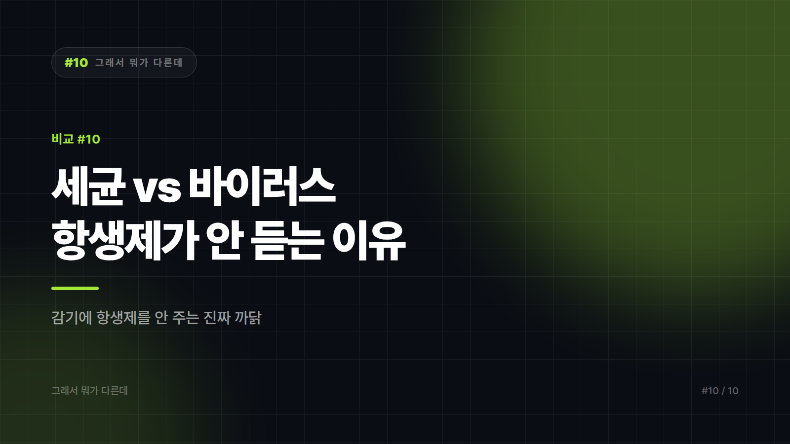

# 세균 vs 바이러스 — "항생제 주세요"가 통하지 않는 이유

*시리즈: 그래서 뭐가 다른데 | 10/10*

---

감기에 걸려 병원에 갔는데 항생제를 안 준다. 억울한 마음에 "지난번엔 줬는데요"라고 말해본 적 있는가. 의사가 인색한 게 아니라, **약이 작동할 대상이 거기 없는 것**이다.

세균과 바이러스는 둘 다 눈에 안 보이고, 둘 다 우리를 아프게 하고, 심지어 증상도 비슷하게 만든다. 그래서 뭉뚱그려 '균'이라고 불린다. 그런데 이 둘은 생물학적으로 **사람과 버섯보다 훨씬 먼 사이**다.

## 1라운드 — 한 줄로 못 박기

**세균(박테리아)**: 스스로 영양분을 쓰고 스스로 분열해 번식하는 **단세포 생물**. 적당한 환경만 있으면 숙주 없이도 산다.

**바이러스**: 유전물질(DNA 또는 RNA)을 단백질 껍질이 감싼 입자. **스스로는 번식할 수 없고, 반드시 살아있는 세포 안에 들어가 그 세포의 복제 장치를 빌려 써야 한다.** 그래서 생물이냐 아니냐를 두고 지금도 논쟁이 있다.

한 문장으로. **세균은 무단 침입한 세입자, 바이러스는 남의 공장 설비를 점거해 자기 제품을 찍어내는 쪽이다.**

## 2라운드 — 결정적 차이

| | 세균 | 바이러스 |
|---|---|---|
| 세포 구조 | 있음(단세포 생물) | 없음(세포가 아님) |
| 크기 | 대체로 마이크로미터 단위 | 대체로 나노미터 단위, 훨씬 작음 |
| 자체 번식 | 가능 | 불가능(숙주 세포 필요) |
| 숙주 밖 생존 | 조건만 맞으면 가능 | 증식 불가, 입자로만 존재 |
| 항생제 | **효과 있음** | **효과 없음** |
| 대응 약물 | 항생제 | 항바이러스제(있는 질환에 한함) |
| 인체에 이로운 경우 | 있음(장내 세균 등) | 드묾 |

가장 실생활에 직결되는 줄은 **항생제** 행이다. 항생제는 세균의 세포벽 합성이나 단백질 합성 같은 **세균만 가진 구조**를 공격하도록 만들어졌다. 바이러스에는 그 구조 자체가 없다. 총알이 빗나가는 게 아니라, 조준할 과녁이 없는 것이다.

그리고 **감기와 대부분의 급성 인후통·독감은 바이러스가 원인**이다. 그래서 항생제를 처방하지 않는 게 원칙에 맞는 진료다.

## 3라운드 — 실제로 헷갈리는 지점

**첫째, 증상만으로는 구분이 잘 안 된다.** 열, 인후통, 기침은 양쪽 다 만든다. 그래서 환자 입장에서는 "같은 병"으로 느껴지고, 지난번에 항생제를 받았던 기억이 이번에도 적용될 거라 기대하게 된다. 실제로 구분하려면 진찰과 필요한 경우 검사가 필요하다.

**둘째, 실제로 둘이 섞이는 상황이 있다.** 바이러스 감염으로 점막이 약해진 뒤에 세균이 추가로 자리 잡는 **2차 세균 감염**이 대표적이다. 감기 뒤에 오는 일부 부비동염·중이염·폐렴이 여기 해당할 수 있다. 이 경우엔 항생제가 필요해질 수 있다. **"감기에 항생제를 받은 적이 있다"는 기억은 대개 이 상황이었을 가능성이 크다** — 감기 자체를 치료한 게 아니라 뒤따라온 세균 감염을 다룬 것이다.

**셋째, '균'이라는 말이 너무 넓다.** 일상어의 '균'에는 세균, 바이러스, 곰팡이(진균)가 다 들어간다. 무좀은 곰팡이, 감기는 바이러스, 식중독은 원인에 따라 세균일 수도 바이러스일 수도 있다. 단어 하나가 세 종류를 덮고 있으니 구분이 될 리가 없다.

**넷째, 손 씻기는 왜 둘 다에 통하나.** 원리가 다르다. 비누는 세균에도 작용하지만, 지질막(외피)을 가진 바이러스의 경우 그 막을 무너뜨리는 효과가 있다. 어느 쪽이든 물리적으로 씻어내는 것 자체가 크게 작용한다. 그래서 손 씻기는 구분 없이 유효한, 드물게 단순한 대책이다.

## 그래서 언제 뭘

- **항생제 → 세균 감염이 확인되거나 강하게 의심될 때만.** 남은 항생제를 다음 감기에 꺼내 먹는 건 효과가 없을 뿐 아니라, 내성균을 키우는 데 기여한다. 처방받은 항생제를 증상이 나아졌다고 중간에 끊는 것도 같은 이유로 권장되지 않는다.
- **감기·독감류 → 대증 치료와 휴식이 기본.** 일부 바이러스 질환에는 항바이러스제가 있지만, 질환과 시기에 따라 적용이 다르다.
- **예방 → 백신은 특정 병원체를 겨냥해 만든다.** 세균용 백신도 있고 바이러스용 백신도 있다. "백신 = 바이러스용"은 오해다.
- **증상이 길어지거나 갑자기 나빠지면 → 2차 감염 가능성을 포함해 진료를 받는 게 맞다.**

**이 글은 생물학적 개념 차이를 정리한 것이며, 진단이나 치료에 대한 권고가 아니다. 증상이 있거나 약물 복용을 결정해야 하는 상황이라면 반드시 의사·약사와 상의해야 한다.**

한 줄로. **세균은 혼자 살고, 바이러스는 남의 세포를 빌려 산다. 그 하나의 차이가 약이 듣느냐 마느냐를 전부 결정한다.**

---

*10편으로 '그래서 뭐가 다른데' 시리즈를 마칩니다. 헷갈리던 한 쌍이라도 선명해졌다면 목적은 달성입니다.*

---

본문에 그림이 들어가면 좋을 자리는 아래와 같다. 실제 이미지는 아직 넣지 않았다.

〔이미지 자리 — 본문에서 1번째 논점을 설명하는 대목〕

〔이미지 자리 — 본문에서 2번째 논점을 설명하는 대목〕

〔이미지 자리 — 본문에서 3번째 논점을 설명하는 대목〕

〔이미지 자리 — 마지막 문단 바로 위〕
