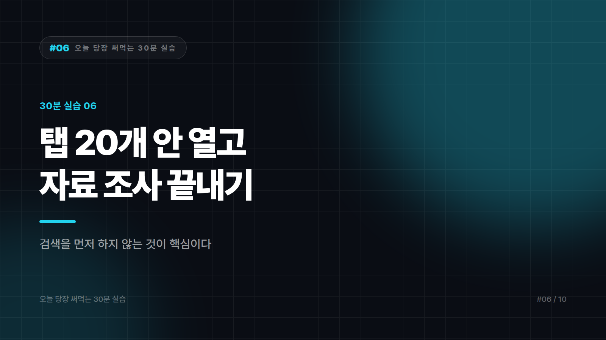

# 자료 조사, 탭 20개 안 열고 끝내는 루틴

*시리즈: 오늘 당장 써먹는 30분 실습 | 6/10*

> 소요 시간 30분 · 준비물 조사해야 할 주제 하나 · 난이도 ★★★☆☆

---

이 시장 좀 조사해봐라는 지시를 받으면 대부분 이렇게 한다. 검색창에 키워드를 넣고, 탭을 스무 개 열고, 두 시간 뒤에 정리 안 된 링크 더미와 함께 남는다. 즐겨찾기 폴더 이름은 "나중에 볼 것"이고, 앞으로도 안 볼 것이다.

이 실습은 그 과정을 뒤집는다. 검색을 먼저 하지 않는 것이 핵심이다.

---

## STEP 1 — 검색 대신 질문 목록부터 만든다 (5분)

조사가 산으로 가는 이유는 무엇을 알아내야 하는지 정하지 않고 찾기 시작하기 때문이다.

```
[조사 주제]에 대해 조사하려고 합니다.
목적은 [왜 조사하는지 — 예: 신규 사업 진출 여부 판단]입니다.

아직 정보를 주지 마세요.
대신, 이 주제를 제대로 파악하려면 어떤 질문에 답해야 하는지
질문 목록을 10개 만들어주세요.

- 반드시 답해야 할 핵심 질문과, 있으면 좋은 질문을 구분해주세요
- 초심자가 놓치기 쉬운 질문도 포함해주세요
```

이 질문 목록이 조사의 체크리스트가 된다. 앞으로 검색은 이 목록을 채우는 작업이 되고, 이쯤이면 됐나를 판단할 기준도 생긴다.

---

## STEP 2 — 아는 것과 확인이 필요한 것을 가른다 (10분)

여기가 이 실습에서 가장 중요한 단계다. AI를 검색 엔진처럼 쓰면 안 되는 이유와도 직결된다.

```
방금 만든 질문 목록에 답해주세요. 단, 각 답변마다 반드시 표시해주세요.

[확실] — 널리 알려진 안정적인 사실
[불확실] — 맞을 가능성이 높지만 확인이 필요함
[모름] — 최신 정보이거나 특정 기업 내부 정보라 답할 수 없음

특히 아래는 무조건 [확인 필요]로 표시해주세요.
- 구체적인 수치, 점유율, 매출 규모
- 최근 1~2년 내의 변화
- 특정 기업의 현재 상태
- 법규, 제도, 요금
```

답변보다 이 분류가 더 가치 있다. 어디를 직접 확인해야 하는지 지도가 그려지기 때문이다. 확실로 분류된 건 배경 지식으로 쓰고 넘어가면 되고, 불확실은 원출처를 찾아 교차 확인한다. 모름으로 남은 항목이 진짜 조사 대상이다. 직접 검색하거나 담당자에게 물어야 채워진다.

---

## STEP 3 — 검색은 여기서 시작한다 (10분)

이제 브라우저를 연다. 불확실과 모름으로 표시된 항목만 찾는다. 스무 개였던 탭이 서너 개로 줄어든다.

찾을 때는 출처의 급을 구분하자. 정부와 공공기관 통계, 기업 공시자료, 학술 논문, 기업 공식 발표가 가장 위다. 주요 언론 보도와 업계 전문 매체가 그다음이다. 블로그와 커뮤니티, 요약 콘텐츠는 출처로 인용하면 안 되고 위의 두 급을 찾는 단서로만 쓴다.

수치를 인용해야 한다면 가장 위 등급의 출처까지 거슬러 올라가는 게 원칙이다. 기사에 나온 숫자도 원본 보고서를 찾아 확인한다. 기사가 반올림하거나 조건을 생략한 경우가 흔하다.

---

## STEP 4 — 구조로 정리하고 빈칸을 남긴다 (5분)

```
지금까지 확인한 내용을 정리해주세요.

[확인된 사실]
- 내용 (출처)

[추정 — 근거 있음]
- 내용 (어떤 근거에서 추정했는지)

[아직 모르는 것]
- 항목과, 누구에게 물어봐야 알 수 있는지

마지막 항목을 절대 비워두지 마세요. 모르는 게 없을 리 없습니다.
```

마지막 지시가 핵심이다. 아직 모르는 것이 비어 있는 조사 보고서는 십중팔구 부실한 조사다. 이걸 명시하면 보고받는 사람도 어디까지 믿을지 판단할 수 있고, 나중에 틀렸을 때 책임 소재도 명확해진다.

---

## 자주 나오는 실수

AI가 말한 통계를 그대로 보고서에 쓰는 게 가장 크게 사고 나는 지점이다. AI는 그럴듯한 숫자와 출처를 만들어낼 수 있다. 어떤 보고서에 따르면 시장 규모가 몇조 원이라는 문장을 원문 확인 없이 쓰면 안 된다. 존재하지 않는 보고서일 수 있다.

출처 링크가 제시됐다고 안심하는 것도 위험하다. 링크를 실제로 열어서 그 안에 정말 그 내용이 있는지 확인해야 한다. 링크는 살아 있는데 내용이 다른 경우가 있다.

조사 범위를 계속 넓히는 것도 흔한 실수다. STEP 1에서 질문 목록을 만든 이유가 이것이다. 목록에 없는 흥미로운 내용이 나오면 따로 적어두고, 이번 조사는 목록까지만 끝낸다.

---

## 완료 체크리스트

- [ ] 검색하기 전에 질문 목록 10개를 만들었다
- [ ] 답변을 [확실] / [불확실] / [모름]으로 분류했다
- [ ] [불확실]·[모름] 항목만 직접 검색했다
- [ ] 인용한 수치는 1급 출처에서 직접 확인했다
- [ ] "아직 모르는 것" 항목을 비워두지 않았다

---

*다음 편: [30분 실습 #7] 메일과 메신저 쓰는 시간 절반으로 줄이기*

---


본문에 그림이 들어가면 좋을 자리는 아래와 같다. 실제 이미지는 아직 넣지 않았다.

〔이미지 자리 — 본문에서 1번째 논점을 설명하는 대목〕

〔이미지 자리 — 본문에서 2번째 논점을 설명하는 대목〕

〔이미지 자리 — 본문에서 3번째 논점을 설명하는 대목〕

〔이미지 자리 — 마지막 문단 바로 위〕
