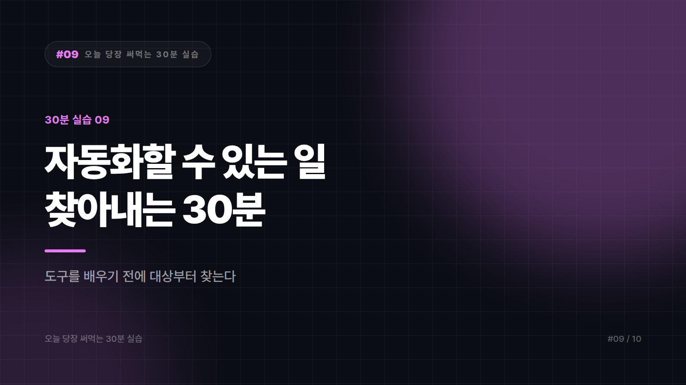

# 내 업무 중 자동화할 수 있는 것을 골라내는 법

*시리즈: 오늘 당장 써먹는 30분 실습 | 9/10*

> 소요 시간 30분 · 준비물 지난 일주일간 한 일에 대한 기억 · 난이도 ★★★☆☆

---

업무 자동화라는 말을 들으면 대개 거창한 걸 떠올린다. 시스템 구축, 개발자 섭외, 예산 결재. 그래서 시작을 못 한다. 그러다 결국 올해도 손으로 또 한다.

이 실습은 반대로 간다. 자동화 도구를 배우기 전에 자동화할 대상부터 찾는다. 대부분의 사람이 이 단계를 건너뛰기 때문에 툴만 배우고 쓸 곳을 못 찾는다.

---

## STEP 1 — 지난주에 한 일을 다 적는다 (10분)

거창하게 적지 말고 생각나는 대로 나열하자. 서른 개쯤 나오면 충분하다.

```
월요일: 주간보고 취합, 메일 확인, 거래처 견적 3건 회신, 재고 시트 업데이트...
화요일: 회의록 정리, 발주서 작성, 배송 현황 확인...
```

여기서 중요한 건 작고 사소해서 업무라고 생각도 안 했던 것을 빠뜨리지 않는 것이다. 자동화의 실제 대상은 대부분 거기에 있다. 매일 아침 여러 사이트에 들어가 숫자를 확인하는 일, 받은 파일 이름을 규칙에 맞게 바꿔 폴더에 넣는 일, 같은 내용 메일을 사람만 바꿔 열 통 보내는 일, 엑셀 두 개를 열어놓고 눈으로 대조하는 일 같은 것들이다.

---

## STEP 2 — 세 가지 기준으로 거른다 (10분)

목록을 AI에 넣고 분류를 시킨다.

```
아래는 제가 지난주에 한 업무 목록입니다.
자동화 가능성 관점에서 분류해주세요.

각 업무를 다음 세 가지로 평가해주세요.
- 반복성: 정해진 주기로 반복되는가? (매일/매주/비정기)
- 규칙성: 판단이 필요 없이 정해진 규칙대로 처리되는가?
- 소요 시간: 한 번에 얼마나 걸리는가?

그리고 아래 세 그룹으로 나눠주세요.

[A] 지금 바로 자동화 가능 — 반복적이고 규칙이 명확함
[B] 부분 자동화 가능 — 일부 단계만 자동화하고 판단은 사람이
[C] 자동화 부적합 — 판단·협상·창의가 핵심인 업무

---
[업무 목록]
```

C가 많다고 실망할 필요는 없다. 오히려 좋은 신호다. 내 업무에서 사람만 할 수 있는 부분이 어디인지 알게 된 것이고, 이건 나중에 AI가 내 일을 대체하나 하는 걱정에 대한 실질적인 답이 된다.

---

## STEP 3 — 하나만 고른다 (5분)

A 그룹에서 딱 하나만 고른다. 매일 또는 매주 반복되는 것, 나 혼자 처리하는 것, 실패해도 피해가 작은 것이 후보다. 어쩌다 한 번 있는 일, 여러 부서가 얽힌 일, 급여나 세금이나 고객 응대처럼 틀리면 큰일 나는 일은 첫 대상으로 피한다.

시간도 기준이 된다. 한 번에 5분에서 30분쯤 걸리는 일이 적당하다. 2분짜리 업무를 자동화하겠다고 세 시간을 쓰는 경우가 정말 흔하다. 귀찮은 정도가 아니라 누적 시간으로 판단하자. 매일 20분이면 한 달에 7시간이다.

---

## STEP 4 — 절차를 글로 적는다 (5분)

고른 업무 하나를 남이 따라 할 수 있을 만큼 상세하게 적는다.

```
제가 자동화하려는 업무의 절차를 정리하려고 합니다.
아래 설명을 읽고, 빠진 단계나 애매한 부분을 질문해주세요.

[업무] 매일 아침 재고 현황 정리
[현재 절차]
1. A사이트 로그인해서 어제 판매량 확인
2. 엑셀에 옮겨 적음
3. 기존 재고에서 차감
4. 100개 이하면 발주 담당자에게 메일

위 절차에서 제가 무의식적으로 하고 있어서
설명에 빠뜨린 판단이 있을 것 같습니다. 짚어주세요.
```

마지막 질문의 답이 중요하다. 실제로는 품목별로 기준이 다르다거나 주말 물량은 따로 계산한다는 식의 숨은 규칙이 반드시 나온다. 자동화가 실패하는 대부분의 이유가 이 숨은 규칙 때문이다.

이 절차 문서는 완성되는 순간 그 자체로 값이 있다. 자동화를 안 하더라도 인수인계 문서가 되고, 나중에 도구를 배울 때 바로 설계도로 쓸 수 있다. 이 감각이 손에 익으면 남의 회사 업무를 대신 골라 자동화해주는 [업무 자동화 구축 대행](../series2_AI부업/09_업무자동화대행.md) 부업으로 확장하는 사람도 있다.

---

## 자주 나오는 실수

도구부터 배우는 게 가장 흔하다. 자동화 툴 강의를 먼저 듣고 이걸로 뭘 하지 하는 경우가 정말 많다. 순서가 반대다. 대상이 정해지면 필요한 도구는 저절로 좁혀진다.

가장 복잡한 업무부터 시도하는 것도 실패로 가는 길이다. 제일 짜증나는 업무가 보통 제일 복잡하다. 첫 자동화는 작고 단순하고 실패해도 되는 것으로 시작하자. 한 번 성공해봐야 다음이 있다.

회사 시스템을 임의로 건드리는 건 성격이 다른 문제다. 사내 시스템에 자동 로그인하거나 데이터를 긁어오는 방식은 보안 정책 위반이 될 수 있다. 개인 업무 효율화라도 회사 계정과 데이터가 얽히면 반드시 사전에 확인하자. 잘해도 문제가 되는 영역이다.

---

## 완료 체크리스트

- [ ] 지난주 업무를 30개쯤 나열했다
- [ ] 반복성·규칙성·소요 시간으로 분류했다
- [ ] 자동화 대상을 하나만 골랐다
- [ ] 그 업무의 절차를 남이 따라 할 수 있게 적었다
- [ ] 숨어 있던 판단 규칙을 찾아냈다
- [ ] 회사 시스템·보안 정책에 저촉되지 않는지 확인했다

---

*다음 편: [30분 실습 #10] AI가 틀렸는지 30초 만에 알아채는 법 (최종편)*

---


본문에 그림이 들어가면 좋을 자리는 아래와 같다. 실제 이미지는 아직 넣지 않았다.

〔이미지 자리 — 본문에서 1번째 논점을 설명하는 대목〕

〔이미지 자리 — 본문에서 2번째 논점을 설명하는 대목〕

〔이미지 자리 — 본문에서 3번째 논점을 설명하는 대목〕

〔이미지 자리 — 마지막 문단 바로 위〕
