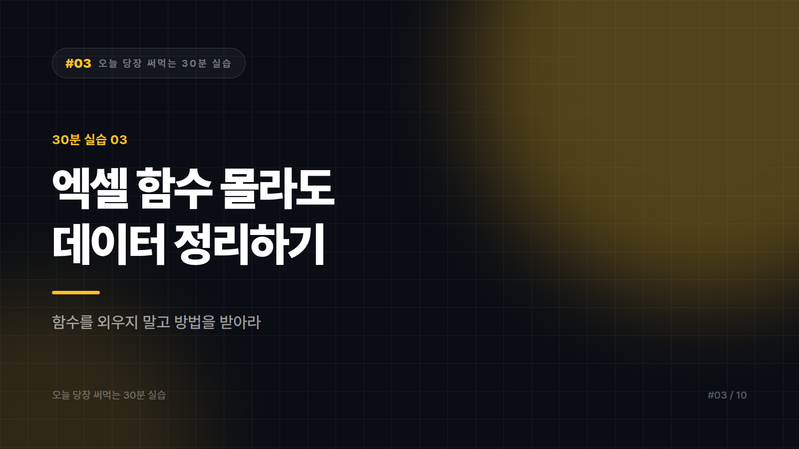

# [30분 실습 #3] 엑셀 함수 하나도 몰라도 데이터 정리하는 법

*시리즈: 오늘 당장 써먹는 30분 실습 | 3/10*

> 소요 시간 30분 · 준비물 정리 안 된 엑셀·CSV 파일 하나 · 난이도 ★★☆☆☆

---

VLOOKUP을 열 번쯤 검색해봤지만 여전히 헷갈리는 사람을 위한 실습이다. 결론부터 말하면 함수를 외울 필요가 없다. 그렇다고 AI한테 파일 던지면 알아서 해주겠지도 틀렸다. 정답은 그 중간 어딘가에 있고, 이 글은 그 지점을 30분 만에 익히는 과정이다.

지저분한 데이터 파일을 하나 준비하자. 없으면 회사 어딘가에 반드시 있다.

---

## STEP 1 — 원본을 복사한다 (2분)

시작하기 전에 딱 하나만. 원본 파일을 복사해두자.

`매출데이터.xlsx`를 `매출데이터_원본.xlsx`로 하나 더 만들어두고 사본으로 작업한다. 데이터 정리는 되돌릴 수 없는 작업이 많다. 이 2분이 나중에 몇 시간을 구한다.

---

## STEP 2 — 뭐가 문제인지부터 물어본다 (8분)

바로 정리해달라고 하지 말자. 먼저 진단을 시킨다. 데이터 일부를 스무 줄에서 서른 줄쯤 복사해서 이렇게 넣는다.

```
아래는 제 데이터의 일부입니다.

정리를 요청하기 전에, 이 데이터에 어떤 문제가 있는지 먼저 진단해주세요.

- 같은 의미인데 다르게 적힌 값 (예: "서울" / "서울시" / "서울특별시")
- 형식이 섞인 열 (날짜, 숫자, 텍스트가 혼재)
- 비어 있거나 이상한 값
- 중복으로 보이는 행

문제 목록만 알려주시고, 아직 고치지는 마세요.

---
[데이터 붙여넣기]
```

이 진단 목록이 오늘 작업의 설계도가 된다. 눈으로 훑었을 때 안 보이던 문제가 여기서 대부분 드러난다.

---

## STEP 3 — 고치지 말고 고치는 법을 받는다 (15분)

여기가 이 실습의 핵심이다. 많은 사람이 데이터를 통째로 붙여넣고 정리해서 돌려달라고 한다. 이 방식은 두 가지 이유로 위험하다. 데이터가 조금만 많아져도 중간이 잘리거나 값이 바뀌고, 무엇이 어떻게 바뀌었는지 확인할 방법이 없다.

그래서 데이터가 아니라 방법을 받아야 한다.

```
진단해주신 문제 중 1번(지역명 표기 불일치)부터 해결하겠습니다.

제 데이터를 직접 수정하지 마시고,
엑셀에서 제가 직접 실행할 수 있는 방법을 알려주세요.

- 어떤 기능이나 수식을 쓰면 되는지
- 어느 셀에 무엇을 입력하는지 단계별로
- 엑셀 초보 기준으로 설명해주세요
```

이렇게 받으면 내가 직접 실행하게 되고, 무엇이 왜 바뀌는지 알게 된다. 다음에 같은 문제가 오면 AI 없이도 처리할 수 있다. 문제는 하나씩 순서대로 해결하자. 한 번에 다섯 개를 고치려 하면 뭐가 잘못됐는지 추적이 안 된다.

받은 수식이 안 먹을 때는 이렇게 되묻는다.

```
알려주신 수식을 A2 셀에 넣었더니 #VALUE! 오류가 납니다.
제 데이터의 A열은 [실제 값 예시]처럼 생겼습니다.
원인이 뭘까요?
```

오류 메시지와 실제 값 예시를 같이 주는 게 포인트다. 오류 이름만 말하면 일반론이 돌아온다.

---

## STEP 4 — 검산한다 (5분)

정리가 끝나면 반드시 확인하자. 이걸 건너뛰면 앞의 28분이 의미가 없다.

먼저 행 개수를 정리 전후로 비교한다. 의도치 않게 줄었다면 데이터가 날아간 것이다. 다음으로 금액이나 수량 열의 총합을 비교한다. 중복을 제거했다면 줄어든 게 맞는지까지 본다. 마지막으로 무작위로 다섯 줄을 골라 원본과 눈으로 대조한다.

마지막 항목이 의외로 중요하다. 숫자는 맞는데 값이 엉뚱한 행으로 밀려 있는 경우가 실제로 자주 생긴다.

---

## 자주 나오는 실수

회사 데이터를 그대로 외부 AI에 넣는 일이 가장 흔하고 가장 위험하다. 고객명이나 연락처, 주민번호, 계좌, 미공개 실적이 들어 있다면 넣기 전에 회사 정책부터 확인해야 한다. 진단 단계에서는 실제 값 대신 형식만 보여주는 것으로 충분한 경우가 많다. 010-1234-5678을 010-XXXX-XXXX로 바꿔 넣는 식이다.

AI가 돌려준 데이터를 그대로 쓰는 것도 문제다. STEP 3에서 방법을 받으라고 한 이유가 여기 있다. 정리해서 돌려준 표는 조용히 값이 바뀌어 있을 수 있고, 특히 긴 숫자와 0으로 시작하는 코드, 날짜가 위험하다.

세 번째는 원본을 덮어쓰는 것이다. STEP 1을 건너뛴 사람이 반드시 후회하는 지점이다.

---

## 완료 체크리스트

- [ ] 원본 파일을 복사해뒀다
- [ ] 정리하기 전에 문제 진단부터 받았다
- [ ] 데이터를 받은 게 아니라 방법을 받아서 직접 실행했다
- [ ] 행 수와 합계로 검산했다
- [ ] 민감 정보가 포함되지 않았는지 확인했다

---

*다음 편: [30분 실습 #4] 읽기 싫은 긴 문서 30분에 파악하기*

---


본문에 그림이 들어가면 좋을 자리는 아래와 같다. 실제 이미지는 아직 넣지 않았다.

〔이미지 자리 — 본문에서 1번째 논점을 설명하는 대목〕

〔이미지 자리 — 본문에서 2번째 논점을 설명하는 대목〕

〔이미지 자리 — 본문에서 3번째 논점을 설명하는 대목〕

〔이미지 자리 — 마지막 문단 바로 위〕
