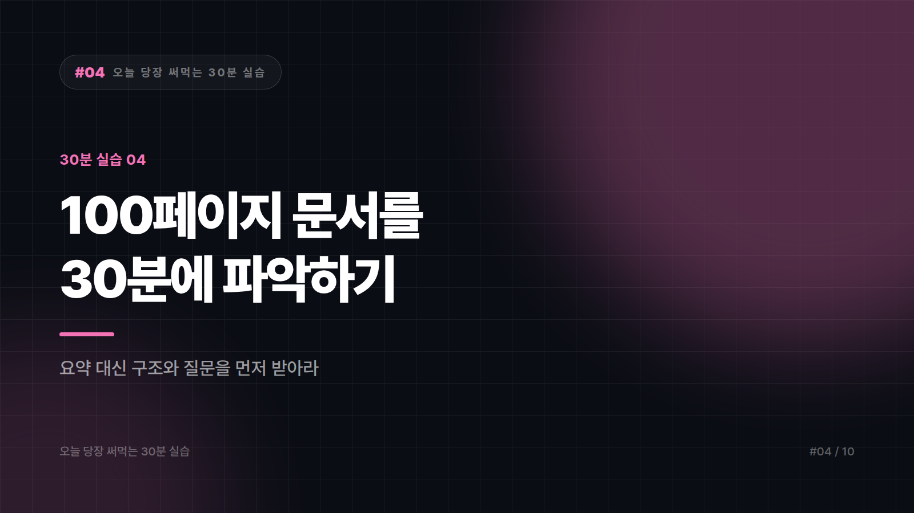

# [30분 실습 #4] 100페이지짜리 문서를 30분에 파악하는 법

*시리즈: 오늘 당장 써먹는 30분 실습 | 4/10*

> 소요 시간 30분 · 준비물 읽어야 하는데 미루고 있는 긴 문서 하나 · 난이도 ★★☆☆☆

---

책상 위에, 혹은 메일함 어딘가에 읽어야 하는데 하고 미뤄둔 긴 문서가 있을 것이다. 보고서, 논문, 사업계획서, 계약서, 매뉴얼 같은 것들. 이 실습은 그걸 30분 안에 남에게 설명할 수 있는 수준까지 끌어올리는 방법이다.

한 가지 미리 짚어두자. 이 방법은 정독을 대체하지 않는다. 정독해야 할 문서인지 아닌지를 30분 만에 판단하고, 정독해야 한다면 어디를 정독할지 찾아내는 게 목적이다.

---

## STEP 1 — 요약부터 시키지 않는다 (5분)

대부분 문서를 통째로 넣고 요약해달라고 누른다. 그러면 읽으나 마나 한 요약이 나온다. 무엇이 중요한지는 문서가 아니라 내가 왜 이걸 읽는지에 따라 달라지기 때문이다.

그래서 목적부터 말해야 한다.

```
아래 문서를 파악하려고 합니다.

제 상황: 저는 [직무]이고, 이 문서를 읽는 이유는 [목적]입니다.
예) 다음 주 회의에서 이 제안에 찬성할지 반대할지 정해야 합니다.

먼저 요약하지 마시고, 이 문서의 전체 구조를 알려주세요.
- 크게 몇 개 부분으로 나뉘는지
- 각 부분이 무엇을 다루는지 한 줄씩
- 제 목적에 비춰 어디를 집중해서 봐야 하는지

---
[문서 내용 붙여넣기]
```

문서 구조 지도를 먼저 얻는 것이다. 이게 있으면 남은 25분을 어디에 쓸지가 정해진다.

---

## STEP 2 — 주장과 근거를 분리한다 (10분)

긴 문서는 대부분 설득하려는 문서다. 그러니 무슨 말을 하는가와 왜 그렇다고 하는가를 갈라내야 한다.

```
이 문서의 핵심 주장을 3~5개로 정리해주세요.
각 주장마다 아래를 함께 적어주세요.

- 주장: 한 문장으로
- 근거: 문서가 제시한 근거 (데이터, 사례, 인용 등)
- 근거의 강도: 구체적인 수치나 검증 가능한 자료인지,
  아니면 일반적 서술이나 추정인지

근거가 약하거나 아예 제시되지 않은 주장이 있다면 따로 표시해주세요.
```

마지막 문장이 이 실습의 핵심이다. 근거 없이 넘어가는 주장이 어디인지 알면 회의에서 정확히 그 지점을 물을 수 있다. 문서를 다 읽은 사람보다 더 날카로운 질문이 나온다.

---

## STEP 3 — 반대편에 서서 읽는다 (10분)

여기가 다른 사람과 차이를 만드는 단계다. 대부분 문서를 이해하고 끝내지만 실무에서 필요한 건 판단이다.

```
이제 비판적으로 검토해주세요.

1) 이 문서가 다루지 않고 넘어간 쟁점은 무엇인가요?
2) 이 주장에 반대하는 사람이라면 어디를 공격할까요?
3) 문서에서 가장 불확실하거나 낙관적인 가정은 무엇인가요?
4) 제가 회의에서 물어야 할 질문 5개를 뽑아주세요.
```

4번의 결과물을 그대로 들고 회의에 들어가면 된다. 문서를 세 번 읽은 사람도 못 하는 질문이 나오는 경우가 많다. 문서를 읽은 사람은 문서의 논리 안에 갇히는데, 이 질문은 밖에서 던지기 때문이다.

---

## STEP 4 — 30초 버전으로 압축한다 (5분)

마지막은 내가 실제로 이해했는지 확인하는 단계다.

```
이 문서를 다음 세 가지 길이로 정리해주세요.

1) 한 문장 — 엘리베이터에서 상사가 "그거 뭐야?" 물었을 때
2) 세 문장 — 팀 회의에서 짧게 공유할 때
3) 열 문장 — 내가 나중에 다시 볼 메모용
```

그리고 1번을 보지 않고 내 입으로 말해보자. 막히면 아직 이해 못 한 것이고, 막힌 지점이 바로 정독해야 할 부분이다.

---

## 자주 나오는 실수

100페이지를 한 번에 붙여넣는 게 첫 번째다. 길이 제한에 걸리거나, 들어가더라도 중간 내용이 뭉개진다. 장 단위로 끊어서 넣고 마지막에 통합 요약을 요청하는 편이 훨씬 정확하다.

요약을 원문 대신 인용하는 것도 위험하다. 회의에서 문서에 이렇게 써 있다고 말하려면 원문을 직접 확인해야 한다. 요약 과정에서 뉘앙스가 바뀌거나 조건절이 빠지는 일이 흔하고, 계약서나 법률 문서는 그 위험이 특히 크다.

대외비 문서를 아무 도구에나 넣는 것도 문제다. 계약서와 미공개 실적, 인사 자료, 고객 데이터가 포함된 문서라면 회사에서 승인한 도구인지부터 확인해야 한다. 이건 개인의 판단 영역이 아니다.

---

## 완료 체크리스트

- [ ] 요약을 시키기 전에 내 목적을 먼저 말했다
- [ ] 주장과 근거를 분리하고, 근거가 약한 지점을 찾았다
- [ ] 반대편 관점에서 질문 5개를 뽑았다
- [ ] 한 문장 요약을 보지 않고 말할 수 있다
- [ ] 인용할 부분은 원문으로 직접 확인했다

---

*다음 편: [30분 실습 #5] 사진 배경 지우고 쓸 만한 이미지 만들기*

---


본문에 그림이 들어가면 좋을 자리는 아래와 같다. 실제 이미지는 아직 넣지 않았다.

〔이미지 자리 — 본문에서 1번째 논점을 설명하는 대목〕

〔이미지 자리 — 본문에서 2번째 논점을 설명하는 대목〕

〔이미지 자리 — 본문에서 3번째 논점을 설명하는 대목〕

〔이미지 자리 — 마지막 문단 바로 위〕
