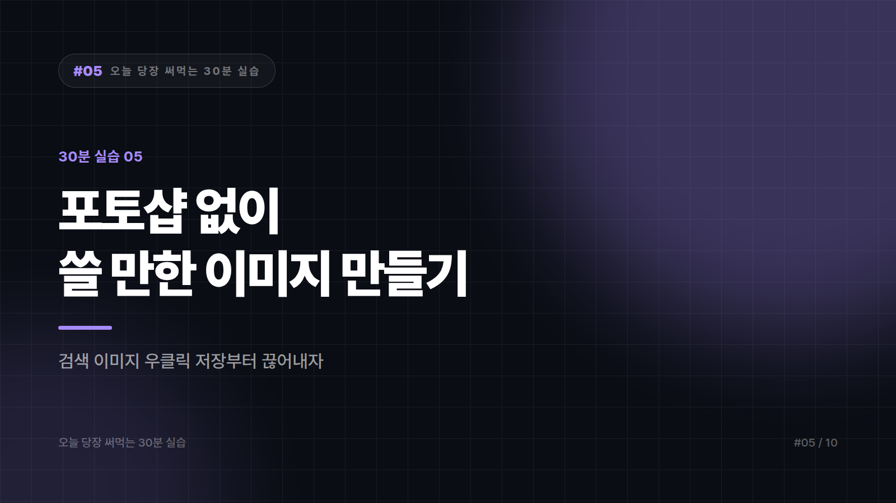

# 발표 자료에 넣을 이미지, 검색해서 가져다 쓰지 않고 30분에 만들기

*시리즈: 오늘 당장 써먹는 30분 실습 | 5/10*

> 소요 시간 30분 · 준비물 정리하고 싶은 사진 몇 장 · 난이도 ★★☆☆☆

---

발표 자료에 넣을 이미지가 필요한데 디자이너는 없고 포토샵은 못 쓴다. 이 상황에서 가장 흔한 선택은 인터넷에서 대충 검색해 가져다 쓰기인데, 회사에서 이보다 위험한 습관도 드물다. 이 실습은 30분 안에 안전하고 쓸 만한 이미지를 확보하는 과정이다.

---

## STEP 1 — 무엇이 필요한지 먼저 정한다 (5분)

이미지 작업이 산으로 가는 이유는 대부분 예쁜 걸 찾다가 시간을 다 쓰기 때문이다. 먼저 세 가지를 정하자.

용도와 크기가 첫 번째다. 발표 슬라이드와 블로그 썸네일, 인쇄물은 요구되는 해상도가 전혀 다르다. 두 번째는 텍스트가 들어갈 자리다. 나중에 글자를 얹어야 한다면 한쪽이 비어 있는 구도가 필요하다. 세 번째는 상업적 사용 여부인데, 이게 가장 중요하다. 사내 문서인지 외부 공개인지에 따라 쓸 수 있는 소스가 달라지고, 외부에 공개되는 자료라면 출처와 라이선스가 반드시 확인돼야 한다.

---

## STEP 2 — 경로를 고른다 (5분)

목적에 따라 길이 갈린다. 아무거나 골라 쓰면 안 된다.

가장 안전한 건 이미 가지고 있는 사진을 다듬는 길이다. 회사가 촬영한 제품 사진이나 내가 찍은 사진이라면 권리 문제가 없고, 배경 제거와 보정만 하면 된다.

생성형 AI로 만드는 길은 삽화나 배경, 분위기용으로 쓸 만하다. 다만 실물이 정확해야 하는 곳에는 쓰면 안 된다. 제품 사진을 AI로 만들어 판매 페이지에 쓰면 과장광고 문제가 된다. 사용하는 서비스의 요금제별 상업적 이용 조건도 반드시 확인해야 한다.

무료 이미지 사이트는 일반적인 분위기 컷에 적당하다. 무료라고 해서 아무 데나 써도 되는 건 아니다. 사이트마다 라이선스가 다르고, 사람 얼굴이 나온 사진은 초상권이 별도로 걸린다. 검색 결과에서 이미지를 우클릭해 저장하는 건 어떤 경우에도 안전한 선택지가 아니다.

---

## STEP 3 — 배경 제거와 정리 (10분)

가장 수요가 많은 작업이다. 요즘은 대부분의 도구가 클릭 한 번으로 처리한다. 피사체와 배경의 경계가 뚜렷한 제품 사진이나 인물 상반신은 거의 문제가 없고, 머리카락과 유리, 반투명 물체, 배경과 색이 비슷한 피사체에서 결과가 나빠진다.

잘 안 될 때의 해결 순서는 이렇다. 먼저 원본을 더 큰 해상도로 다시 넣어본다. 작은 이미지일수록 경계 인식이 나빠진다. 그래도 안 되면 수동 브러시로 보정한다. 대부분의 도구에 지우개와 복원 브러시가 있다. 마지막은 구도를 바꿔 잘라내는 것이다. 문제가 되는 부분을 아예 크롭으로 없애는 게 빠를 때가 많다.

세 번째가 의외로 정답인 경우가 많다. 완벽한 누끼를 따려고 20분을 쓰느니 잘라내고 다음 작업으로 넘어가는 게 낫다.

---

## STEP 4 — 일관성을 만든다 (10분)

슬라이드가 아마추어처럼 보이는 이유는 이미지 품질이 낮아서가 아니라 제각각이기 때문이다. 사진 스타일이 장마다 다르면 아무리 좋은 이미지를 써도 어수선해 보인다.

맞출 건 셋이다. 비율을 통일해 모든 이미지를 같은 형태로 자르고, 색감을 맞춰 한 장은 따뜻하고 한 장은 차가운 상황을 없앤다. 밝기와 채도만 맞춰도 크게 좋아진다. 이미지와 텍스트 사이 간격을 모든 장에서 동일하게 두는 것도 효과가 크다.

AI 이미지를 여러 장 만들 때도 마찬가지다. 프롬프트에서 스타일 지시 부분을 고정 문구로 두고 주제만 바꾸면 톤이 일관되게 나온다.

```
[고정] flat vector illustration, soft shadows, navy and amber palette,
        clean negative space, no text
[변경]  주제 부분만 교체
```

---

## 자주 나오는 실수

검색 이미지를 그대로 쓰는 일이 가장 흔하다. 사내 회의 자료라도 위험하고 외부 공개 자료라면 명확한 문제가 된다. 출처와 라이선스를 댈 수 없는 이미지는 쓰지 않는 게 원칙이다.

AI 이미지에 실존 인물이나 브랜드를 넣는 것도 조심해야 한다. 특정 연예인이나 기업 로고가 연상되는 결과물은 상업적으로 쓸 수 없다. 프롬프트에 실명을 넣는 것 자체를 피하는 편이 낫다.

저해상도 이미지를 늘려 쓰는 것도 자주 보인다. 작은 이미지를 키우면 뭉개지고 인쇄물이라면 더 심하다. 필요한 최종 크기보다 큰 원본을 확보하는 게 먼저다.

---

## 완료 체크리스트

- [ ] 용도·크기·텍스트 자리를 먼저 정했다
- [ ] 이미지 출처가 명확하고 라이선스를 확인했다
- [ ] 배경 제거가 안 될 때 크롭이라는 선택지를 고려했다
- [ ] 여러 장의 비율과 색감을 통일했다
- [ ] 실존 인물·브랜드가 연상되는 요소가 없다

---

*다음 편: [30분 실습 #6] 자료 조사를 30분 만에 끝내는 루틴*

---


본문에 그림이 들어가면 좋을 자리는 아래와 같다. 실제 이미지는 아직 넣지 않았다.

〔이미지 자리 — 본문에서 1번째 논점을 설명하는 대목〕

〔이미지 자리 — 본문에서 2번째 논점을 설명하는 대목〕

〔이미지 자리 — 본문에서 3번째 논점을 설명하는 대목〕

〔이미지 자리 — 마지막 문단 바로 위〕
