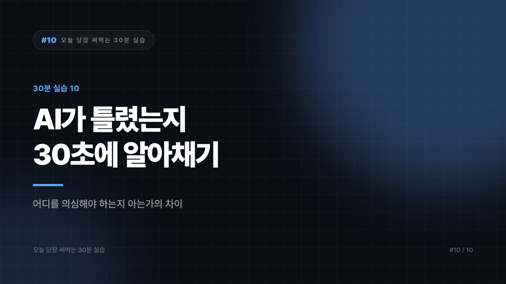

# AI가 틀렸는지 30초 만에 알아채는 법

*시리즈: 오늘 당장 써먹는 30분 실습 | 10/10*

> 소요 시간 30분 · 준비물 AI가 만들어준 결과물 아무거나 · 난이도 ★★★★☆

---

이 시리즈의 마지막 편이자 가장 중요한 한 편이다.

앞의 아홉 편은 전부 AI에게 일을 잘 시키는 법이었다. 이번 편은 반대다. AI가 만들어온 결과물을 의심하는 법이다. 이걸 못 하면 앞의 아홉 개가 전부 위험 요인이 된다.

AI를 잘 쓰는 사람과 사고 치는 사람의 차이는 프롬프트 실력이 아니다. 어디를 의심해야 하는지 아는가의 차이다.

---

## STEP 1 — 위험 지대를 외운다 (5분)

AI는 아무 데서나 틀리지 않는다. 틀리는 자리가 정해져 있다. 그 자리만 기억하면 검증 시간이 10분의 1로 줄어든다.

가장 위험한 건 숫자와 통계와 날짜다. 그럴듯한 값을 자신 있게 만들어낸다. 출처와 인용, 논문이나 보고서 제목도 같은 등급이다. 존재하지 않는 자료를 지어낼 수 있다. 법규와 제도, 요금, 세율도 여기 들어간다. 개정 전 정보이거나 다른 나라 기준일 수 있기 때문이다. 이 세 부류는 예외 없이 원문을 확인해야 한다.

그다음 등급은 고유명사와 최근에 일어난 일이다. 인명과 회사명, 제품명은 비슷한 이름끼리 뒤섞이고, 최근 1~2년 사이의 일은 학습 시점 이후라 알지 못할 수 있다. 여기는 한 번 더 확인한다.

문장을 다듬거나 구조를 잡거나 아이디어를 발산하는 작업은 위험이 낮다. 틀려도 내가 바로 알아보기 때문이다. 이건 그냥 쓰면 된다.

---

## STEP 2 — 결과물에 빨간 줄을 그어본다 (10분)

AI가 만들어준 결과물을 하나 꺼내서 직접 해보자. 앞에서 정리한 최상위 위험 항목에 해당하는 부분을 전부 표시한다.

보통 이런 것들이 걸린다. 2024년 기준 약 37퍼센트라는 문장은 어디서 나온 숫자인지 물어야 하고, 어느 연구소 보고서에 따르면이라는 표현은 그 보고서가 실제로 있는지 확인해야 한다. 현행법상 30일 이내라는 문장은 그 조항이 지금도 유효한지 봐야 하고, A사가 작년에 도입한이라는 구절은 정말 A사가 맞는지, 정말 작년인지 둘 다 확인해야 한다.

표시된 개수를 세어보자. 한 페이지에 다섯 개 이상 나왔다면 그 문서는 지금 상태로 쓰면 안 된다.

---

## STEP 3 — 검증 질문을 던진다 (10분)

표시한 항목을 AI에게 되묻는다. 검증에 쓰는 질문은 작성할 때와 형식이 다르다.

먼저 확신도를 물어본다.

```
방금 답변에서 사실 관계에 해당하는 내용만 뽑아,
각각 확신도를 표시해주세요.

[확실] 널리 알려진 안정적 사실
[불확실] 맞을 가능성이 높으나 확인 필요
[생성됨] 실제 근거 없이 맥락상 채워 넣은 내용

특히 숫자, 출처, 고유명사는 빠짐없이 분류해주세요.
```

생성됨이라는 선택지를 명시적으로 주는 게 핵심이다. 이 선택지가 없으면 모든 걸 확실로 분류하려는 경향이 있다.

다음은 반대로 논증시키는 방법이다.

```
방금 답변과 정반대 결론을 지지하는 논거를 만들어주세요.
```

양쪽을 다 보면 원래 답변의 근거가 얼마나 약했는지가 드러난다. 반대 논증이 더 그럴듯하다면 원래 답변을 버려야 한다.

마지막은 백지에서 다시 묻는 것이다. 새 대화창을 열고 같은 질문을 처음부터 다시 던져본다. 앞의 대화 맥락이 없는 상태에서도 같은 답이 나오는지 보는 것이다. 답이 달라지면 둘 중 하나 또는 둘 다 틀린 것이고, 특히 숫자가 달라지면 그 숫자는 지어낸 것이다.

---

## STEP 4 — 나만의 검증 규칙을 정한다 (5분)

마지막으로 앞으로 지킬 규칙을 정해두자. 아래는 출발점으로 쓸 수 있는 기본형이다.

```
[절대 규칙]
- 숫자와 출처는 원문 확인 전까지 외부에 내보내지 않는다
- 법규·제도는 시행 시점 기준을 직접 확인한다
- 회사 밖으로 나가는 문서는 고유명사를 전부 대조한다

[상황별 규칙]
- 내부 초안: 최상위 위험 항목만 확인하고 진행
- 외부 발송·공개: 최상위와 그다음 등급까지 전부 확인
- 계약·법률·재무: AI 결과물을 초안으로만 쓰고 전문가 검토를 거친다
```

마지막 줄이 중요하다. 계약서 검토와 세무 처리, 의료나 법률 판단은 AI로 초안을 잡을 수는 있어도 최종 판단을 맡기면 안 되는 영역이다.

---

## 가장 위험한 순간

결과물이 내 생각과 일치할 때가 첫 번째다. 사람은 자기 생각과 맞는 정보를 덜 의심한다. 역시 내 말이 맞았네 싶은 순간이 검증이 가장 느슨해지는 때다.

급할 때가 두 번째다. 마감 직전에 받은 결과물이 제일 위험하다. 시간이 없을수록 최상위 위험 항목만이라도 확인하자. 전부 못 하면 최소한 숫자만이라도 본다.

잘 아는 분야일 때가 세 번째다. 이 분야는 내가 아니까 보면 안다는 생각이 방심을 부른다. 오히려 익숙한 분야일수록 미묘하게 틀린 걸 그냥 넘기기 쉽다.

---

## 완료 체크리스트

- [ ] 가장 위험한 항목들을 외웠다
- [ ] 실제 결과물에 표시해보고 개수를 세어봤다
- [ ] 확신도 분류를 요청해봤다
- [ ] 새 대화창에서 같은 질문을 다시 던져 비교해봤다
- [ ] 나만의 검증 규칙을 문서로 남겼다

---

## 시리즈를 마치며

열 편을 관통하는 원칙은 하나다. AI에게 결과물을 받지 말고 과정을 받아라.

회의록은 정리된 결과가 아니라 빠진 것을 찾는 눈으로 썼고, 데이터는 정리된 표가 아니라 정리하는 방법으로 받았다. 긴 문서에서는 요약 대신 물어볼 질문을 뽑았고, 조사에서는 답이 아니라 확인해야 할 목록을 얻었다. 메일은 완성본이 아니라 막힌 첫 문장을 뚫는 용도였다.

결과물을 받으면 검증할 게 늘어나지만 과정을 받으면 내 실력이 는다. 실력이 늘면 AI 없이도 더 빨라진다. 그게 이 시리즈가 노린 지점이다.

---

*시리즈 전체 목록: 01 프롬프트 기본기 · 02 회의록 정리 · 03 데이터 정리 · 04 긴 문서 파악 · 05 이미지 작업 · 06 자료 조사 · 07 메일 작성 · 08 발표 자료 · 09 반복 업무 찾기 · 10 검증하는 법*

*※ 이 시리즈에서 반복해 언급한 보안·정책 확인 사항은 회사마다 기준이 다릅니다. 사내 데이터를 외부 도구에 입력하기 전에는 반드시 소속 조직의 정책을 확인하시기 바랍니다.*

---


본문에 그림이 들어가면 좋을 자리는 아래와 같다. 실제 이미지는 아직 넣지 않았다.

〔이미지 자리 — 본문에서 1번째 논점을 설명하는 대목〕

〔이미지 자리 — 본문에서 2번째 논점을 설명하는 대목〕

〔이미지 자리 — 본문에서 3번째 논점을 설명하는 대목〕

〔이미지 자리 — 마지막 문단 바로 위〕
