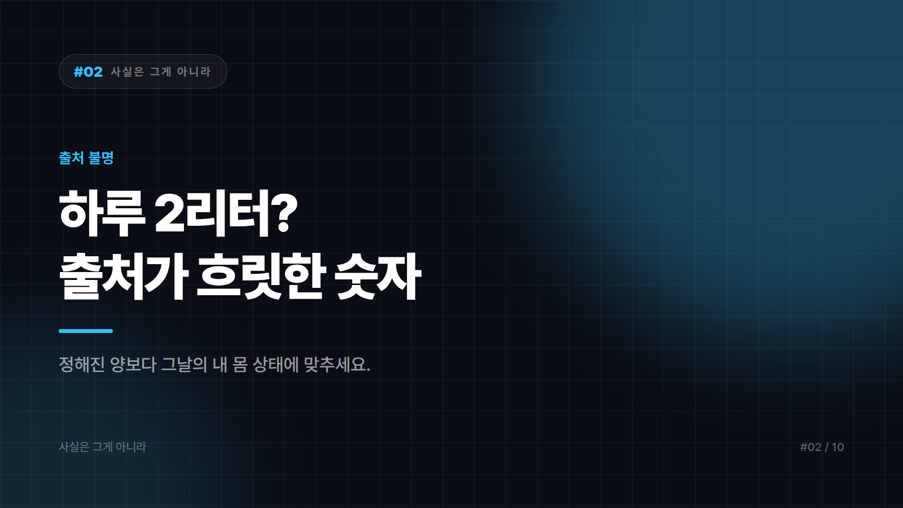

# 02. 물은 하루 2리터 마셔야 한다? — 이 숫자의 출처를 아무도 모른다

---

건강을 위해 하루 2리터, 여덟 잔의 물을 마셔야 한다. 너무 널리 퍼져서 반박할 생각조차 안 드는 상식이다. 사무실 책상마다 1리터짜리 물병이 놓여 있고, 오늘 몇 잔 마셨는지 체크해주는 앱도 있다.

그런데 이 숫자에는 근거가 되는 단일 연구가 없다. 하루 여덟 잔이라는 구체적인 권장이 어디서 시작됐는지 거슬러 올라가 보면 출처가 흐릿해진다.

## 문장 하나가 떨어져 나갔다는 이야기

가장 자주 지목되는 설명은 이렇다. 과거 어떤 권장 문헌에 성인은 하루 약 2.5리터의 수분이 필요하다는 내용이 있었는데, 바로 뒤에 붙어 있던 이 양의 상당 부분은 음식에 들어 있다는 문장이 인용 과정에서 떨어져 나갔다는 것이다. 그래서 필요한 총 수분량이 마셔야 할 물의 양으로 둔갑했다는 설명이다.

다만 이 유래설 자체도 여러 버전으로 전해진다. 기원이 명확히 밝혀진 숫자가 아니다 정도로 이해하는 게 정확하다.

핵심은 남는다. 우리가 섭취하는 수분의 상당 부분은 음식에서 온다. 국과 찌개, 과일, 채소, 밥에도 물이 들어 있고 커피와 차도 수분으로 계산된다. 그런데 2리터를 물만으로 채우려 하면 실제 필요량보다 많이 마시게 된다.

## 왜 이 숫자가 살아남았나

기억하기 쉬운 숫자라는 게 첫 번째 이유다. 2리터, 여덟 잔은 깔끔하다. 당신의 체중과 활동량과 기온에 따라 다릅니다라는 문장은 아무도 기억하지 못한다. 단순한 숫자는 정확한 설명을 이긴다.

팔기 좋다는 점도 있다. 물병과 정수기, 수분 섭취 앱, 기능성 음료. 명확한 목표치가 있어야 상품이 만들어진다.

반박해도 별 이득이 없었다는 사정도 있다. 물을 조금 더 마셔서 큰일 나는 사람은 드물다. 그래서 틀렸다고 말할 유인이 적었고, 아무도 굳이 확인하지 않은 채 수십 년이 지났다.

## 그럼 얼마나 마시나

필요량은 사람마다, 날마다 다르다. 체중과 활동량, 기온, 식단에 따라 달라진다. 땀을 많이 흘린 날과 종일 앉아 있던 날이 같을 리 없다.

갈증은 꽤 쓸 만한 신호다. 건강한 성인이라면 목이 마를 때 마시는 것으로 대체로 충분하다. 다만 고령자는 갈증 감각이 둔해질 수 있어 의식적인 섭취가 권장되는 편이다. 소변 색도 실용적인 지표다. 진한 노란색이면 부족 신호일 수 있고, 거의 투명하면 충분하거나 과한 상태일 수 있다.

많이 마실수록 좋다는 것도 아니다. 단시간에 과량을 마시면 혈중 나트륨 농도가 떨어지는 문제가 생길 수 있다. 드물지만 실제로 보고되는 위험이다.

2리터는 목표라기보다 오해에서 굳어진 숫자에 가깝다. 정해진 양을 채우는 것보다 내 몸 상태와 그날의 조건에 맞추는 편이 합리적이다.

---

*※ 신장 질환, 심부전 등으로 수분 섭취량을 조절해야 하는 경우에는 반드시 의료진의 지시를 따라야 합니다. 이 글은 일반적인 정보 정리이며 의학적 조언이 아닙니다.*

---

본문에 그림이 들어가면 좋을 자리는 아래와 같다. 실제 이미지는 아직 넣지 않았다.

〔이미지 자리 — 본문에서 1번째 논점을 설명하는 대목〕

〔이미지 자리 — 본문에서 2번째 논점을 설명하는 대목〕

〔이미지 자리 — 본문에서 3번째 논점을 설명하는 대목〕

〔이미지 자리 — 마지막 문단 바로 위〕
