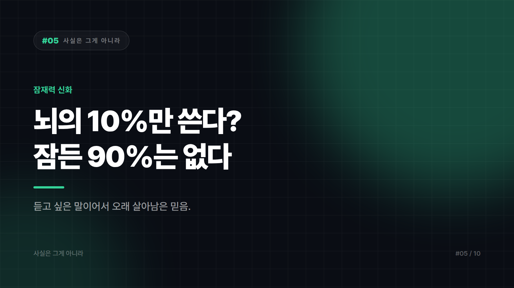

# 05. 우리는 뇌의 10%만 쓴다? — 남은 90%는 어디 있을까

---

인간은 뇌의 10퍼센트밖에 쓰지 못한다, 나머지 90퍼센트를 깨우면 잠재력이 폭발한다. 영화의 단골 설정이고 자기계발 강연의 도입부 단골이며 두뇌 개발 상품의 근거로 인용된다. 아인슈타인도 그렇게 말했다는 꼬리표까지 붙어 다닌다.

뇌에는 놀고 있는 90퍼센트가 없다. 근거는 여러 방향에서 나온다.

## 세 갈래로 어긋난다

먼저 뇌는 대단히 비싼 기관이다. 몸무게에서 차지하는 비중은 작지만 에너지 소비 비중은 그와 비교가 안 되게 크다. 이 정도 비용을 들여가며 90퍼센트를 놀리는 구조가 진화적으로 유지되기는 어렵다.

손상 사례도 말해준다. 90퍼센트가 쓰이지 않는다면 뇌의 어느 부위가 다쳐도 대부분은 별일이 없어야 한다. 실제로는 그렇지 않다. 작은 부위의 손상도 말과 기억, 운동, 시야에 구체적인 이상을 남긴다. 기능이 없는 영역이라는 건 사실상 없다.

뇌 활동을 관찰하는 영상 기법으로 봐도 마찬가지다. 특정 순간에 특별히 활발한 영역과 덜한 영역이 있을 뿐, 영구히 꺼져 있는 영역이 나타나지는 않는다. 하루를 놓고 보면 뇌는 전 영역이 다 동원된다. 10퍼센트만 쓴다는 말이 성립하려면 90퍼센트를 제거해도 괜찮아야 하는데, 그런 일은 일어나지 않는다.

## 사실이었으면 좋겠다는 마음

이 믿음의 진짜 내용은 뇌에 관한 게 아니다. 당신에게는 아직 꺼내지 않은 엄청난 능력이 있다는 위로다. 사실이냐보다 기분이 좋으냐가 전파력을 결정한 사례다.

오래된 관찰이 잘못 옮겨졌을 가능성도 크다. 뇌 연구 초기에는 자극을 줘도 뚜렷한 반응이 안 나타나는 넓은 영역들이 있었다. 지금은 그런 부위들이 여러 정보를 엮는 고차 기능을 맡는 것으로 이해된다. 기능을 아직 모르는 영역이 기능이 없는 영역으로 번역된 셈이다.

권위를 빌린 것도 한몫했다. 아인슈타인이 실제로 그런 말을 했다는 근거는 확인되지 않는다. 출처 없는 인용문에 유명인의 이름을 붙이는 건 주장의 신뢰도를 공짜로 올리는 가장 흔한 방법이다. 여기에 잠자는 90퍼센트를 깨워준다는 교육 프로그램과 기기까지 붙으면, 믿음을 유지할 이유가 하나 더 생긴다.

## 대신 알아둘 것

뇌의 몇 퍼센트 같은 표현이 나오면 근거를 물어보는 게 좋다. 이 숫자가 어디서 측정됐는지 설명하는 곳은 거의 없다. 잠재력을 깨운다는 상품은 대체로 이 신화 위에 서 있다.

실제로 효과가 확인된 것들은 훨씬 시시하다. 충분한 수면, 규칙적인 신체 활동, 꾸준한 학습과 반복. 극적이지 않아서 잘 안 팔릴 뿐이다. 뇌는 쓰지 않던 영역을 여는 게 아니라 쓰는 방식을 바꾸며 적응한다. 연습하면 달라지는 건 사용률이 아니라 연결 구조에 가깝다.

뇌에 잠들어 있는 90퍼센트는 없다. 이 믿음이 오래 산 이유는 사실이어서가 아니라 사실이었으면 좋겠어서다.

---

본문에 그림이 들어가면 좋을 자리는 아래와 같다. 실제 이미지는 아직 넣지 않았다.

〔이미지 자리 — 본문에서 1번째 논점을 설명하는 대목〕

〔이미지 자리 — 본문에서 2번째 논점을 설명하는 대목〕

〔이미지 자리 — 본문에서 3번째 논점을 설명하는 대목〕

〔이미지 자리 — 마지막 문단 바로 위〕
