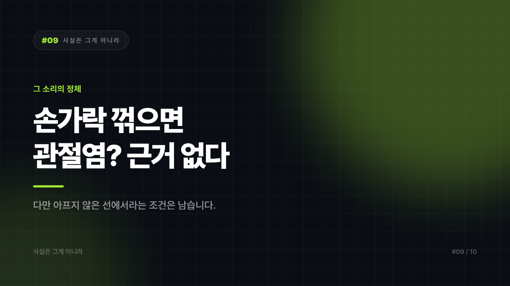

# 손가락 꺾으면 관절염 걸린다? — 그 소리의 정체

*시리즈: 사실은 그게 아니라 | 9/10*

---

책상 앞에서 우두둑 소리를 내면 옆자리에서 꼭 한마디가 날아온다. 뼈가 닳는다, 마디가 커진다, 늙어서 고생한다. 소리가 워낙 요란하니 몸에 나쁠 것 같다는 직관도 강력하다.

그런데 손가락을 꺾는 습관이 퇴행성 관절염의 원인이 된다는 근거는 확인되지 않았다. 비교적 오래 들여다본 주제인데, 꺾는 사람과 안 꺾는 사람 사이에서 관절염 발생의 뚜렷한 차이가 나타나지 않는다는 쪽으로 정리되어 있다.

## 우두둑은 뼈가 내는 소리가 아니다

관절 안은 윤활액으로 차 있다. 관절을 당겨 사이를 벌리면 내부 압력이 급격히 떨어지면서 액체 속에서 기체가 빠져나와 공동이 만들어지는데, 그 과정에서 나는 소리라는 설명이 널리 받아들여진다.

같은 손가락을 연속으로 두 번 꺾으면 소리가 안 나는 것도 이 때문이다. 기체가 다시 녹아들 시간이 필요하다. 뼈가 닳는 소리라면 몇 번이고 날 것이다.

여기서 반대편으로 넘어가지는 말자. 그러니 아무 상관 없다가 아니라, 관절염과 연결되는 근거가 없다까지가 정확한 표현이다. 지나치게 세게 억지로 꺾다가 주변 조직에 무리가 가는 경우는 별개의 문제다.

## 소리가 만든 평판

우리 몸에서 나는 소리 중 우두둑은 대체로 나쁜 신호다. 소리의 인상이 판단을 앞질렀다.

나이 든 사람의 손과 겹쳐 보이는 것도 이유다. 손가락 마디가 굵어진 어르신의 손은 흔히 볼 수 있고, 그분들 중에는 오래 손을 쓴 분이 많다. 자연스러운 노화와 사용의 흔적이 꺾는 버릇의 결과로 연결되어 기억된다.

훈계에 유용했다는 점도 크다. 남이 내는 소리는 거슬린다. 보기 싫다보다 몸에 나쁘다가 훨씬 말리기 좋은 문장이다. 이 믿음의 상당 부분은 건강 정보가 아니라 예절 규범에 가깝다. 게다가 굳이 확인해서 얻을 게 없는 통념은 반박될 일도 없이 그냥 남는다.

## 그래도 남는 조건

관절염 걱정 때문에 습관 자체를 끊을 필요는 없다. 다만 아플 때까지 밀어붙이지는 말자. 소리를 내려고 억지로 비틀거나 과한 힘을 쓰는 건 다른 이야기다.

꺾고 싶어지는 이유가 뻣뻣함이라면 그쪽을 다루는 게 낫다. 오래 타이핑한 뒤라면 손을 털고 가볍게 펴주는 동작과 중간중간의 휴식이 실질적인 해법이다. 통증이나 부기, 마디의 변형이 있다면 습관 문제가 아니다. 소리와 무관하게 진료 대상이고, 소리가 나면서 아픈 경우도 마찬가지다.

목이나 허리를 스스로 꺾는 것은 손가락과 같은 문제로 취급하지 않는 게 좋다. 부위의 구조가 다르므로 이 글의 내용을 그대로 적용하기 어렵다.

그 소리는 뼈가 닳는 소리가 아니고, 관절염과 연결되는 근거도 확인되지 않았다. 아프지 않은 선에서라는 조건만 그대로 남는다.

---

*※ 관절 통증, 부기, 변형이 있다면 이 글의 내용과 무관하게 정형외과 등 전문의 진료를 받으시기 바랍니다. 이 글은 일반적인 정보 정리이며 의학적 조언이 아닙니다.*

*다음 편: "만리장성은 우주에서 보인다" — 시리즈 마지막 편*

---

본문에 그림이 들어가면 좋을 자리는 아래와 같다. 실제 이미지는 아직 넣지 않았다.

〔이미지 자리 — 본문에서 1번째 논점을 설명하는 대목〕

〔이미지 자리 — 본문에서 2번째 논점을 설명하는 대목〕

〔이미지 자리 — 본문에서 3번째 논점을 설명하는 대목〕

〔이미지 자리 — 마지막 문단 바로 위〕
